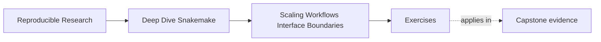

# Exercises

<!-- page-maps:start -->
## Page Maps

<!-- page-maps:end -->

Use these after reading the five core lessons and the worked example. The goal is to make
your scaling and interface reasoning visible, not to produce the most elaborate folder
tree.

Each answer should show three things:

- the boundary you are protecting
- the evidence route you would use
- the refactor or review decision that follows

## Exercise 1: Choose one healthy rule-family split

Take a workflow that is growing but still conceptually one graph.

Describe one split that belongs under `workflow/rules/` and explain why it improves named
ownership without hiding the orchestration story.

What to hand in:

- the workflow concern being split
- the proposed file name
- one sentence explaining what that file owns
- one sentence explaining why this is not yet a module boundary

## Exercise 2: Decide whether a boundary should become a module

Describe one sub-workflow that might be promoted into `workflow/modules/`.

Explain whether it really has a stable interface or whether it should remain an include.

What to hand in:

- the candidate boundary
- the interface questions you would ask first
- your decision and why
- one sign that would make the opposite decision safer

## Exercise 3: Write a small file contract

Choose one output family and describe it as a public contract.

What to hand in:

- the stable path or path family
- the semantics of that file family
- one internal path family that should not be treated as public
- one sentence explaining what kind of change would require explicit interface review

## Exercise 4: Choose the right scaling gate

For each of these questions, choose the smallest honest review surface:

- did the rule-family split keep the visible workflow surface legible
- did the public contract still align after the refactor
- did the workflow still plan the same high-level work

What to hand in:

- the command or surface for each question
- one sentence per route explaining why it is the right size of proof

## Exercise 5: Review one resource or executor-facing assumption

Describe one workflow rule family that is heavier than the others.

Explain how the repository should make that visible without hardwiring the design to one
executor story.

What to hand in:

- the heavier workflow concern
- the workflow-side resource distinction you would make visible
- one sentence explaining what should remain policy rather than workflow meaning

## Mastery standard for this exercise set

Across all five answers, Module 04 wants the same habits:

- you split by named ownership rather than by file length alone
- you treat interfaces as contracts rather than folder preferences
- you choose proof routes that defend the boundary actually under review

If your answer says only "the repo should be more modular," keep going.
