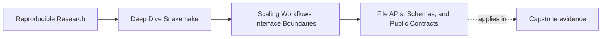
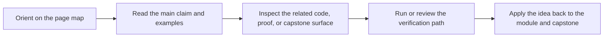
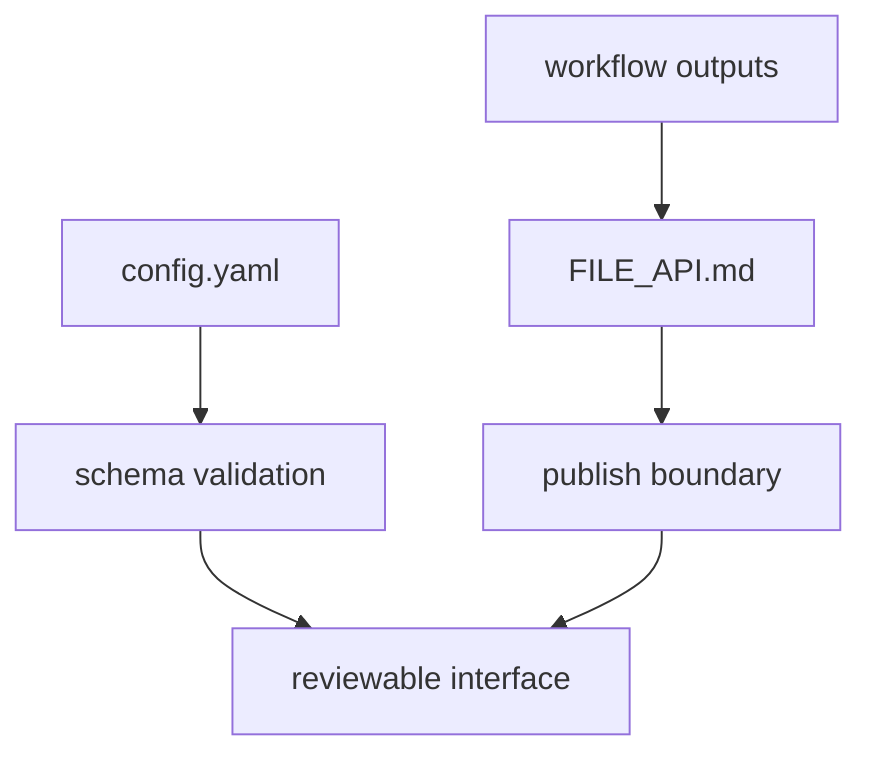

# File APIs, Schemas, and Public Contracts

<!-- page-maps:start -->
## Page Maps

<!-- page-maps:end -->

Repository growth becomes dangerous when people cannot answer one basic question:

> which files are part of the contract, and which ones are only internal coordination state?

This page is about making that answer explicit.

## A file API is a human-facing contract

A file API says:

- which paths another consumer may rely on
- what those files mean
- which changes count as interface breaks

That is why `FILE_API.md` matters in the capstone. It is not decorative documentation. It
is the human description of the stable file boundary.

## Not every output is public

Workflows create many useful files:

- intermediate processing outputs
- discovered-set artifacts
- logs
- benchmarks
- published summaries

Those files do not all have the same status.

A healthy repository distinguishes at least two classes:

- internal execution state
- public or downstream-facing contract files

If everything under `results/` is treated as public, the repository will become harder to
change safely.

## What belongs in a file API

A useful file API usually answers:

- the stable path or path family
- the semantics of that output
- whether ordering, schema, or naming rules matter
- what kind of change would require versioning or explicit review

This keeps the discussion concrete.

Weak file API note:

> reports live in publish.

Stronger file API note:

> `publish/v1/summary.json` is the stable machine-readable run summary; changing its keys
> or meaning requires explicit interface review.

The difference is contract precision.

## Schemas protect interface trust

Schemas matter because they move interface failure earlier.

Without validation:

- the workflow may emit a structurally wrong config or artifact
- the problem appears later as vague runtime breakage
- the interface boundary becomes harder to review

With validation:

- a malformed boundary fails close to the source
- the repository can explain which interface was violated

That is not bureaucracy. It is scaling discipline.

## One healthy interface stack

This model matters because human trust comes from both:

- machine-checked structure
- human-readable contract meaning

You usually need both at scale.

## Public paths should be smaller than repository state

A common scaling mistake is to let the public contract grow accidentally:

- one notebook starts reading `results/`
- another tool relies on a helper TSV
- a teammate assumes logs are part of the downstream interface

This is how internal state becomes accidental API.

The repair is to keep the public boundary intentionally smaller and documented.

## Common failure modes

| Failure mode | What it looks like | Better repair |
| --- | --- | --- |
| internal `results/` paths are treated as downstream contract | every refactor feels dangerous | define a smaller documented public boundary |
| `FILE_API.md` is vague | reviewers cannot tell what is stable | document paths, semantics, and break conditions clearly |
| schemas exist only for config, not key external artifacts | output boundaries fail late | validate the interface surfaces that matter most |
| logs or benchmarks become accidental API | diagnostics become harder to evolve | keep evidence separate from the public contract |
| versioned publish paths change casually | downstream trust drifts silently | require explicit interface review or version bumps |

## The explanation a reviewer trusts

Strong explanation:

> the workflow keeps internal coordination state under `results/`, but the stable downstream
> contract lives under `publish/v1/` and is described in `FILE_API.md`; schema validation
> protects config and key structured interfaces so repository growth does not turn internal
> files into accidental public API.

Weak explanation:

> the important files are the ones we usually look at after the run.

The strong version defines a contract. The weak version defines a habit.

## End-of-page checkpoint

Before leaving this page, you should be able to:

- distinguish internal workflow state from public file contracts
- describe what a good file API must say explicitly
- explain why schemas and validation support scaling rather than merely formalize it
- name one way accidental public APIs emerge in growing repositories
