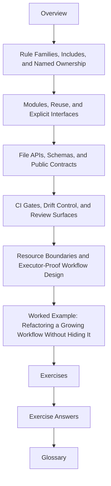

# Module 04: Scaling Workflows and Interface Boundaries

Modules 01 to 03 teach truthful workflow contracts, disciplined dynamic behavior, and
operational policy. Module 04 asks the next growth question:

> how do you make the repository bigger without making the workflow harder to explain?

This module is about scaling through boundaries. Includes, modules, file APIs, schemas,
and CI gates matter because they keep repository growth from turning into hidden coupling.

## What this module is for

By the end of Module 04, you should be able to explain five things in plain language:

- when a workflow should stay in one visible graph and when it should split into named rule families
- how `include:` and `module` solve different scaling problems
- which files belong to a public file interface and which remain internal execution detail
- how schemas and validation keep repository boundaries reviewable
- what CI or proof gates should defend before a larger workflow change is trusted

## Study route



Read the module in that order the first time. When you return later, jump to the page
that matches the scaling decision in front of you.

## The ten files in this module

1. Overview (`index.md`)
2. [Rule Families, Includes, and Named Ownership](rule-families-includes-and-named-ownership.md)
3. [Modules, Reuse, and Explicit Interfaces](modules-reuse-and-explicit-interfaces.md)
4. [File APIs, Schemas, and Public Contracts](file-apis-schemas-and-public-contracts.md)
5. [CI Gates, Drift Control, and Review Surfaces](ci-gates-drift-control-and-review-surfaces.md)
6. [Resource Boundaries and Executor-Proof Workflow Design](resource-boundaries-and-executor-proof-workflow-design.md)
7. [Worked Example: Refactoring a Growing Workflow Without Hiding It](worked-example-refactoring-a-growing-workflow-without-hiding-it.md)
8. [Exercises](exercises.md)
9. [Exercise Answers](exercise-answers.md)
10. [Glossary](glossary.md)

## How to use the file set

| If you need to... | Start here |
| --- | --- |
| split one large Snakefile into named rule ownership without losing the visible DAG | [Rule Families, Includes, and Named Ownership](rule-families-includes-and-named-ownership.md) |
| decide whether a boundary should become a real workflow module | [Modules, Reuse, and Explicit Interfaces](modules-reuse-and-explicit-interfaces.md) |
| define which files are public workflow contracts and how to validate them | [File APIs, Schemas, and Public Contracts](file-apis-schemas-and-public-contracts.md) |
| protect repository growth with proportionate gates and review surfaces | [CI Gates, Drift Control, and Review Surfaces](ci-gates-drift-control-and-review-surfaces.md) |
| keep resources and executor-facing assumptions from distorting workflow meaning | [Resource Boundaries and Executor-Proof Workflow Design](resource-boundaries-and-executor-proof-workflow-design.md) |
| see the whole module as one repository refactor | [Worked Example: Refactoring a Growing Workflow Without Hiding It](worked-example-refactoring-a-growing-workflow-without-hiding-it.md) |
| test your own understanding | [Exercises](exercises.md) |
| compare your reasoning against a reference answer | [Exercise Answers](exercise-answers.md) |
| stabilize the module vocabulary | [Glossary](glossary.md) |

## The running question

Carry this question through every page:

> if this repository grows tomorrow, which boundary should absorb the change so the workflow stays explainable?

Good Module 04 answers usually mention one or more of these:

- a rule-family split with clear ownership
- a module interface with named inputs and outputs
- a file API that marks public versus internal paths
- a schema or validation boundary that fails early
- a gate or proof route that protects the change before it spreads

## The running example

This module keeps returning to one repository shape:

- a top-level workflow becomes too large to review comfortably
- coherent rule families move under `workflow/rules/`
- a reusable sub-workflow may move under `workflow/modules/`
- the public file contract is documented separately from internal orchestration
- CI and review gates prove the split did not weaken the workflow

That is the smallest scaling story worth teaching.

## Commands to keep close

These commands form the evidence loop for Module 04:

```bash
snakemake --list-rules
snakemake --rulegraph mermaid-js > rulegraph.mmd
snakemake -n
snakemake --lint
make capstone-tour
```

They answer different questions:

- what rule surfaces are visible now
- how the rule relationships look after a split
- whether the plan still matches the intended contract
- whether obvious design smells already exist
- how the executed capstone expresses repository boundaries

## Learning outcomes

By the end of this module, you should be able to:

- split a growing workflow by named ownership instead of by file length alone
- choose between `include:` and `module` with a real interface reason
- document and validate a stable file interface
- defend repository growth with proportionate gates and drift evidence
- explain resource declarations as workflow-facing contracts rather than executor folklore

## Exit standard

Do not move on until all of these are true:

- you can explain one split that belongs in `workflow/rules/` and one that belongs in `workflow/modules/`
- you can name which paths are public and which are internal in one workflow family
- you can describe one schema or validation check that protects an interface boundary
- you can say which gate should fail first if a scaling change quietly breaks the contract
- you can explain one resource declaration without treating it as accidental scheduler trivia

When those become ordinary, Module 04 has done its job.
