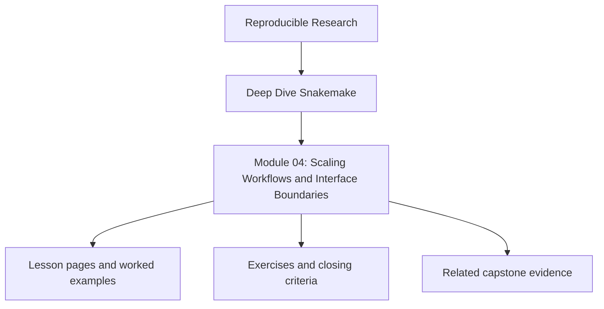
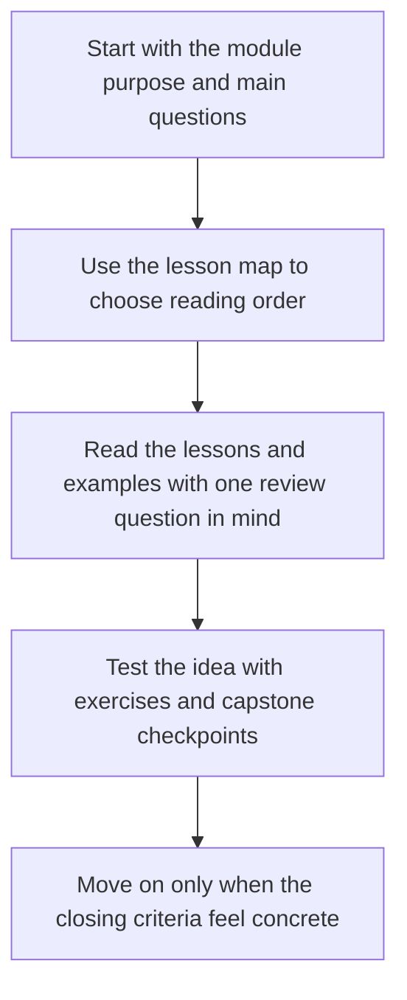
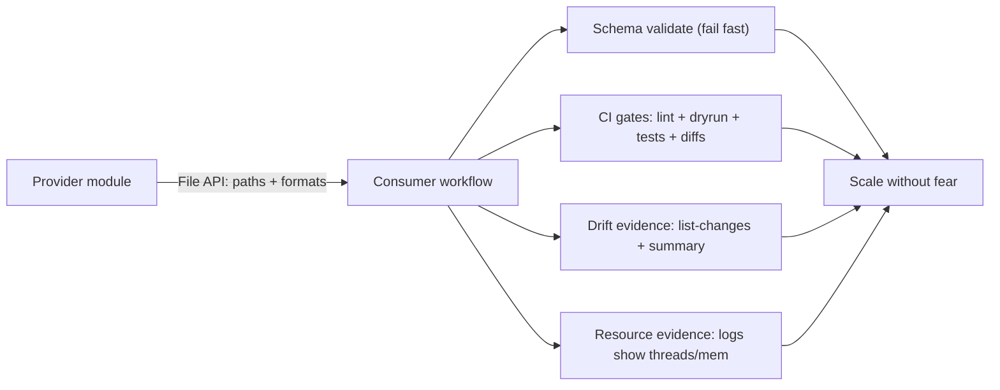
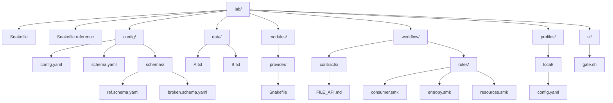
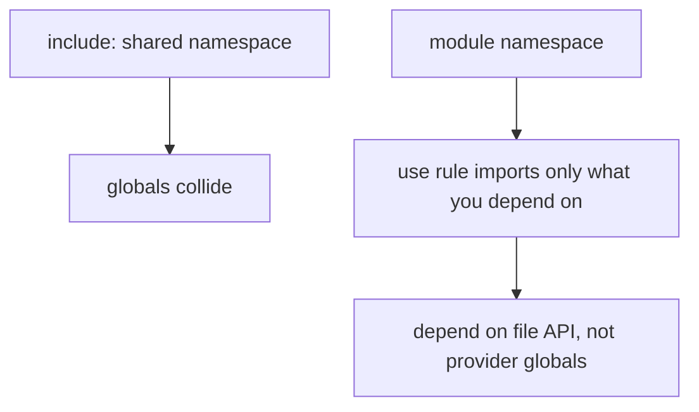
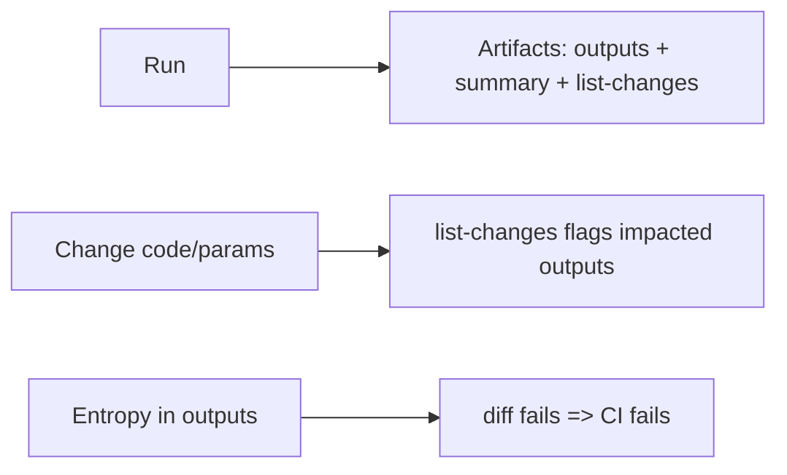
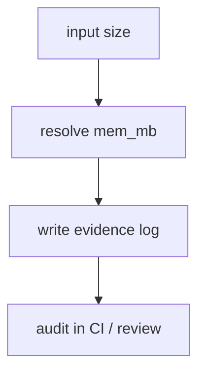

<a id="top"></a>

# Module 04: Scaling Workflows and Interface Boundaries


<!-- page-maps:start -->
## Module Position




<!-- page-maps:end -->

Read the first diagram as a placement map: this page sits between the course promise, the lesson pages listed below, and the capstone surfaces that pressure-test the module. Read the second diagram as the study route for this page, so the diagrams point you toward the `Lesson map`, `Exercises`, and `Closing criteria` instead of acting like decoration.

Module 04 turns one working workflow into a repository another engineer can still review.
Interfaces, file APIs, module boundaries, and CI gates matter because they keep growth
from turning into hidden coupling.

Capstone exists here as corroboration. The module should already make interface
boundaries meaningful before you inspect the repository layout and proof surfaces in the
reference workflow.

## Scaling Workflows and Interface Boundaries

> **Version & scope contract**
>
> * Target: **Snakemake 9.14.x** (CLI reporting, profiles, modules, schema validation).
> * This module is about **scaling correctness**, not tuning a specific cluster (Module 03) and not checkpoints/dynamic DAGs (Module 02).
> * Verify:
>
>   ```bash
>   snakemake --version
>   snakemake -h | sed -n '1,40p'
>   ```

---

## Why this module matters

Teams often say a workflow has “outgrown itself” when the real problem is that nobody
defined its interfaces. Files, schemas, modules, CI gates, and resource claims become
implicit, so every change starts to feel dangerous.

This module is about restoring that safety by making boundaries explicit enough that
workflows can scale in size, team count, and execution context without becoming fragile.

## Reading path

1. Start with module boundaries and file APIs.
2. Read CI and drift control after the interface story is clear.
3. Read resource semantics after you know what is being protected.
4. Finish with workflow-as-product thinking so scaling is understood as a contract problem.

## Capstone connection

The capstone’s `FILE_API.md`, workflow module layout, and confirmation targets are the concrete
expression of this module. If you want to see what “executor-proof semantics” means in one small
repository, this is the module that explains that shape.

## At a Glance

| Focus | Learner question | Capstone timing |
| --- | --- | --- |
| modular boundaries | "Where does one workflow responsibility end and another begin?" | inspect the capstone once interface boundaries already feel meaningful |
| file APIs | "Which paths are public contracts and which are internal detail?" | compare `FILE_API.md` with rule files intentionally |
| CI gates | "What should scale review protect before the workflow gets bigger?" | use confirmation targets as the operational side of the interface story |

---

## Orientation: scaling fails at boundaries

When a workflow “doesn’t scale”, it’s usually not CPU. It’s:

* hidden coupling across files,
* implicit file contracts,
* nondeterministic outputs,
* or resources that were never proved to the executor.

### Unified scaling model

> **Total scaling failure ≈ hidden coupling + implicit contracts + entropy + unproven resources + upgrade drift**



---

## Runnable lab (single repo, two assemblies)

You will have:

* **Module assembly** (real boundaries): `Snakefile`
* **Single-file sanity** (fast baseline): `Snakefile.reference`

### Golden layout



### `profiles/local/config.yaml`

```yaml
executor: local
cores: 2
printshellcmds: true
latency-wait: 5
```

### `config/config.yaml`

```yaml
results_prefix: "results/v1"
samples: ["A", "B"]
```

### `config/schema.yaml`

```yaml
type: object
required: [results_prefix, samples]
properties:
  results_prefix: {type: string, minLength: 1}
  samples:
    type: array
    minItems: 1
    items: {type: string, pattern: "^[A-Za-z0-9._-]+$"}
additionalProperties: false
```

### `workflow/contracts/FILE_API.md`

```md
# File API (v1)

Provider outputs:
- path: results/v1/provider/{sample}.upper.txt
- semantics: uppercase of data/{sample}.txt

Consumer outputs:
- path: results/v1/consumer/all.upper.txt
- semantics: concatenation of provider outputs in config.samples order

Breaking changes:
- Any change to output paths, patterns, or semantics => bump results_prefix to results/v2
```

### `data/A.txt`, `data/B.txt`

```bash
printf "hello a\n" > data/A.txt
printf "hello b\n" > data/B.txt
```

### Commissioning sequence (module assembly)

```bash
snakemake --profile profiles/local --lint
snakemake --profile profiles/local -n
snakemake --profile profiles/local --list-rules
snakemake --profile profiles/local --rulegraph mermaid-js > .proof/rulegraph.mmd
snakemake --profile profiles/local --cores 2
snakemake --profile profiles/local --summary > .proof/summary.txt
snakemake --profile profiles/local --list-changes code > .proof/list-changes.code.txt || true
```

**Expected invariants you can verify immediately:**

* `results/v1/consumer/all.upper.txt` exists and contains:

  ```
  HELLO A
  HELLO B
  ```
* `.proof/summary.txt` contains a header with the columns:

  ```
  filename  modification time  rule version  status  plan
  ```

---

## Core 1 — Modularity that scales: `include` vs `module` and real boundaries

## Learning objectives

You will be able to:

* Reproduce a silent correctness bug caused by `include:` namespace leakage.
* Replace it with a `module` boundary + explicit `use rule` imports.
* Prove the boundary using `--list-rules` and a stable file API.

## Definition

* `include:` merges Snakefiles into one namespace (globals can collide).
* `module` loads a workflow into its own namespace; `use rule ... from ...` imports explicitly.

## Semantics



## Failure signatures

* Dry-run target set changes with “no obvious reason”.
* Consumer changes provider behavior without touching provider code.

## Minimal repro (leak via `include`)

### `modules/provider/Snakefile`

```python
SAMPLES = ["A", "B"]

rule provider_make:
    input: "data/{sample}.txt"
    output: "results/v1/provider/{sample}.upper.txt"
    shell: "tr '[:lower:]' '[:upper:]' < {input} > {output}"
```

### `workflow/rules/consumer.smk` (bug: overwrites provider global)

```python
SAMPLES = ["A"]  # accidental narrowing

rule consumer_all:
    input:
        expand("results/v1/provider/{sample}.upper.txt", sample=SAMPLES)
    output:
        "results/v1/consumer/all.upper.txt"
    shell:
        "cat {input} > {output}"
```

### Top-level `Snakefile` (bad assembly)

```python
include: "modules/provider/Snakefile"
include: "workflow/rules/consumer.smk"

rule all:
    input: "results/v1/consumer/all.upper.txt"
```

Run:

```bash
snakemake --profile profiles/local -n
```

**Expected planning evidence (verbatim file set):**

* Planned input includes `results/v1/provider/A.upper.txt`
* Does **not** include `results/v1/provider/B.upper.txt`

## Fix pattern (module boundary + config-derived list)

### `workflow/rules/consumer.smk` (fixed: no globals)

```python
rule consumer_all:
    input:
        expand(f"{config['results_prefix']}/provider/{{sample}}.upper.txt", sample=config["samples"])
    output:
        f"{config['results_prefix']}/consumer/all.upper.txt"
    shell:
        "cat {input} > {output}"
```

### Top-level `Snakefile` (good assembly)

```python
from snakemake.utils import validate

configfile: "config/config.yaml"
validate(config, "config/schema.yaml")

module provider:
    snakefile: "modules/provider/Snakefile"

use rule provider_make from provider as provider_*

include: "workflow/rules/consumer.smk"

rule all:
    input: f"{config['results_prefix']}/consumer/all.upper.txt"
```

Run:

```bash
snakemake --profile profiles/local -n
```

**Expected planning evidence (verbatim file set):**

* Planned inputs include both:

  * `results/v1/provider/A.upper.txt`
  * `results/v1/provider/B.upper.txt`

## Proof hook

Provide:

* `snakemake --profile profiles/local --list-rules` output (before/after).
* Two dry-runs showing the target set changed exactly as described.

---

## Core 2 — Interface contracts: naming, schemas, versioned outputs, compatibility

## Learning objectives

You will be able to:

* Fail fast on bad config via schema validation.
* Classify changes as breaking/non-breaking mechanically.
* Force breaking changes to be explicit via `results_prefix` bump.

## Definition

A contract is **path + format + semantics**, written down and enforced.

## Semantics

* The config schema makes typos impossible to ignore.
* The file API doc makes upgrades reviewable.

## Failure signatures

* “It ran, but outputs are wrong” (schema drift or semantic drift).
* Typos accepted (missing strict schema).

## Minimal repro (schema failure must be immediate)

Break `config/config.yaml`:

```yaml
results_prefix: "results/v1"
samplez: ["A", "B"]
```

Run:

```bash
snakemake --profile profiles/local -n
```

**Expected failure evidence (verbatim fragment):**

* A validation error mentioning:

  * missing required property `samples`
  * unexpected property `samplez`

## Fix pattern

* Keep `additionalProperties: false`.
* Put breaking changes behind `results/v2/...`.

## Proof hook

Provide:

* The schema error excerpt.
* The fixed config + a successful `-n`.

---

## Core 3 — Determinism and drift control: CI as the correctness boundary

## Learning objectives

You will be able to:

* Demonstrate nondeterminism with a stable diff.
* Enforce a CI gate that catches entropy and drift.
* Produce drift artifacts (`--summary`, `--list-changes`) as PR evidence.

## Definition

Determinism means:

* stable plan for stable inputs,
* stable outputs for stable inputs,
* stable provenance signals.

## Semantics



## Failure signatures

* “CI is flaky” (time/RNG/unordered globs in outputs).
* Drift report is empty when it shouldn’t be (metadata dropped or bypassed).

## Minimal repro (prove entropy)

### `workflow/rules/entropy.smk`

```python
rule entropy_bad:
    output: f"{config['results_prefix']}/entropy.txt"
    shell:
        "python - << 'PY'\n"
        "import time\n"
        "print(time.time())\n"
        "PY\n"
        "> {output}"
```

Run twice and diff:

```bash
snakemake --profile profiles/local -F results/v1/entropy.txt
cp results/v1/entropy.txt /tmp/e1.txt
snakemake --profile profiles/local -F results/v1/entropy.txt
diff -u /tmp/e1.txt results/v1/entropy.txt && echo OK || echo NONDETERMINISTIC
```

**Expected output (verbatim):**

```
NONDETERMINISTIC
```

## Fix pattern

* Entropy goes to logs, not semantic outputs.
* If randomness is required, seed is config and becomes provenance.

## CI gate (minimal, enforceable)

### `ci/gate.sh`

```bash
#!/usr/bin/env bash
set -euo pipefail

snakemake --profile profiles/local --lint
snakemake --profile profiles/local -n
snakemake --profile profiles/local --cores 2
snakemake --profile profiles/local --summary > .proof/summary.txt
snakemake --profile profiles/local --list-changes code > .proof/list-changes.code.txt || true
```

## Proof hook

Provide:

* the failing diff (`NONDETERMINISTIC`) and the fixed diff (`OK`),
* `.proof/summary.txt` and `.proof/list-changes.code.txt`.

---

## Core 4 — Resource semantics with evidence: prove what the workflow asked for

## Learning objectives

You will be able to:

* Resolve dynamic resources deterministically from explicit evidence (input size).
* Prove resolved `threads` and `mem_mb` using log artifacts.
* Detect oversubscription failures before cluster execution.

## Definition

Resource correctness is not “I wrote `resources:`”. It is:

* the workflow resolved concrete values,
* evidence was produced,
* and the executor could have enforced them.

## Semantics (portable evidence)



## Failure signatures

* “Resources ignored” (no evidence exists; you’re guessing).
* Oversubscription (threads > available cores) causes stalls/rejections.

## Minimal repro (resource evidence logs)

### `workflow/rules/resources.smk`

```python
def mem_mb_from_input(wc, input):
    # deterministic; scale with size for demonstration
    return max(200, int(2 * input.size_mb) + 200)

rule resource_probe:
    input: "data/{sample}.txt"
    output: f"{config['results_prefix']}/resources/{{sample}}.done.txt"
    log: "logs/resources/{sample}.txt"
    threads: 2
    resources:
        mem_mb=mem_mb_from_input
    shell:
        r"""
        printf "sample={wildcards.sample}\nthreads={threads}\nmem_mb={resources.mem_mb}\ninput={input}\n" > {log}
        echo OK > {output}
        """
```

Make B large:

```bash
python - << 'PY'
with open("data/B.txt","w") as f:
    f.write("x" * 5_000_000 + "\n")
PY
```

Run:

```bash
snakemake --profile profiles/local results/v1/resources/A.done.txt results/v1/resources/B.done.txt
echo "=== A ==="; cat logs/resources/A.txt
echo "=== B ==="; cat logs/resources/B.txt
```

**Expected log evidence (verbatim lines present in both):**

```
sample=...
threads=2
mem_mb=...
input=data/...
```

And **B’s `mem_mb` must be > A’s**.

## Fix pattern

* Defaults belong in profile; rule-level resources are exceptions.
* Any “special” rule must emit an evidence log of resolved resources.

## Proof hook

Provide:

* `logs/resources/A.txt` and `logs/resources/B.txt`,
* and one sentence: “B mem_mb > A mem_mb (evidence above).”

---

## Core 5 — Workflow as a product: distribution, pinning, upgrade paths, team practice

## Learning objectives

You will be able to:

* Make a breaking change that is mechanically explicit (v1 → v2).
* Prove a non-breaking refactor does not perturb consumers.
* Encode team review rules that prevent silent breakage.

## Definition

A workflow is a versioned product:

* stable file API,
* pinned dependencies,
* explicit upgrade paths.

## Semantics (breaking change demo, isolated and concrete)

### Step 1: baseline (v1)

Confirm:

```bash
snakemake --profile profiles/local --cores 2
snakemake --profile profiles/local --summary | grep -E "results/v1/provider|results/v1/consumer" | head
```

### Step 2: introduce a breaking change (format semantics)

Change provider to output **lowercase** instead of uppercase (breaking semantics) but keep the path the same (this is the *mistake*).

Edit `modules/provider/Snakefile`:

```python
rule provider_make:
    input: "data/{sample}.txt"
    output: "results/v1/provider/{sample}.upper.txt"
    shell: "cat {input} > {output}"  # now wrong semantics for v1
```

Run:

```bash
snakemake --profile profiles/local -F --cores 2
head -n 2 results/v1/consumer/all.upper.txt
```

**Expected evidence (verbatim):**

```
hello a
hello b
```

This proves: **semantic breaking change silently shipped under v1 path**.

### Step 3: correct governance (bump to v2)

Fix by bumping `results_prefix` in `config/config.yaml`:

```yaml
results_prefix: "results/v2"
samples: ["A", "B"]
```

Update `workflow/contracts/FILE_API.md` to “File API (v2)” and describe the new semantics.
Run:

```bash
snakemake --profile profiles/local --cores 2
ls -1 results/v2/provider | head
```

**Expected evidence (verbatim path change):**

* outputs now exist under `results/v2/...`
* v1 remains intact unless explicitly cleaned

## Fix pattern (team checklist)

A PR is not reviewable without:

* `snakemake --lint`
* `snakemake -n`
* `.proof/summary.txt`
* `.proof/list-changes.*.txt`
* FILE_API.md diff if anything about outputs changed

## Proof hook

Provide:

* the `head` output showing silent semantic break under v1,
* the config + contract bump to v2,
* and a directory listing proving v2 outputs exist.

---

## Debugging playbook: scaling boundary failures

| Symptom                   | Command                    | Evidence                 | Likely cause          | First fix                              |
| ------------------------- | -------------------------- | ------------------------ | --------------------- | -------------------------------------- |
| Targets shrink/expand     | `snakemake -n`             | planned file set differs | include leakage       | module boundary + config-derived lists |
| Config typos accepted     | `snakemake -n`             | no validation error      | missing strict schema | `validate(config, schema)`             |
| CI flaky                  | `diff`                     | NONDETERMINISTIC         | entropy in outputs    | move entropy to logs; seed via config  |
| Unsure what changed       | `--list-changes code`      | impacted outputs listed  | drift                 | attach drift artifact; rerun targeted  |
| Resource claims untrusted | `cat logs/resources/*.txt` | threads/mem logged       | unproved resources    | evidence logs per rule                 |
| Module import surprises   | `--list-rules`             | unexpected rules present | wildcard import       | import only required rules             |

---

## `Snakefile` (module assembly, final)

```python
from snakemake.utils import validate

configfile: "config/config.yaml"
validate(config, "config/schema.yaml")

include: "workflow/rules/consumer.smk"
include: "workflow/rules/entropy.smk"
include: "workflow/rules/resources.smk"

module provider:
    snakefile: "modules/provider/Snakefile"

use rule provider_make from provider as provider_*

rule all:
    input:
        f"{config['results_prefix']}/consumer/all.upper.txt",
        f"{config['results_prefix']}/entropy.txt",
        f"{config['results_prefix']}/resources/A.done.txt",
        f"{config['results_prefix']}/resources/B.done.txt"
```

---

## `Snakefile.reference` (single-file sanity, final)

```python
from snakemake.utils import validate

configfile: "config/config.yaml"
validate(config, "config/schema.yaml")

SAMPLES = config["samples"]
P = config["results_prefix"]

rule all:
    input:
        f"{P}/consumer/all.upper.txt",
        f"{P}/entropy.txt",
        f"{P}/resources/A.done.txt",
        f"{P}/resources/B.done.txt"

rule provider_make:
    input: "data/{sample}.txt"
    output: f"{P}/provider/{{sample}}.upper.txt"
    shell: "tr '[:lower:]' '[:upper:]' < {input} > {output}"

rule consumer_all:
    input:
        expand(f"{P}/provider/{{sample}}.upper.txt", sample=SAMPLES)
    output:
        f"{P}/consumer/all.upper.txt"
    shell:
        "cat {input} > {output}"

rule entropy_bad:
    output: f"{P}/entropy.txt"
    shell:
        "python - << 'PY'\n"
        "import time\n"
        "print(time.time())\n"
        "PY\n"
        "> {output}"

def mem_mb_from_input(wc, input):
    return max(200, int(2 * input.size_mb) + 200)

rule resource_probe:
    input: "data/{sample}.txt"
    output: f"{P}/resources/{{sample}}.done.txt"
    log: "logs/resources/{sample}.txt"
    threads: 2
    resources:
        mem_mb=mem_mb_from_input
    shell:
        r"""
        printf "sample={wildcards.sample}\nthreads={threads}\nmem_mb={resources.mem_mb}\ninput={input}\n" > {log}
        echo OK > {output}
        """
```

Run sanity:

```bash
snakemake --profile profiles/local -s Snakefile.reference --cores 2
```

---

## Closing recap

Scaling Snakemake is boundary engineering:

1. **Modules** enforce explicit dependencies; includes invite silent coupling.
2. **Schemas + file API docs** turn correctness into something you can prove.
3. **CI gates** kill entropy early.
4. **Resources** must produce evidence artifacts; otherwise they are folklore.
5. **Breaking changes** must be path/version changes, not “refactors”.
