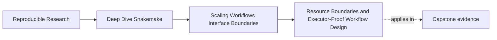
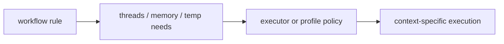

# Resource Boundaries and Executor-Proof Workflow Design

<!-- page-maps:start -->
## Page Maps

<!-- page-maps:end -->

As repositories grow, teams often start talking about resources as if they were only a
scheduler problem.

That is too weak for a course about workflow boundaries.

Module 04 treats resources as part of the design question:

> can the workflow explain its own resource assumptions without being secretly tied to one executor story?

That is what executor-proof workflow design means here.

## Resources are a boundary between workflow intent and runtime policy

Resource declarations matter because they describe what a rule expects:

- threads
- memory
- disk or temporary space
- runtime shape that another context must still understand

The exact scheduler mapping may vary by executor. The workflow-side meaning should remain
coherent.

That is why resource thinking belongs in this module, not only in operations.

## Executor-proof does not mean executor-agnostic in every detail

The repository is allowed to run in:

- local mode
- CI
- a scheduler-backed context

Those contexts will not look identical.

Executor-proof means something narrower and more useful:

- the workflow still explains what one rule needs
- the interface does not collapse when the executor changes
- policy layers adapt the context without rewriting workflow meaning

That is a much more realistic standard than pretending executors do not matter.

## Resource declarations should help humans review the graph

A good resource story lets a reviewer say:

- this rule is heavier than that one
- this module boundary aggregates many per-sample jobs
- this executor-facing policy is adapting a known workflow-side claim

If resources live only in one scheduler template or one maintainer's shell habits, the
workflow becomes harder to scale safely.

## One healthy model

This picture matters because the workflow should still explain the left side even when the
right side changes.

## Weak resource design

Weak shape:

- one rule has hidden heavy behavior
- no resource story is visible at the workflow boundary
- the scheduler layer compensates through tribal settings

That may run for a while. It does not scale reviewably.

## Stronger resource design

Stronger shape:

- rule families expose which work is light versus heavy
- the workflow names resource-relevant distinctions where they matter
- executor or profile policy adapts those distinctions for context

This keeps the workflow-side contract readable while still allowing operational variation.

## Why this belongs with scaling

As repositories grow, resource misunderstandings create the same symptoms as bad modular
boundaries:

- surprising failures
- hidden coupling
- context-specific breakage
- fear of changing the repository

That is why resource declarations should be reviewable alongside rule splits, file APIs,
and gates.

## Common failure modes

| Failure mode | What it looks like | Better repair |
| --- | --- | --- |
| rule resource needs live only in scheduler policy | the workflow graph hides which work is expensive | surface workflow-side resource distinctions more clearly |
| resource settings are copied blindly across unrelated rule families | one module boundary stops matching real work shape | name resource-relevant differences per concern |
| executor changes require workflow rewrites | the repository is too tied to one runtime story | keep executor adaptation in policy layers where possible |
| reviewers cannot tell which jobs are heavy | scaling discussions become anecdotal | make heavy boundaries visible in rule organization or contract docs |
| resource tweaks bypass review surfaces | operational drift becomes harder to explain | treat resource changes like other scaling-boundary changes |

## The explanation a reviewer trusts

Strong explanation:

> the workflow distinguishes lightweight orchestration from heavier per-sample processing,
> and executor-facing policy adapts those resource needs by context; the repository can
> therefore scale across contexts without hiding which rule families are actually expensive.

Weak explanation:

> resources are handled somewhere in the cluster setup, so the workflow does not need to say much.

The strong version keeps the contract visible. The weak version pushes the boundary out of
review.

## End-of-page checkpoint

Before leaving this page, you should be able to:

- explain what executor-proof means in this course
- describe why resource declarations are part of workflow design rather than only scheduler configuration
- name one sign that a repository is hiding resource assumptions badly
- explain how resource review fits beside modularity and interface review
