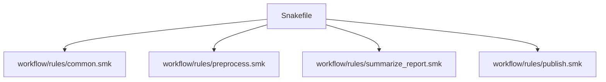

# Rule Families, Includes, and Named Ownership

The first scaling decision is usually simpler than teams make it sound:

> does this workflow need more boundaries, or does it only need clearer ownership?

Many repositories split too early and end up with more files but less clarity. This page
is about the first healthy split: rule families with named ownership.

## A larger file is not automatically a modularity problem

When one `Snakefile` grows, teams often reach for file splits because the file feels long.

Length can matter. It is not the real test.

The real questions are:

- can a reviewer still explain which rules belong together
- can they name where one workflow concern begins and ends
- does the visible DAG stay easier to read after the split

If the answer is no, the split is probably cosmetic rather than architectural.

## `include:` is for coherent rule families

`include:` is a good tool when:

- the repository still owns one visible workflow graph
- a set of rules clearly belongs to one concern
- the split improves human reading order

Typical examples:

- discovery and preprocessing rules
- summarization and reporting rules
- publish or verification rules

That is why the capstone keeps rule families under `workflow/rules/` while still using
one top-level `Snakefile` as the visible orchestration surface.

## The ownership test

Before creating a new rule file, try to say its job in one sentence.

Good sentence:

> `workflow/rules/publish.smk` owns promotion of reviewed internal results into the public publish boundary.

Weak sentence:

> this file has the extra stuff that did not fit anywhere else.

If the sentence is weak, the split is weak too.

## One healthy split



This is not impressive because it uses more files. It is impressive because each file has
named ownership and the top-level workflow story remains visible.

## What `include:` must not hide

An include-based split becomes harmful when it hides things such as:

- cross-cutting defaults that nobody can locate quickly
- wildcard assumptions that only exist in helper files
- path conventions that the top-level workflow never names
- a consumer-facing contract that now depends on private internal trivia

The rule is simple:

> if a reviewer has to open random helper files before they can explain the workflow, the split is already weakening the repository.

## A weak first split

Weak shape:

```text
workflow/rules/
  helpers.smk
  more_helpers.smk
  misc.smk
```

This fails because:

- ownership is unclear
- review order is unclear
- the names do not tell the reader which concern each file owns

It creates smaller files without creating better boundaries.

## A stronger split

Stronger shape:

```text
workflow/rules/
  common.smk
  preprocess.smk
  summarize_report.smk
  publish.smk
```

This works better because:

- the names correspond to real workflow concerns
- the reader can predict what each file should contain
- the top-level `Snakefile` still tells the orchestration story

That is named ownership.

## When to stop splitting

A repository can over-split just as easily as it can under-split.

Stop when:

- each rule family has one clear concern
- the top-level orchestration still reads as one visible graph
- opening another file would add indirection more than clarity

The goal is not to maximize file count. The goal is to make the workflow explainable.

## Common failure modes

| Failure mode | What it looks like | Better repair |
| --- | --- | --- |
| split by length only | files are shorter but ownership is still vague | split by named workflow concern |
| helper files absorb real workflow meaning | reviewers cannot explain rules from the visible graph | keep the contract visible from `Snakefile` and rule-family files |
| file names are generic | reading order becomes guesswork | name files by the workflow concern they own |
| one concern is scattered across many files | changes require repository archaeology | regroup rules under one owning family |
| `include:` is used for reusable sub-workflows with stable interfaces | boundaries stay too soft | consider a real module boundary instead |

## The explanation a reviewer trusts

Strong explanation:

> the repository still owns one visible workflow graph, but `workflow/rules/preprocess.smk`
> groups discovery and per-sample processing, while `workflow/rules/publish.smk` owns the
> public promotion boundary, so each file has named workflow ownership.

Weak explanation:

> we split the Snakefile because it was getting long.

The first explanation gives a boundary. The second gives a symptom.

## End-of-page checkpoint

Before leaving this page, you should be able to:

- explain when `include:` is the right first scaling tool
- describe one good rule-family boundary in one sentence
- name one sign that a split created indirection instead of clarity
- explain why file count is a weak proxy for modularity
