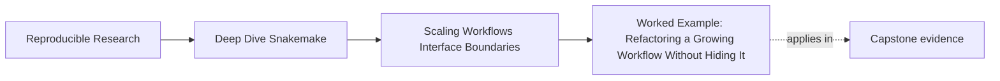

# Worked Example: Refactoring a Growing Workflow Without Hiding It


<!-- page-maps:start -->
## Page Maps




<!-- page-maps:end -->

This file ties the module together around one realistic problem:

> a workflow still works, but the repository has become large enough that every change feels risky.

The goal is not to make the repository look more "architectural." The goal is to make it
easier for another engineer to explain the workflow after the refactor.

## The starting situation

Assume a repository that already has:

- truthful rules
- explicit dynamic discovery where needed
- stable publish and production boundaries

The problem is growth:

- one `Snakefile` has become hard to read
- helper logic and path conventions are mixed together
- public versus internal files are not documented clearly
- CI runs, but reviewers cannot say which boundary each check protects

That is a good Module 04 starting point because the workflow is not broken. It is only
getting hard to trust at scale.

## Step 1: split by named rule ownership

The first repair is not a module. It is a rule-family split.

Move coherent concerns into files such as:

```text
workflow/rules/
  common.smk
  preprocess.smk
  summarize_report.smk
  publish.smk
```

This works because each file can now be explained in one sentence.

The repository is better not because there are more files, but because a reviewer can name
the ownership boundary quickly.

This is Core 1 becoming visible.

## Step 2: promote only real reusable boundaries into modules

Now ask whether one sub-workflow has a stable interface of its own.

If a QC bundle or screen bundle is reused with named inputs and outputs, that is a good
candidate for `workflow/modules/`.

If a split only hides details without clarifying an interface, it should stay an include.

This is Core 2:

- includes group one visible graph by ownership
- modules represent reusable workflow boundaries with explicit interfaces

## Step 3: document the file contract explicitly

The refactor is still weak if another engineer cannot tell which paths are public.

So add or strengthen `FILE_API.md`:

- define the stable publish paths
- explain the meaning of those files
- mark internal execution state as internal

This is Core 3: a growing repository needs a smaller, documented public contract instead
of letting `results/` become accidental API.

## Step 4: align gates with the new boundaries

After the split, CI should answer real review questions:

- does lint still pass
- does the workflow still plan correctly
- does the rule surface still look the way the repository now claims
- does the public contract still verify

That means:

- a rulegraph or `--list-rules` review surface protects architecture visibility
- targeted verification protects public contract alignment
- stronger routes remain available when the claim expands

This is Core 4: gates defend named boundaries instead of adding generic noise.

## Step 5: keep executor-facing assumptions explainable

Finally, the team reviews resources and executor-facing assumptions.

The workflow should still explain:

- which rule families are heavier
- which policy layers adapt execution by context
- why the repository is not secretly tied to one scheduler story

This is Core 5: resource assumptions are part of scaling design, not hidden trivia.

## The repaired scaling story

By the end of the refactor, the repository can be described cleanly:

1. top-level orchestration stays visible
2. rule families are grouped by named ownership
3. reusable workflow bundles become modules only when the interface is explicit
4. public file contracts are documented separately from internal state
5. gates and proof routes protect the boundaries the repository actually claims

That is what it means to refactor a growing workflow without hiding it.

## Review questions for the repaired design

When you inspect a repository shaped like this, ask:

1. which split is only an include and which is a true module boundary
2. where is the public file contract documented
3. which gate would fail first if the refactor broke the visible workflow surface
4. which paths remain internal after the refactor
5. where are executor-facing assumptions explained without distorting workflow meaning

If those answers are visible, the module’s scaling story has landed.
