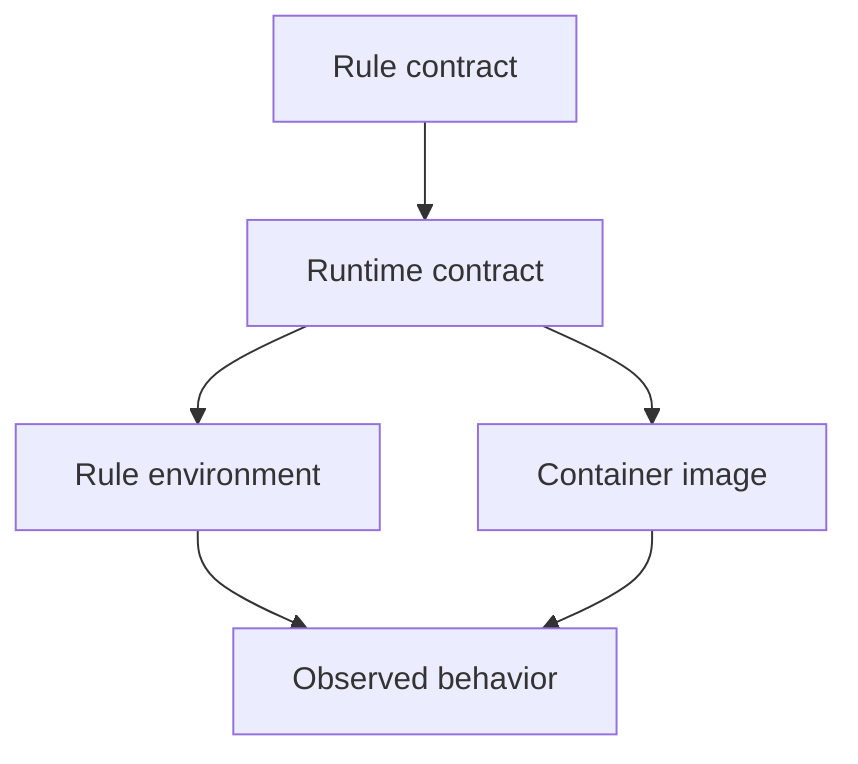

# Environments, Containers, and Runtime Contracts

Software boundaries are not only about where code lives.

They are also about where code runs.

That is why Snakemake learners eventually need a more serious idea than "use a conda
environment when packages get annoying."

An environment or container is a runtime contract.

It says:

- what software this step expects
- what versions matter
- what interpreter or binary family is assumed
- what must stay stable for a rerun to mean the same thing

That is a much better mental model than "dependency helper."

## A rule is not reproducible if its runtime is vague

Two rules can have identical inputs, outputs, and shell commands and still behave
differently if:

- one runs with a different Python version
- a CLI tool resolves to a different binary
- a library upgrade changes parsing or formatting behavior
- system packages differ across machines

This is why software boundaries belong in the course. Reproducibility is not only about
declaring files. It is also about declaring the runtime that gives those files meaning.

## Three common runtime surfaces

In the capstone, you can already see three distinct runtime surfaces:

- rule-scoped environments such as `workflow/envs/python.yaml`
- repository-level environments such as `environment.yaml`
- container definitions such as `Dockerfile`

These are not interchangeable just because they all mention software.

They answer different questions.

## One useful comparison

| Runtime surface | Best use | Main promise |
| --- | --- | --- |
| rule-scoped environment | a rule or small group of rules needs a declared toolchain | this step runs with the software it was designed for |
| repository environment | contributors need a shared authoring or development baseline | people can work on the repository without guessing setup |
| container image | a larger execution boundary needs portable system-level consistency | this workflow can move across machines with fewer hidden system assumptions |

Pedagogically, this comparison matters because learners often try to make one of these
surfaces solve every problem.

That usually creates confusion.

## The contract should sit close to the step it protects

When a rule depends on a particular Python stack, a rule-scoped environment keeps the
dependency boundary reviewable.

Conceptually:

```python
rule build_provenance:
    input:
        "publish/v1/results.tsv"
    output:
        "publish/v1/provenance.json"
    conda:
        "workflow/envs/python.yaml"
    script:
        "workflow/scripts/provenance.py"
```

This teaches something important.

The rule is saying that the file contract and the runtime contract belong together.

That makes review easier:

- the reviewer sees which step needs the environment
- the environment does not pretend to describe the whole repository
- the script can rely on declared software instead of ambient luck

## Containers solve a different class of uncertainty

A container earns its keep when system-level assumptions matter:

- OS packages
- shell tools
- compiled dependencies
- execution on infrastructure where host configuration is not trustworthy

That is why a `Dockerfile` is not just a larger environment file.

It is a stronger boundary.



The point of this diagram is not to glorify containers. It is to show that both
environments and containers shape behavior.

## A weak pattern

Weak shape:

- the rule assumes `python` exists
- the script imports libraries that are never declared
- the workflow works on one laptop because that laptop happens to be prepared already

This gives a false sense of simplicity. Nothing is explicit.

When the run fails elsewhere, the repository has not become "unlucky." It has revealed
that the runtime contract was missing.

## A stronger pattern

Stronger shape:

- keep authoring dependencies in the repository environment
- keep rule-specific runtime needs close to the rules that require them
- use a container when the machine boundary matters, not only when installation is hard

This makes the software story legible instead of magical.

## How to choose without overengineering

Ask these questions:

1. Is the uncertainty mostly a library or interpreter concern for one step?
2. Is the uncertainty about system-level behavior across machines?
3. Is this software boundary needed for authors, runners, or both?

If the answer is mostly "one step needs a declared toolchain," start with a rule-scoped
environment.

If the answer is "this must behave the same across machine families," a container may be
the right boundary.

If the answer is "contributors need a stable place to edit, lint, and test the repo,"
that is a repository environment concern.

## Common failure modes

| Failure mode | Why it hurts | Better repair |
| --- | --- | --- |
| one huge environment for every rule | tiny changes force unrelated runtime churn | split runtime contracts by actual ownership |
| rules rely on undeclared host tools | success depends on machine history | declare the tools in an environment or container |
| container used with no reason | review becomes heavier without better guarantees | use containers for real machine-boundary problems |
| environment files copied without explanation | learners memorize files instead of intent | explain which step or boundary the file protects |
| repository environment treated as workflow proof | runtime drift remains hidden at rule level | keep rule execution contracts explicit where needed |

## The explanation a reviewer trusts

Strong explanation:

> this rule uses `workflow/envs/python.yaml` because the provenance script has a specific
> Python dependency boundary; the repository-level environment remains for authoring, and
> the container is reserved for machine-level portability.

Weak explanation:

> we added more environment files because reproducibility is important.

The first explanation describes ownership. The second only gestures at virtue.

## End-of-page checkpoint

Before leaving this page, you should be able to:

- explain why runtime declarations belong to reproducibility, not only setup convenience
- distinguish rule-scoped environments from repository environments
- explain when a container solves a stronger problem than an environment file
- describe why the runtime contract should stay close to the rule it protects
