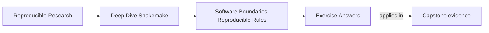
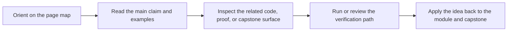

# Exercise Answers

<!-- page-maps:start -->
## Page Maps

<!-- page-maps:end -->

These answers are written as model explanations, not as the only acceptable wording.

The standard to aim for is clear ownership reasoning.

## Answer 1: Decide what stays in the rule

What should stay in the rule:

- declared inputs and outputs
- any simple parameter wiring that helps a reviewer understand file meaning
- the visible execution boundary for the step

What should move into `workflow/scripts/`:

- the non-trivial transformation logic owned by this step
- code that makes the rule hard to read but is still tightly coupled to this step

What should move into `src/`:

- parsing logic that another reporting step will also need
- reusable helpers that deserve direct tests outside Snakemake

Why:

The rule should remain the place where the file contract is obvious. Step-local
implementation belongs in a script. Reusable logic belongs in the repository's package
surface.

## Answer 2: Choose the right runtime boundary

Rule-scoped environment:

- declares the software needed by one step or a small cluster of closely related steps
- keeps the runtime boundary close to the rule that depends on it

Repository-level `environment.yaml`:

- gives contributors and workflow runners a shared baseline for working with the project
- supports authoring and whole-repository execution setup

Container definition:

- provides a stronger machine-level boundary when host differences are risky
- helps when OS tools, compiled dependencies, or infrastructure portability matter

Why they are not interchangeable:

They all describe software, but they protect different scopes. A repository environment is
too broad to explain every step. A rule-scoped environment is too narrow to replace a full
machine boundary. A container solves portability problems an environment file alone cannot.

## Answer 3: Diagnose a hidden dependency

Why it is a software-boundary problem:

- the visible rule contract is smaller than the real behavior
- a reviewer cannot trust the declared execution story

Risks:

- the file graph is misleading
- rebuild behavior may ignore a meaningful input
- publication review becomes weaker because software behavior is partially hidden

Repair:

- declare `config/report-style.yaml` in the rule if it materially affects the output
- keep the script as implementation, not as a place to invent undeclared dependencies

The core principle is simple: meaningful inputs should stay visible at the rule boundary.

## Answer 4: Review a wrapper adoption decision

A strong review comment would delay adoption for now:

> I would not merge this wrapper change yet. The shorter rule is not enough benefit unless
> we can explain the wrapper's tool version assumptions, runtime requirements, and visible
> file contract. Right now the wrapper reduces local readability but also reduces review
> confidence. If we can document what it runs and why that contract is acceptable, then the
> wrapper may become a net improvement.

Why this is the right reasoning:

- the question is whether the wrapper increases clarity
- if it hides behavior the team cannot review, it weakens the software boundary

## Answer 5: Plan a rebuild after software drift

Why outputs may no longer be trustworthy:

- helper code under `src/capstone/` can change output meaning even with unchanged inputs
- a runtime change in `workflow/envs/python.yaml` can alter execution behavior

Evidence to request before approval:

- confirmation that affected outputs were rebuilt
- provenance showing the new repository revision and runtime context
- a review explanation connecting the software change to the rebuilt artifacts

What provenance should accompany the rebuilt outputs:

- repository revision or release identifier
- relevant runtime declaration or software versions
- execution timestamp
- any workflow configuration that materially affects meaning

The main lesson is that unchanged input datasets do not cancel software drift.

## Self-check

If your answers consistently explain:

- who owns the file contract
- where the implementation belongs
- which runtime boundary matters
- what evidence supports rebuilt trust

then you are using the module correctly.
