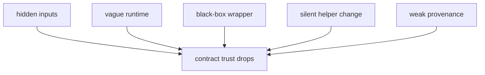

# Failure Modes at the Software Boundary

The easiest way to understand software boundaries is to study how they fail.

Most repositories do not become confusing because someone explicitly decides to hide
meaning. They become confusing because small shortcuts accumulate:

- a helper script reads one more file than the rule declares
- a wrapper pulls in behavior nobody reviews
- an environment file expands until no one knows what it protects
- a package helper quietly changes output meaning

This page turns those patterns into things you can recognize early.

## Failure mode 1: the rule contract is smaller than the real behavior

This happens when a script or helper code reads files that are not declared in the rule.

The rule claims one execution story. The software performs another.

Why it matters:

- DAG review becomes misleading
- rerun logic can miss meaningful dependencies
- future maintainers cannot trust the visible contract

Better repair:

- keep meaningful file dependencies declared in the rule
- treat helper code as implementation, not as a place to invent hidden inputs

## Failure mode 2: giant helper code with no ownership signal

Sometimes a repository creates a `helpers.py` or `utils.py` that slowly absorbs
everything.

The problem is not the filename by itself. The problem is that ownership disappears.

No one can tell:

- which rules depend on which helpers
- which code is step-local and which code is reusable
- what deserves direct tests

Better repair:

- split step-local scripts from reusable package code
- give modules names that describe domain intent rather than generic utility status

## Failure mode 3: environment declarations drift away from the steps they protect

This happens when a repository has runtime files, but nobody can explain their scope.

Symptoms:

- one environment file is shared by unrelated rules
- dependency changes are merged with no step-level reasoning
- runtime failures are debugged by trial and error

Better repair:

- keep runtime contracts near the rules they protect when possible
- document whether a file serves authoring, execution, or portability

## Failure mode 4: wrappers are adopted as black boxes

Wrappers can reduce noise, but they also create distance from the executed behavior.

That becomes dangerous when the team cannot explain:

- which tool version is being invoked
- which runtime assumptions the wrapper brings
- which file relationships remain visible versus hidden

Better repair:

- treat wrapper adoption as a review decision
- document why the wrapper improves clarity rather than obscures it

## Failure mode 5: provenance is weaker than publication claims

This happens when published results look polished but the software story is thin.

Symptoms:

- no clear record of repository revision
- runtime information missing from publication artifacts
- no easy way to explain whether helper-code edits triggered a rebuild

Better repair:

- emit provenance next to outputs that will travel outside the repo
- keep rebuild evidence strong enough for a reviewer to defend the result

## One diagnostic map

This is useful because the visible symptom is often just "the workflow feels brittle."

The real causes are usually more specific.

## A review checklist that actually helps

When reviewing a workflow change, ask:

1. Does the rule still declare the meaningful files?
2. Is the software ownership clear between rule, script, package, and wrapper?
3. Can we explain which runtime boundary this step depends on?
4. Would a helper-code or environment change obviously trigger rebuild thinking?
5. Will a future reviewer be able to defend the resulting artifact?

These questions are not bureaucracy. They are shortcuts to better judgment.

## Common anti-explanations

Weak explanation:

> it works locally, and the rest is implementation detail.

Why it fails:

- software boundaries are exactly where implementation detail becomes workflow meaning

Weak explanation:

> the wrapper handles that for us.

Why it fails:

- responsibility still belongs to the repository adopting the wrapper

Weak explanation:

> we can rebuild later if needed.

Why it fails:

- without clear provenance and ownership, "later" becomes guesswork

## The explanation a reviewer trusts

Strong explanation:

> the rule declares all meaningful inputs, the transformation code is owned by a named
> software surface, the runtime is explicit, and the publication output records enough
> provenance to explain a rebuild.

That explanation sounds simple because the repository structure has done the hard work.

## End-of-page checkpoint

Before leaving this page, you should be able to:

- name five concrete software-boundary failure patterns
- explain why hidden inputs are more dangerous than untidy code style
- describe how wrappers and environments can reduce or increase clarity
- explain why strong provenance is part of error prevention, not only documentation
