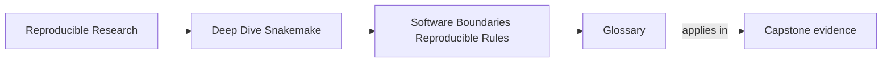
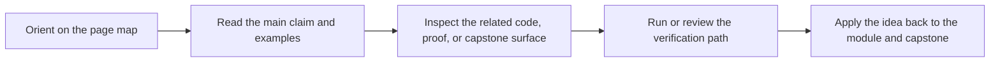

# Glossary

<!-- page-maps:start -->
## Page Maps

<!-- page-maps:end -->

This glossary keeps the language of Module 05 stable. The goal is not to impress you with
terminology. The goal is to make sure the same words keep the same meaning across lessons,
reviews, exercises, and capstone work.

## Terms

| Term | Meaning in this module |
| --- | --- |
| file contract | The visible rule-level declaration of meaningful inputs, outputs, params, and execution boundaries. |
| software boundary | The line between workflow orchestration and the software surfaces that implement behavior. |
| step-local code | Code owned by one workflow step, often a good fit for `workflow/scripts/`. |
| reusable package code | Logic under `src/` that deserves imports, tests, and reuse across steps. |
| runtime contract | The declared software environment or container boundary that gives a step stable execution meaning. |
| repository environment | A project-level software baseline for contributors and whole-repository workflow execution. |
| rule-scoped environment | A smaller runtime declaration attached to one rule or a small group of rules. |
| container boundary | A stronger machine-level execution surface used when host differences matter materially. |
| wrapper | A reusable command surface around an external tool that should reduce repeated plumbing without hiding meaning. |
| hidden dependency | A meaningful file or runtime requirement used by the implementation but not visible in the rule contract. |
| provenance artifact | A recorded file that travels with outputs and explains the software context of a run. |
| software drift | A change in helper code, runtime, or tool behavior that can invalidate output trust even when input files do not change. |
| rebuild evidence | The combination of rerun results and recorded software context that lets a reviewer trust new outputs. |
| publication trust | The degree to which released artifacts can still be defended after the run has finished. |
| ownership boundary | The answer to who owns orchestration, implementation, runtime, and review explanation for a workflow step. |

## How to use these terms

If a workflow change becomes hard to review, ask which term has become vague:

- is the file contract incomplete?
- is the software boundary unclear?
- is the runtime contract missing?
- is the provenance artifact too weak?

That habit keeps the module practical.
