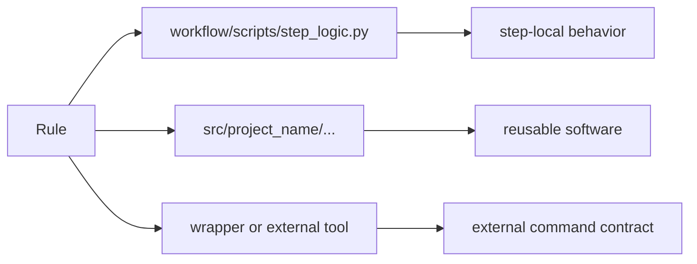

# Helper Code, Packages, and Reusable Boundaries

Once learners accept that some logic should move out of rules, the next question appears
immediately:

> where should that code live?

That question matters because not all software in a workflow repository has the same job.

Some code is close to one workflow step. Some code is reusable application logic. Some
code is a third-party wrapper with its own contract.

If those categories blur together, the repository becomes harder to explain and harder to
maintain.

## Three different homes mean three different kinds of ownership

The most useful split in a Snakemake repository is often this:

- `workflow/scripts/` for step-adjacent implementation
- `src/` for reusable package code
- wrappers for externally maintained command surfaces

These are not style preferences. They express different ownership boundaries.

## `workflow/scripts/` is close to the rule on purpose

Code under `workflow/scripts/` is a good fit when:

- one rule owns the behavior
- the code depends on the `snakemake` object or on step-local file contracts
- reuse outside that step is limited

The capstone's `workflow/scripts/provenance.py` is a useful example. Its job is tightly
connected to one publication-oriented step. That makes script-level ownership reasonable.

## `src/` is for software that deserves a normal program shape

Code under `src/` is a better fit when:

- several rules may need the same logic
- the code deserves direct imports and tests
- the logic is part of the project's domain model, not only workflow glue

The capstone already signals this by placing reusable package code under `src/capstone/`.

That layout tells future readers something important:

- this code is part of the repository's software surface
- it should be importable, testable, and understandable outside a Snakemake run

## Wrappers solve a different problem again

A wrapper is useful when:

- an external tool already has a stable invocation pattern
- repeating the same command plumbing across rules would add noise
- the wrapper's contract is understood and acceptable

But a wrapper is not a place to hide understanding.

If the team cannot explain:

- what the wrapper runs
- what files the rule truly depends on
- what software boundary the wrapper assumes

then the wrapper has reduced clarity rather than improved it.

## One comparison that helps

| Code home | Typical owner | Best use |
| --- | --- | --- |
| `workflow/scripts/` | the workflow step | meaningful step-local implementation |
| `src/` package code | the repository's software layer | reusable logic, tests, direct imports |
| wrapper | a stable external command surface | standard invocation without repeating plumbing |

This table gives learners a practical way to reason about placement without memorizing
rules blindly.

## A concrete split

The point is not that every rule must point to all three. The point is that each route
means something different.

## Weak placement

Weak shape:

- every non-trivial script gets dropped into `workflow/scripts/`
- package-worthy code never graduates into `src/`
- wrappers are adopted without reviewing the external behavior they bring in

This often feels quick in the short term. Two months later, nobody can tell which code is
step-local and which code is part of the reusable software layer.

## Strong placement

Strong shape:

- keep step-bound code close to the step
- promote real reusable logic into a package
- use wrappers when they reduce repeated command ceremony without hiding meaning

That gives the repository a readable shape.

## A practical test

Ask these questions about a piece of code:

1. Would I want to import and test this outside a Snakemake run?
2. Is this code tightly coupled to one step's file contract?
3. Am I relying on an external wrapper that the team can actually review?

If the answer to the first question is yes, `src/` is often the right home.

If the answer to the second question is yes, `workflow/scripts/` may be enough.

If the third question is no, a wrapper may be the wrong abstraction.

## Common failure modes

| Failure mode | What it causes | Better repair |
| --- | --- | --- |
| reusable logic trapped in one script | duplication and weak tests | promote the logic into package code under `src/` |
| package code reaches into workflow internals casually | ownership becomes muddy | keep file contracts and step wiring in the rule layer |
| wrappers used as black boxes | debugging becomes indirect | review the wrapper contract and document why it is acceptable |
| every helper stored under `scripts/` forever | repository shape stops signaling meaning | separate step-local code from reusable software |
| step-local code promoted too early | project structure becomes ceremonial | keep code near the step until reuse or testing need is real |

## The explanation a reviewer trusts

Strong explanation:

> this logic stays in `workflow/scripts/` because it is owned by one publication step,
> but the shared parsing helpers live under `src/capstone/` because they are reusable
> software that deserve direct tests.

Weak explanation:

> we put the important code in `src/` and the rest in scripts.

The strong explanation is about ownership and reuse. The weak one is about status.

## End-of-page checkpoint

Before leaving this page, you should be able to:

- explain when `workflow/scripts/` is the right home for code
- explain when code should move into `src/`
- describe what a wrapper should clarify rather than hide
- explain why repository layout is part of pedagogy and reviewability
