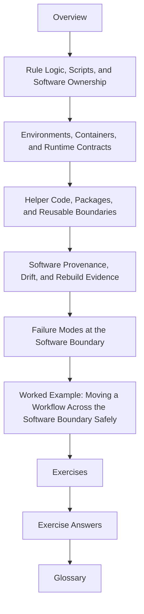

# Module 05: Software Boundaries and Reproducible Rules

Modules 01 to 04 teach workflow truth, dynamic discipline, production policy, and
repository scaling. Module 05 asks the next boundary question:

> where does Snakemake stop, and where should software implementation begin?

This module is about making that line explicit. Scripts, packages, environments,
containers, and helper code matter only when another engineer can still explain what the
workflow owns, what the software owns, and what changed when a run becomes unreproducible.

## What this module is for

By the end of this module, you should be able to explain five things in plain language:

- when logic belongs in a rule and when it belongs in a script or package
- how environments and runtime images become semantic workflow inputs
- how helper code can stay reusable without hiding file contracts
- what software provenance is needed to defend a rerun or code review later
- which failure modes mean "repair the workflow boundary" and which mean "repair the software boundary"

## Study route



Read the module in that order the first time. When you return later, jump straight to the
page that matches the software-boundary decision in front of you.

## The ten files in this module

1. Overview (`index.md`)
2. [Rule Logic, Scripts, and Software Ownership](rule-logic-scripts-and-software-ownership.md)
3. [Environments, Containers, and Runtime Contracts](environments-containers-and-runtime-contracts.md)
4. [Helper Code, Packages, and Reusable Boundaries](helper-code-packages-and-reusable-boundaries.md)
5. [Software Provenance, Drift, and Rebuild Evidence](software-provenance-drift-and-rebuild-evidence.md)
6. [Failure Modes at the Software Boundary](failure-modes-at-the-software-boundary.md)
7. [Worked Example: Moving a Workflow Across the Software Boundary Safely](worked-example-moving-a-workflow-across-the-software-boundary-safely.md)
8. [Exercises](exercises.md)
9. [Exercise Answers](exercise-answers.md)
10. [Glossary](glossary.md)

## How to use the file set

| If you need to... | Start here |
| --- | --- |
| decide whether logic should stay in a rule or move into software | [Rule Logic, Scripts, and Software Ownership](rule-logic-scripts-and-software-ownership.md) |
| treat env files, containers, and runtime surfaces as real workflow inputs | [Environments, Containers, and Runtime Contracts](environments-containers-and-runtime-contracts.md) |
| keep reusable helper code visible without hiding workflow semantics | [Helper Code, Packages, and Reusable Boundaries](helper-code-packages-and-reusable-boundaries.md) |
| explain what changed after a software or helper-code edit | [Software Provenance, Drift, and Rebuild Evidence](software-provenance-drift-and-rebuild-evidence.md) |
| diagnose failures that happen at the workflow-versus-software seam | [Failure Modes at the Software Boundary](failure-modes-at-the-software-boundary.md) |
| see the whole module as one safe refactor of workflow logic into software boundaries | [Worked Example: Moving a Workflow Across the Software Boundary Safely](worked-example-moving-a-workflow-across-the-software-boundary-safely.md) |
| test your own understanding | [Exercises](exercises.md) |
| compare your reasoning against a reference answer | [Exercise Answers](exercise-answers.md) |
| stabilize the module vocabulary | [Glossary](glossary.md) |

## The running question

Carry this question through every page:

> if this rule behaves differently on another machine, which part of the software boundary moved and where is that movement recorded?

Good Module 05 answers usually mention one or more of these:

- a rule that owns only orchestration while a script owns implementation
- an environment or image that changed workflow meaning
- a package or helper that stayed reusable without hiding undeclared inputs
- provenance that explains code or runtime drift
- a failure that shows the workflow and software boundary were drawn in the wrong place

## The running example

This module keeps returning to one practical repository shape:

- simple orchestration stays in Snakemake rules
- workflow-adjacent helpers live under `workflow/scripts/`
- reusable implementation code lives under `src/`
- environment and container surfaces make runtime expectations reviewable
- provenance artifacts explain what software actually ran

That is the smallest software-boundary story worth teaching.

## Commands to keep close

These commands form the evidence loop for Module 05:

```bash
snakemake -n -p
snakemake --summary
snakemake --list-changes code
make proof
```

They answer different questions:

- what the rule surface claims to do
- what the repository currently believes about outputs and rule ownership
- which code changes now justify reruns
- how the capstone packages software boundaries into one stronger proof route

## Learning outcomes

By the end of this module, you should be able to:

- keep rule files readable by moving the right logic into software boundaries
- treat environments and containers as explicit workflow inputs rather than local conveniences
- structure helper code so file contracts remain visible
- leave enough software evidence behind to explain reruns later
- recognize and repair failures that happen at the workflow-versus-software seam

## Exit standard

Do not move on until all of these are true:

- you can explain one case where logic should stay in a rule and one where it should move into software
- you can name one environment or image change that would count as semantic workflow drift
- you can say which helper code belongs in `workflow/scripts/` and which belongs in `src/`
- you can explain one rerun using software provenance or code-drift evidence
- you can classify one failure as a workflow-boundary problem or a software-boundary problem

When those become ordinary, Module 05 has done its job.
