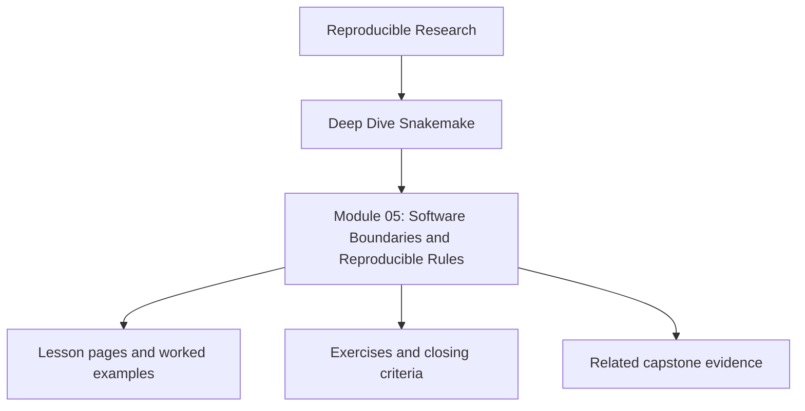
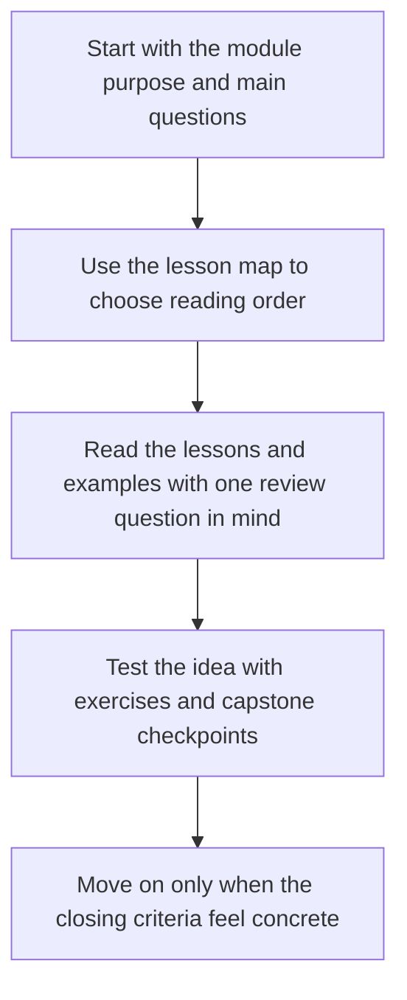

<a id="top"></a>

# Module 05: Software Boundaries and Reproducible Rules


<!-- page-maps:start -->
## Module Position




<!-- page-maps:end -->

Read the first diagram as a placement map: this page sits between the course promise, the lesson pages listed below, and the capstone surfaces that pressure-test the module. Read the second diagram as the study route for this page, so the diagrams point you toward the `Lesson map`, `Exercises`, and `Closing criteria` instead of acting like decoration.

Once a workflow is semantically correct, the next source of failure is usually the
boundary between Snakemake and the software it drives. Shell fragments grow into mini
programs, Python imports leak across environments, wrappers hide assumptions, and a rule
that looked truthful on one machine becomes irreproducible somewhere else.

This module is about keeping that boundary explicit: what belongs in workflow logic, what
belongs in a script or package, what belongs in an environment definition, and what must
be recorded as software evidence if another person is going to trust the run.

Capstone exists here as corroboration. The local exercises should already make the
workflow-versus-software boundary clear before you inspect the reference environments,
scripts, and package layout.

### Before You Begin

This module works best after Modules 01-04, especially the parts on file contracts,
dynamic DAGs, profiles, and modular workflow boundaries.

Use this module if you need to learn how to:

* decide when rule logic should stay in `shell:` versus move to `script:` or a Python package
* keep Conda, containers, and helper code from silently changing workflow meaning
* make software provenance visible enough that reruns can be defended later

Proof loop for this module:

```bash
snakemake -n -p
snakemake --summary
snakemake --list-changes code
```

Capstone corroboration:

* inspect `capstone/workflow/envs/python.yaml`
* inspect `capstone/workflow/scripts/provenance.py`
* inspect `capstone/src/capstone/`
* inspect `capstone/environment.yaml` and `capstone/Dockerfile`

### At a Glance

| Focus | Learner question | Capstone timing |
| --- | --- | --- |
| rule-versus-program logic | "What belongs in the workflow and what belongs in code?" | inspect scripts and packages only after the workflow contract itself is clear |
| software stacks | "Which environment choices are part of workflow meaning?" | compare environment files, Docker surface, and provenance deliberately |
| provenance | "What software evidence is necessary to defend a rerun later?" | use the capstone as a small but complete example |

---

<a id="toc"></a>
## 1) Table of Contents

1. [Table of Contents](#toc)
2. [Learning Outcomes](#outcomes)
3. [How to Use This Module](#usage)
4. [Core 1 — Rule Logic Versus Program Logic](#core1)
5. [Core 2 — Environments as Workflow Inputs](#core2)
6. [Core 3 — Scripts, Wrappers, and Reusable Boundaries](#core3)
7. [Core 4 — Software Provenance and Rebuild Evidence](#core4)
8. [Core 5 — Failure Modes at the Tool Boundary](#core5)
9. [Capstone Sidebar](#capstone)
10. [Exercises](#exercises)
11. [Closing Criteria](#closing)

---

<a id="outcomes"></a>
## 2) Learning Outcomes

By the end of this module, you can:

* decide which logic belongs in Snakemake and which belongs in a script, wrapper, or package
* treat environments, containers, and wrapper versions as semantic workflow inputs
* structure helper code so rules stay readable without hiding the file contract
* record enough software provenance to explain a rerun or a change review
* recognize when a workflow has become “correct only on one machine”

[Back to top](#top)

---

<a id="usage"></a>
## 3) How to Use This Module

Build a local lab with three layers:

```text
lab/
  workflow/
    Snakefile
    envs/
      python.yaml
    scripts/
      summarize_qc.py
  src/
    labtools/
      __init__.py
      metrics.py
  data/
  config/
```

Use it to practice one rule in each style:

1. a small `shell:` rule that stays readable
2. a `script:` rule that calls reusable Python logic
3. an environment-backed rule whose software stack is part of the workflow contract

The goal is not to use every Snakemake directive. The goal is to make the boundary
between workflow semantics and program behavior auditable.

[Back to top](#top)

---

<a id="core1"></a>
## 4) Core 1 — Rule Logic Versus Program Logic

Snakemake should describe:

* declared inputs and outputs
* parameters that matter to the file contract
* resource claims
* the execution boundary for one step

It should not become the place where you hide a full parser, a mini report generator, or
domain logic that would be clearer as tested code.

Use this rule of thumb:

| Situation | Better home |
| --- | --- |
| a short single-purpose command | `shell:` |
| non-trivial data transformation | `script:` |
| reusable project logic | Python package under `src/` |
| third-party maintained step | `wrapper:` or external tool call |

If the rule body is hard to review but the helper code is also invisible, you have made
the workflow harder to trust instead of easier to maintain.

[Back to top](#top)

---

<a id="core2"></a>
## 5) Core 2 — Environments as Workflow Inputs

An environment file is not just convenience. It is part of the workflow’s meaning.

If a rule depends on:

* specific package versions
* a Python interpreter with certain libraries
* a container image
* a wrapper revision

then that dependency belongs in the workflow contract just as much as an input FASTQ file
or a configuration parameter.

Good practice:

* keep per-rule environments small and purposeful
* reuse environments intentionally instead of solving a new one for every rule
* pin what must stay stable
* make the environment location and policy visible in code review

Bad practice:

* relying on the developer shell implicitly
* mixing host-installed tools with Conda-managed ones without recording the boundary
* changing `environment.yaml` and then acting surprised when code-change reports matter

[Back to top](#top)

---

<a id="core3"></a>
## 6) Core 3 — Scripts, Wrappers, and Reusable Boundaries

Reuse is valuable only if the reader can still answer:

* what files does this rule read and write?
* which parameters change its meaning?
* where is the real computation implemented?

Healthy reuse patterns:

* `script:` for project-owned logic whose inputs/outputs are still declared in the rule
* `src/` package code with unit tests for pure logic
* wrappers only when their version and assumptions are explicit
* helper libraries that reduce shell duplication without hiding the file graph

Unhealthy reuse patterns:

* giant `run:` blocks that mix DAG logic and Python implementation
* helper code that reads undeclared files from the repo
* wrappers copied into the repository with no version story
* import paths that work only because the current shell happens to be configured a certain way

[Back to top](#top)

---

<a id="core4"></a>
## 7) Core 4 — Software Provenance and Rebuild Evidence

You do not need to record every microscopic detail of an execution environment, but you do
need enough evidence to answer “what changed?” later.

Useful software evidence includes:

* environment files and container references kept in version control
* provenance JSON describing tool versions and workflow revision
* `--summary` and `--list-changes code` output when reviewing reruns
* unit tests for helper code that is outside the Snakefile

The important distinction is between:

* workflow semantics
* execution policy
* software evidence

When those are separated cleanly, a code review can tell whether a rerun came from a file
contract change, a helper-code change, or an environment change.

[Back to top](#top)

---

<a id="core5"></a>
## 8) Core 5 — Failure Modes at the Tool Boundary

Practice recognizing these failure modes:

* a rule works locally because the helper package is importable only from your shell
* a Conda environment changed but no one treated it as a meaningful workflow change
* a wrapper hides extra downloads or side effects that are not declared in the rule
* a long shell block silently became the least tested program in the repository
* a helper script writes files that are not declared in `output:`

The repair loop:

1. decide whether the logic belongs in the workflow, a script, or a package
2. declare the environment or container boundary explicitly
3. make helper code testable outside Snakemake
4. record provenance that explains software drift without drowning the learner in noise

[Back to top](#top)

---

<a id="capstone"></a>
## 9) Capstone Sidebar

Use the capstone to inspect:

* `workflow/envs/python.yaml` as a per-workflow software contract
* `workflow/scripts/provenance.py` as a controlled `script:` boundary
* `src/capstone/` as reusable project-owned logic with tests
* `environment.yaml` and `Dockerfile` as runtime policy surfaces outside the rule bodies

[Back to top](#top)

---

<a id="exercises"></a>
## 10) Exercises

1. Move one overly long `shell:` block into a tested Python script without changing the file contract.
2. Add a rule-specific environment and explain why its packages are semantic inputs rather than local convenience.
3. Generate a small provenance artifact that records helper-code and tool versions.
4. Intentionally break an import boundary, then repair it so the workflow no longer depends on your current shell.

[Back to top](#top)

---

<a id="closing"></a>
## 11) Closing Criteria

You pass this module only if you can demonstrate:

* one clear rule boundary between Snakemake logic and helper code
* one explicit environment or container contract that a reviewer can inspect
* software evidence that explains a meaningful change without guesswork
* helper code that stays reusable without hiding undeclared workflow behavior

[Back to top](#top)

## Directory glossary

Use [Glossary](glossary.md) when you want the recurring language in this module kept stable while you move between lessons, exercises, and capstone checkpoints.
