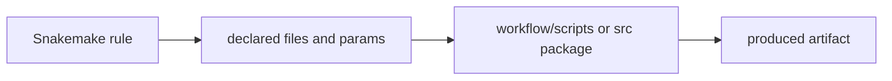

# Rule Logic, Scripts, and Software Ownership

The first software-boundary decision is usually the most common one:

> should this logic stay in the rule, or should it move into software?

If that question is answered badly, the repository often gets worse in two ways at once:

- rules become hard to review
- helper code becomes hard to trust

This page is about drawing that line well.

## Rules should own orchestration, not hidden programs

A Snakemake rule is strongest when it makes these things explicit:

- declared inputs and outputs
- parameters that affect file meaning
- resource claims
- the execution boundary for one step

That is orchestration.

Once a rule starts containing large parsing logic, data transformation logic, or report
generation logic, it is often becoming the least testable program in the repository.

That is the warning sign.

## What belongs comfortably in a rule

Rules are a good home for:

- short shell commands whose meaning is still obvious
- small glue logic that keeps the file contract readable
- explicit parameter passing into an external command or script

The important part is that a reviewer can still explain:

- what files this rule reads
- what files it writes
- what change would make it rerun

If that explanation becomes cloudy, the boundary is already weakening.

## What usually belongs in a script or package

Move logic out of the rule when it becomes:

- non-trivial data transformation
- reusable domain logic
- logic that deserves direct tests outside Snakemake
- code whose readability would improve if treated like a normal program

That is why the capstone keeps reusable processing code under `src/capstone/` and leaves
workflow-adjacent metadata generation in `workflow/scripts/`.

The rule should still own the file contract even when the implementation moves.

## One useful split



This picture matters because the rule is not replaced. It remains the place where the
file contract stays visible.

The script or package owns implementation, not workflow meaning by itself.

## A weak first draft

Weak shape:

```python
rule summarize:
    input:
        "results/raw.json"
    output:
        "publish/v1/summary.json"
    run:
        import json
        data = json.load(open(input[0]))
        # many lines of transformation and formatting logic here
        ...
```

This may work. It creates two problems:

- the rule body becomes the hidden implementation layer
- the logic is harder to test outside a workflow run

The repository now has software; it is just pretending it does not.

## A stronger rewrite

Stronger shape:

```python
rule summarize:
    input:
        "results/raw.json"
    output:
        "publish/v1/summary.json"
    script:
        "workflow/scripts/summarize.py"
```

Or, when the logic is reusable:

```python
rule summarize:
    input:
        "results/raw.json"
    output:
        "publish/v1/summary.json"
    shell:
        "python -m capstone.summarize --input {input} --output {output}"
```

This improves the repository only if the rule still tells the file story clearly and the
software boundary is explicit.

## `script:` and package code solve different problems

`script:` is a good fit when:

- the code is workflow-adjacent
- the logic is meaningful but still closely tied to one orchestration step

Package code under `src/` is a better fit when:

- the logic is reusable across steps
- it deserves direct tests and imports
- it is real implementation code, not only glue

The difference is not prestige. It is ownership.

## Common failure modes

| Failure mode | What it looks like | Better repair |
| --- | --- | --- |
| giant `run:` block | rule files become the least reviewed programs in the repo | move non-trivial logic into script or package code |
| script hides undeclared file reads | the rule contract looks smaller than the real behavior | keep all meaningful file dependencies visible in the rule |
| package code changes workflow meaning silently | helpers become a second hidden workflow | keep the rule as the visible contract boundary |
| shell fragments turn into mini applications | debugging and testing stay trapped inside Snakemake runs | promote real program logic into software surfaces |
| everything is moved to helper code reflexively | rules stop explaining the workflow | leave simple orchestration in the rule where it belongs |

## The explanation a reviewer trusts

Strong explanation:

> this rule still owns the file contract, but the transformation logic moved into
> `workflow/scripts/` because it became real program logic; the repository now keeps the
> workflow story visible in the rule and the implementation testable in code.

Weak explanation:

> we moved it to a script because the rule looked messy.

The first explanation gives an ownership reason. The second gives only a cleanliness
reaction.

## End-of-page checkpoint

Before leaving this page, you should be able to:

- explain one case where logic should stay in a rule
- explain one case where logic should move into a script
- explain one case where logic belongs in package code under `src/`
- describe why moving code out of a rule does not remove the rule’s ownership of the file contract
