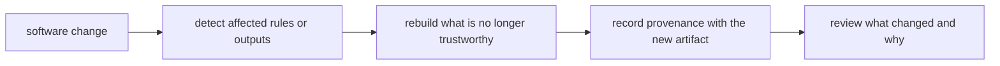

# Software Provenance, Drift, and Rebuild Evidence

Software boundaries are only half the story.

The other half is proving what changed when the software changes.

That matters because a workflow can become non-reproducible even when the file graph still
looks correct.

If a helper script, package function, environment file, or container image changes, the
repository needs a credible way to explain:

- what changed
- which outputs are now questionable
- what should be rebuilt
- what evidence will travel with the rebuilt results

That is the job of software provenance.

## Drift does not begin only with input files

Learners often first meet Snakemake through file timestamps and declared dependencies.

That is a useful start, but it is incomplete.

Drift can also come from:

- edits to workflow scripts
- changes in package code under `src/`
- runtime declaration changes in environment files
- container image revisions
- tool upgrades that alter behavior without changing rule syntax

This is why software boundaries must stay explicit. You cannot review or rebuild what you
cannot name.

## Reproducibility needs change evidence

A strong repository can answer questions like:

- did a software change invalidate published outputs?
- which rules are affected by a helper-code edit?
- what runtime changed between two runs?
- can we explain the software surface that produced this artifact?

Those are not luxury questions. They are the practical questions of trust.

## One useful review loop

This loop is what turns reproducibility from a slogan into a working practice.

## What counts as software evidence

Good software evidence often includes:

- the git revision or release identifier of the repository
- the environment or container declaration used for execution
- tool or interpreter versions that materially affect behavior
- a provenance artifact that travels with published results

In the capstone, `workflow/scripts/provenance.py` points toward this idea. A workflow step
can emit an artifact that explains the software context of the publication outputs.

That is much stronger than relying on memory or a comment in a pull request.

## File freshness is not enough

Weak assumption:

> if the inputs are unchanged, the outputs are still trustworthy.

That assumption fails when:

- a script's transformation logic changes
- a library upgrade alters ordering, formatting, or statistical behavior
- a package helper fixes a bug that changes output meaning

The files may look fresh while the meaning is stale.

That is drift.

## A stronger practice

Stronger shape:

- keep software surfaces explicit enough that a reviewer can name them
- treat code and runtime changes as reasons to re-evaluate output trust
- generate provenance artifacts for outputs that will be shared or published
- use rebuild-oriented review commands when software changes are suspected

In practice, this is where commands such as `--list-changes code` or broader provenance
checks become valuable. They help the team connect software edits to output risk.

## A simple example

Imagine this sequence:

1. `src/capstone/reporting.py` changes how summary statistics are rounded.
2. No input files change.
3. Published tables still exist from the earlier run.

If the team only checks input freshness, those tables may appear valid.

If the team treats software as part of workflow meaning, it asks a better question:

> which outputs were produced with the old implementation, and where is the evidence for
> the new build?

That question is the difference between accidental and intentional reproducibility.

## Common failure modes

| Failure mode | What goes wrong | Better repair |
| --- | --- | --- |
| provenance only records input files | software drift stays invisible | record software context for important outputs |
| helper-code edits are treated as “internal only” | stale publications survive longer than they should | review software edits as output-affecting changes |
| environment updates are merged without rebuild thinking | runs become incomparable | connect runtime changes to rebuild and release review |
| publication artifacts omit software identity | external readers cannot trace the producing surface | emit provenance next to important deliverables |
| teams trust memory over recorded evidence | review becomes anecdotal | prefer generated evidence and versioned declarations |

## The explanation a reviewer trusts

Strong explanation:

> this output was rebuilt because the reporting helper changed under `src/`, and the new
> publication includes updated provenance that records the runtime and repository state.

Weak explanation:

> the code changed a bit, but the files looked current.

The first explanation defends trust. The second confuses absence of file churn with
absence of semantic drift.

## End-of-page checkpoint

Before leaving this page, you should be able to:

- explain how software drift differs from input drift
- name at least three kinds of software evidence worth keeping
- describe why published outputs need provenance that includes software context
- explain why unchanged input files do not guarantee trustworthy outputs
