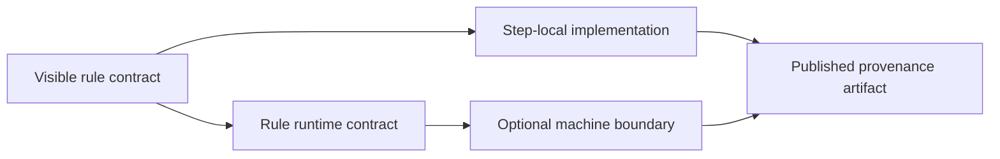

# Worked Example: Moving a Workflow Across the Software Boundary Safely

This worked example ties the module together.

The goal is not to show every possible Snakemake feature. The goal is to show how a
workflow step becomes more trustworthy when software ownership, runtime, and provenance are
made explicit together.

## Starting situation

Imagine a publication step that needs to write a provenance artifact for released results.

A rushed first draft might keep everything inline:

```python
rule build_provenance:
    input:
        "publish/v1/results.tsv"
    output:
        "publish/v1/provenance.json"
    run:
        import datetime
        import json
        import platform
        import subprocess
        import sys
        ...
```

This works until the step becomes real software.

Now the repository has several problems:

- the rule hides implementation detail in a large `run:` block
- runtime assumptions are implicit
- the publication artifact has no clearly owned software boundary
- reviewers cannot easily separate file contract from implementation

## Better target

The capstone points toward a stronger design:

- the rule owns the file contract
- `workflow/scripts/provenance.py` owns step-local implementation
- `workflow/envs/python.yaml` declares the step runtime
- `environment.yaml` serves repository-level authoring and workflow execution setup
- `Dockerfile` offers a stronger machine-portability surface

That is already a meaningful boundary stack.

## Step 1: keep the rule readable

Conceptually, the rule should look more like this:

```python
rule build_provenance:
    input:
        results="publish/v1/results.tsv"
    output:
        json="publish/v1/provenance.json"
    conda:
        "workflow/envs/python.yaml"
    script:
        "workflow/scripts/provenance.py"
```

This rule tells a reviewer four useful things immediately:

- which artifact is being produced
- which input gives it context
- where the implementation lives
- which runtime boundary the step relies on

That is a much stronger contract than a long `run:` block.

## Step 2: keep step-local code in the right place

The capstone's `workflow/scripts/provenance.py` is a good example of code that belongs in
`workflow/scripts/` rather than in a reusable package:

- it depends on the injected `snakemake` object
- it is tightly coupled to one workflow step
- its job is tied to publication metadata rather than broad domain reuse

If later multiple steps need shared formatting or metadata helpers, that reusable portion
can graduate into `src/capstone/`.

That is the important judgment:

- step-local behavior stays near the workflow
- reusable behavior moves into package code

## Step 3: declare the runtime where it matters

`workflow/envs/python.yaml` currently declares a small Python runtime:

```yaml
name: capstone-python
channels:
  - conda-forge
dependencies:
  - python=3.11
```

That file is not useful because it is long. It is useful because it says the
provenance step should not depend on ambient host Python.

At the repository level, `environment.yaml` serves a different purpose:

- it gives contributors and workflow runners a predictable baseline
- it pins the Snakemake family used for the project

And `Dockerfile` solves a broader boundary again by packaging that environment into a more
portable machine-level contract.

## Step 4: make provenance part of the output story

The current provenance script records several important pieces of software evidence:

- timestamp
- Python version and executable
- platform
- Snakemake version
- git commit
- workflow config

That design matters because publication outputs should be defensible after the run is
finished.

When a reviewer asks, "what software context produced this artifact?", the repository can
answer with a file instead of a memory.

## Step 5: think through change scenarios

Now imagine three different edits:

1. `workflow/scripts/provenance.py` changes how metadata is serialized.
2. `workflow/envs/python.yaml` adds another runtime dependency.
3. `Dockerfile` changes because the execution surface is moving to a stricter container path.

These edits do not all mean the same thing, but they all affect software trust.

The repository should now be able to reason clearly:

- the rule contract is still visible
- the step implementation changed in a named place
- the runtime boundary changed in a named place
- provenance artifacts can help distinguish earlier outputs from rebuilt outputs

That is what a healthy software boundary feels like in practice.

## What this example teaches



The point is not complexity for its own sake.

The point is that each layer now has one clear job:

- rule: file meaning
- script: implementation
- environment: step runtime
- container: machine portability when needed
- provenance artifact: evidence after execution

## Review summary

If you can explain this example well, you understand the module:

- why the rule remains visible even when implementation moves out
- why runtime declarations belong next to execution boundaries
- why not all code belongs in the same directory
- why provenance is part of publication trust, not optional decoration
