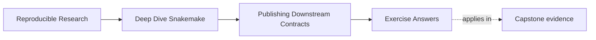
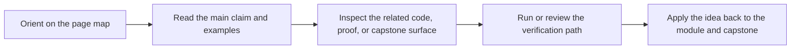

# Exercise Answers

<!-- page-maps:start -->
## Page Maps

<!-- page-maps:end -->

These answers are model explanations, not the only acceptable wording.

What matters is whether the reasoning protects downstream trust.

## Answer 1: Separate internal state from the public bundle

What should remain internal:

- `results/sample-a/qc.json`
- `results/sample-a/trim.json`
- `results/sample-b/qc.json`
- `logs/summarize.log`

Why:

These files support workflow execution, detailed inspection, or debugging. They are not
yet a stable downstream-facing surface.

What could belong in the published contract:

- `publish/summary.tsv`
- `publish/report.html`

What is still missing:

- a versioned publish boundary such as `publish/v1/`
- a manifest and checksums
- provenance
- a clear explanation of artifact roles and stability

The main lesson is that copying a few files into `publish/` is not enough by itself.

## Answer 2: Decide whether a change is compatible

Likely compatible within `v1`:

- adding a new optional field to `summary.json`

Likely versioning discussion:

- renaming the file to `published-summary.json`
- removing an existing field that consumers may rely on

Why:

An additive field can preserve the old contract if existing consumers still work. Path
changes and field removals often alter the public promise directly.

## Answer 3: Diagnose a weak integrity surface

What the bundle cannot answer well:

- whether the bundle is complete
- whether files were altered or corrupted
- what software context produced the outputs

Why the report is not enough:

- it is a human-readable interpretation surface, not an inventory or identity surface

What to add first:

- `manifest.json` with published paths
- checksums for the published files
- `provenance.json` for software-context evidence

The report should remain useful, but it should not be the entire trust story.

## Answer 4: Clarify artifact roles

A strong response would say:

> Scraping HTML is a weak machine contract because presentation markup is not a stable API.
> Machine consumers should read a structured artifact such as `summary.json` or
> `summary.tsv`. The report should help humans inspect and interpret the run, not serve as
> the only machine-facing surface.

Why:

- machine consumers need structured, stable data
- reports are valuable for humans but brittle as programmatic interfaces

## Answer 5: Review publish drift

Risks:

- the report path change may break downstream users
- the manifest is no longer aligned with the published bundle
- downstream code reading from `results/` means the public boundary is not doing enough work

What should be repaired before approval:

- either restore the stable report path or treat the rename as a contract change
- update the manifest so it inventories the real bundle
- repair the publish contract so downstream consumers do not depend on `results/`

Does this require versioning discussion, repair, or both:

- both

The manifest mismatch is a repair inside the current review. The path rename and internal
file dependency both raise versioning and contract adequacy questions.

## Self-check

If your answers consistently explain:

- what is internal versus public
- what changed in the contract
- which artifact carries which responsibility
- what evidence supports downstream trust

then you are using the module correctly.
