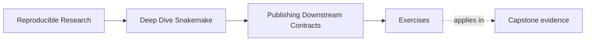
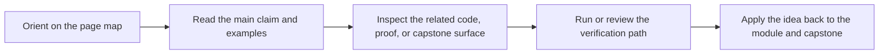

# Exercises

<!-- page-maps:start -->
## Page Maps

<!-- page-maps:end -->

Use these exercises to practice publish judgment, not only publish vocabulary.

The strongest answers will make the downstream contract visible and defensible.

## Exercise 1: Separate internal state from the public bundle

You inherit a workflow with these outputs:

- `results/sample-a/qc.json`
- `results/sample-a/trim.json`
- `results/sample-b/qc.json`
- `logs/summarize.log`
- `publish/summary.tsv`
- `publish/report.html`

Write a short review note that explains:

- which files should remain internal
- which files could belong in the published contract
- what is still missing before the publish bundle is trustworthy

Your answer should justify the boundary rather than only list files.

## Exercise 2: Decide whether a change is compatible

A workflow currently publishes `publish/v1/summary.json`.

You are considering three changes:

1. add a new optional field to the JSON
2. rename the file to `published-summary.json`
3. remove an existing field because it seems redundant

Explain which of these may be compatible within `v1` and which should trigger a versioning
discussion.

## Exercise 3: Diagnose a weak integrity surface

A publish bundle contains:

- `summary.json`
- `report/index.html`

It does not contain:

- a manifest
- checksums
- provenance

Explain:

- what downstream trust questions this bundle cannot answer well
- why the report is not enough by itself
- what integrity surfaces you would add first

## Exercise 4: Clarify artifact roles

A team says:

> downstream users can scrape the report HTML, and maintainers can check the JSON if needed.

Write a short response that explains:

- why this is a weak contract design
- which artifact should be authoritative for machine use
- what role the report should play instead

## Exercise 5: Review publish drift

During a pull request review, you notice:

- `publish/v1/report/index.html` was renamed
- `manifest.json` was not updated
- a notebook in another repository reads from `results/`

Describe:

- the publish-boundary risks you see
- what should be repaired before approval
- whether this looks like a versioning discussion, a repair within the current version, or both

## Mastery check

You have a strong grasp of this module if your answers consistently keep four ideas visible:

- internal workflow state is not automatically public
- publish paths and meanings are a contract
- manifests, checksums, provenance, and reports have different jobs
- downstream trust must be reviewed, not assumed
