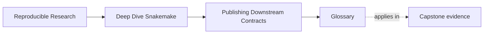
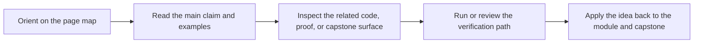

# Glossary

<!-- page-maps:start -->
## Page Maps

<!-- page-maps:end -->

This glossary keeps the language of Module 06 stable. The goal is practical clarity:
publish review gets much easier when the same terms keep the same meaning.

## Terms

| Term | Meaning in this module |
| --- | --- |
| internal state | Workflow-owned outputs that help execution, debugging, or intermediate reasoning but are not the downstream contract. |
| public contract | The smaller set of published artifacts that downstream users are allowed to trust and depend on. |
| publish boundary | The directory and artifact set that define the downstream-facing contract, such as `publish/v1/`. |
| versioned boundary | A publish surface whose version communicates compatibility expectations over time. |
| compatible change | A change that preserves existing downstream expectations within the current publish version. |
| contract change | A change to paths, meanings, or required fields that alters the published promise and may require a new version. |
| manifest | The inventory of published artifacts, ideally including paths and digests. |
| checksum | A digest used to confirm file identity, detect corruption, or spot silent replacement. |
| bundle integrity | The degree to which a publish bundle can prove completeness and identity coherently. |
| provenance | Evidence about the software and execution context that produced the published outputs. |
| machine-readable artifact | A structured output designed for programmatic downstream use, such as `summary.json` or `summary.tsv`. |
| human-readable artifact | An output designed to help a person interpret the run, such as `report/index.html`. |
| file API | A document that explains what published artifacts exist, what they mean, and how stable they are. |
| publish drift | Any change that weakens or alters the downstream contract, whether through paths, semantics, or artifact-role confusion. |
| downstream trust | The confidence that another person or tool can use the published bundle without reverse engineering the workflow internals. |

## How to use these terms

If a publish review starts to feel vague, ask which term has become unclear:

- is the boundary internal or public?
- is the change compatible or contract-breaking?
- is this artifact for machines, humans, integrity, or provenance?

That question usually reveals the real problem quickly.
