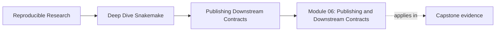
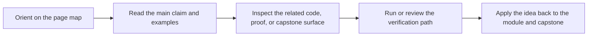

# Module 06: Publishing and Downstream Contracts


<!-- page-maps:start -->
## Page Maps




<!-- page-maps:end -->

A workflow run is not automatically a downstream contract.

That distinction matters because a workflow usually produces many files that help it run,
debug, or explain itself, but only a smaller set of files should be safe for another
human, notebook, or pipeline to trust as published outputs.

This module is about drawing that line on purpose.

You will learn how to:

- separate internal workflow state from public deliverables
- version a publish boundary so downstream expectations stay stable
- use manifests, checksums, reports, and provenance without confusing their jobs
- review publish drift before downstream trust is damaged

The capstone corroboration surface for this module is the versioned bundle under
`publish/v1/`, especially `summary.json`, `summary.tsv`, `report/index.html`,
`manifest.json`, `provenance.json`, and `discovered_samples.json`.

## Why this module exists

Many workflows fail at the exact moment they seem most useful: when someone tries to use
their outputs downstream.

Typical failure patterns look like this:

- downstream consumers read from `results/` because no publish contract is visible
- report files are treated as the contract even though they are meant for humans
- manifests exist but do not clearly defend the bundle
- published paths drift without a deliberate version change

This module repairs those problems by teaching publish surfaces as contracts, not as
accidental folders.

## Study route

```mermaid
flowchart LR
  overview["Overview"] --> core1["Core 1: internal vs public"]
  core1 --> core2["Core 2: versioned publish boundary"]
  core2 --> core3["Core 3: manifest and integrity evidence"]
  core3 --> core4["Core 4: machine vs human publish surfaces"]
  core4 --> core5["Core 5: publish drift review"]
  core5 --> example["Worked example"]
  example --> practice["Exercises and answers"]
  practice --> glossary["Glossary"]
```



Read the module in that order if the publish boundary still feels fuzzy.

If you already know the basic problem, use this shortcut:

- open Core 2 if your question is mostly about versioning and compatibility
- open Core 3 if your question is mostly about manifests, checksums, and validation
- open Core 5 if your question is mostly about review and downstream risk

## Module map

| Page | Purpose |
| --- | --- |
| [Overview](index.md) | explains the module promise and study route |
| [Internal Results versus Public Contracts](internal-results-vs-public-contracts.md) | teaches the first and most important split |
| [Versioned Publish Boundaries and Compatible Change](versioned-publish-boundaries-and-compatible-change.md) | teaches versioning, compatibility, and path stability |
| [Manifests, Checksums, and Bundle Integrity](manifests-checksums-and-bundle-integrity.md) | teaches how a publish bundle defends itself |
| [Reports, File APIs, and Human versus Machine Surfaces](reports-file-apis-and-human-vs-machine-surfaces.md) | teaches which artifacts are for machines, humans, or both |
| [Reviewing Publish Drift and Downstream Risk](reviewing-publish-drift-and-downstream-risk.md) | teaches how to review publish changes before trust is lost |
| [Worked Example: Promoting Results into a Versioned Publish Bundle](worked-example-promoting-results-into-a-versioned-publish-bundle.md) | walks through a concrete publish-boundary design |
| [Exercises](exercises.md) | gives five mastery exercises |
| [Exercise Answers](exercise-answers.md) | explains model answers and review logic |
| [Glossary](glossary.md) | keeps the module vocabulary stable |

## What should be clear by the end

By the end of this module, you should be able to explain:

- why `results/` and `publish/v1/` are different promises
- when a publish change requires a version change
- why a manifest is not the same thing as a report
- how provenance and checksums support downstream trust
- how to review a published bundle as a contract rather than a convenience folder

## Capstone route

Use the capstone only after the local module ideas are already legible.

Best corroboration surfaces for this module:

- `capstone/workflow/rules/summarize_report.smk`
- `capstone/workflow/rules/publish.smk`
- `capstone/workflow/contracts/FILE_API.md`
- `capstone/publish/v1/`
- [Capstone Review Worksheet](../capstone/capstone-review-worksheet.md)

Useful proof route:

```bash
snakemake -n
snakemake publish/v1/manifest.json
python scripts/verify_publish.py --publish publish/v1
```

The point of that route is not just to run the workflow. It is to inspect whether the
published bundle still deserves downstream trust.
