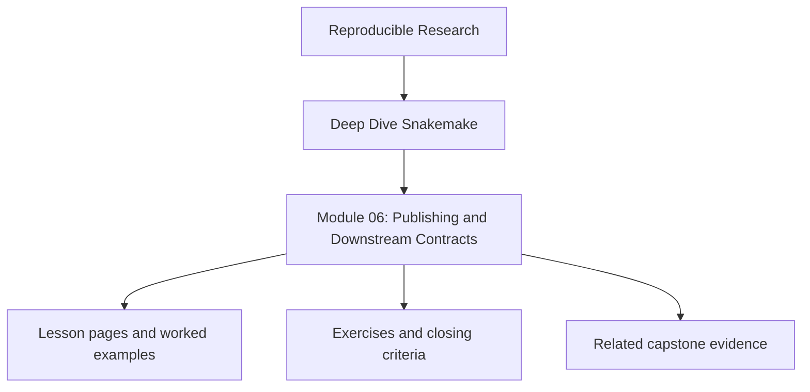
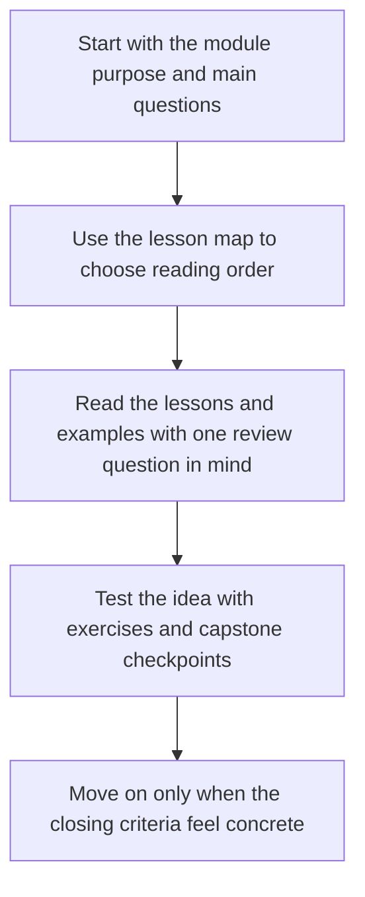

<a id="top"></a>

# Module 06: Publishing and Downstream Contracts


<!-- page-maps:start -->
## Module Position




<!-- page-maps:end -->

Read the first diagram as a placement map: this page sits between the course promise, the lesson pages listed below, and the capstone surfaces that pressure-test the module. Read the second diagram as the study route for this page, so the diagrams point you toward the `Lesson map`, `Exercises`, and `Closing criteria` instead of acting like decoration.

A workflow run is not automatically a trustworthy result. The internal execution state
that helps the workflow operate is often not the same thing as the published surface that
another human, notebook, or downstream pipeline is allowed to depend on.

This module is about designing that boundary on purpose: what remains internal, what is
published, how published outputs are versioned, and how manifests, reports, and checksums
support trust without turning every run into a pile of unreviewable noise.

Capstone exists here as corroboration. The local publishing exercises should already make
the internal-versus-public split clear before you inspect `publish/v1/` and the file API
in the reference workflow.

### Before You Begin

This module works best after Modules 01-05, especially the parts on file contracts,
provenance, and safe rule boundaries.

Use this module if you need to learn how to:

* separate internal workflow state from stable published deliverables
* version a publish boundary so downstream users know what they are trusting
* decide which reports and manifests are proof artifacts and which are part of the public contract

Proof loop for this module:

```bash
snakemake -n
snakemake --summary
snakemake publish/v1/manifest.json
```

Capstone corroboration:

* inspect `capstone/publish/v1/`
* inspect `capstone/docs/FILE_API.md`
* inspect `capstone/workflow/rules/publish.smk`
* inspect `capstone/docs/TOUR.md`

## At a Glance

| Focus | Learner question | Capstone timing |
| --- | --- | --- |
| publish boundaries | "Which files are internal workflow state, and which files are safe for others to trust?" | inspect `publish/v1/` only after the internal-versus-public split is explicit |
| versioned contracts | "How do downstream users know what changed and what remained stable?" | compare publish structure and the file API together |
| proof artifacts | "Which manifests and reports defend the published bundle without becoming the contract themselves?" | use the capstone when you are ready to review evidence surfaces intentionally |

---

<a id="toc"></a>
## 1) Table of Contents

1. [Table of Contents](#toc)
2. [Learning Outcomes](#outcomes)
3. [How to Use This Module](#usage)
4. [Core 1 — Internal Results Versus Published Results](#core1)
5. [Core 2 — Versioned Publish Boundaries](#core2)
6. [Core 3 — Manifests, Checksums, and File APIs](#core3)
7. [Core 4 — Reports and Human-Readable Proof](#core4)
8. [Core 5 — Reviewing a Published Contract for Drift](#core5)
9. [Capstone Sidebar](#capstone)
10. [Exercises](#exercises)
11. [Closing Criteria](#closing)

---

<a id="outcomes"></a>
## 2) Learning Outcomes

By the end of this module, you can:

* distinguish internal workflow outputs from stable downstream deliverables
* define a versioned publish boundary that survives repository growth
* use manifests and checksums to make a published tree auditable
* decide when a report is part of the contract versus supporting evidence
* review a workflow’s publish surface for accidental coupling or drift

[Back to top](#top)

---

<a id="usage"></a>
## 3) How to Use This Module

Build a local lab with two output layers:

```text
lab/
  workflow/
    Snakefile
  results/
  publish/
    v1/
  docs/
```

Require your lab to produce:

1. internal per-sample results under `results/`
2. a stable published bundle under `publish/v1/`
3. a manifest that inventories the published files
4. one human-readable report that explains the run

The teaching goal is to make the learner able to answer, file by file, which outputs are
safe for downstream consumers to trust.

[Back to top](#top)

---

<a id="core1"></a>
## 4) Core 1 — Internal Results Versus Published Results

Not every output belongs in the public contract.

Internal state often includes:

* intermediates needed for later jobs
* per-rule logs and benchmarks
* scratch outputs that support aggregation
* diagnostic summaries used for review

Published state should include only what downstream readers are allowed to rely on:

* stable paths
* stable formats
* clear versioning
* enough supporting evidence to validate what was published

If a downstream notebook depends on `results/` because the publish boundary is vague, the
workflow is teaching the wrong contract.

[Back to top](#top)

---

<a id="core2"></a>
## 5) Core 2 — Versioned Publish Boundaries

Versioned publication is not ceremony. It is how you tell a consumer whether a file path
or format is still meant to be stable.

Good publish-boundary questions:

* what are the canonical outputs for this workflow version?
* which paths may change without breaking consumers?
* what should a reviewer inspect before approving a new publish version?

Common discipline:

* keep the stable surface in a path such as `publish/v1/`
* document it in a file API or contract note
* change the version only when the downstream contract really changes

Bad discipline:

* publishing directly from `results/`
* letting report names drift every run
* changing manifest structure without treating it as a contract change

[Back to top](#top)

---

<a id="core3"></a>
## 6) Core 3 — Manifests, Checksums, and File APIs

A publish directory is much more trustworthy when it can explain itself.

Three complementary surfaces help:

| Surface | Purpose |
| --- | --- |
| manifest | lists what was published |
| checksums | prove file identity and detect tampering or accidental drift |
| file API document | tells a human what each artifact means and how stable it is |

You do not need to dump every internal detail into the manifest. You do need enough
information to answer:

* what files belong in the bundle
* how a consumer can validate them
* which artifact is authoritative for each question

[Back to top](#top)

---

<a id="core4"></a>
## 7) Core 4 — Reports and Human-Readable Proof

Published workflows often need two kinds of artifacts:

* machine-consumable contract artifacts
* human-readable proof artifacts

Examples:

* `summary.tsv` or `summary.json` for downstream programmatic use
* `report/index.html` for human interpretation
* provenance or manifest JSON for validation and review

The mistake is not having both. The mistake is failing to say which role each one plays.

A report should help answer “what happened?” without being the only authoritative source
of machine-readable truth.

[Back to top](#top)

---

<a id="core5"></a>
## 8) Core 5 — Reviewing a Published Contract for Drift

Review the publish surface the same way you review code:

* did the set of published files change?
* did any stable path move or disappear?
* did the file API still describe reality?
* are reports and manifests still aligned?
* did new internal artifacts leak into the public contract accidentally?

Drift is often introduced by convenience:

* “just publish this extra JSON too”
* “let’s read from `results/` for now”
* “the report has the information, so we do not need to update the manifest”

Those shortcuts turn future reviews into archaeology.

[Back to top](#top)

---

<a id="capstone"></a>
## 9) Capstone Sidebar

Use the capstone to inspect:

* `publish/v1/` as the stable public surface
* `FILE_API.md` as the human contract for those files
* `workflow/rules/publish.smk` as the logic that draws the boundary
* `TOUR.md` and the workflow tour bundle as human-readable proof surfaces

[Back to top](#top)

---

<a id="exercises"></a>
## 10) Exercises

1. Split one workflow’s outputs into internal results and a clean published bundle.
2. Add a manifest and explain which published artifacts are authoritative for downstream code.
3. Create one human-readable report and one machine-readable summary without making them interchangeable.
4. Simulate a publish-boundary change, then decide whether it requires a new publish version.

[Back to top](#top)

---

<a id="closing"></a>
## 11) Closing Criteria

You pass this module only if you can demonstrate:

* a clear distinction between internal outputs and published outputs
* a versioned publish boundary with stable paths
* a manifest or checksum surface that validates the published tree
* a documented contract that a downstream consumer could follow without guessing

[Back to top](#top)

## Directory glossary

Use [Glossary](glossary.md) when you want the recurring language in this module kept stable while you move between lessons, exercises, and capstone checkpoints.
