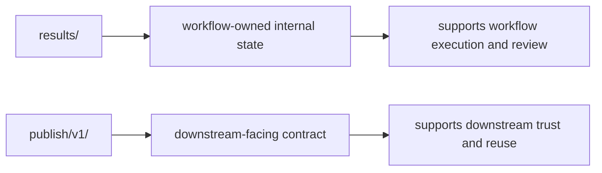

# Internal Results Versus Public Contracts

The first publishing decision is the most important one:

> which outputs belong to the workflow, and which outputs belong to the downstream world?

If that line is vague, the workflow becomes harder to review and downstream users are
forced to guess which files are safe to trust.

This page is about making that line explicit.

## A workflow usually produces more files than it should publish

A healthy workflow often creates many useful files:

- per-step logs
- benchmarks
- scratch intermediates
- per-sample result files
- validation artifacts
- final summaries and reports

Those files do not all make the same promise.

Some exist to help the workflow operate. Some exist to help maintainers review a run.
Some exist so another person or tool can rely on the results later.

Publishing begins when you decide which category a file belongs to.

## Internal state is still important, but it is not the public contract

Internal outputs are often necessary for:

- chaining rules together
- debugging failures
- inspecting detailed sample-level behavior
- supporting later aggregation

In the capstone, much of `results/` serves that purpose. It contains per-sample files that
help the workflow do its job, but it is not the main downstream promise.

That distinction matters because downstream consumers should not be forced to reverse
engineer the workflow layout to use the published results.

## Published outputs are an explicit promise

A published output says something stronger than "this file exists."

It says:

- this path is intentionally exposed
- this file meaning is stable enough for consumers to rely on
- this artifact belongs to a reviewable contract

That is why the capstone promotes a smaller surface under `publish/v1/`.

Files such as:

- `summary.json`
- `summary.tsv`
- `report/index.html`
- `manifest.json`
- `provenance.json`
- `discovered_samples.json`

are not just another directory. They are the deliberate public boundary.

## One simple contrast

This diagram matters because many publishing mistakes begin when both directories are
treated as if they made the same promise.

They do not.

## A weak boundary

Weak shape:

- notebooks read directly from `results/`
- published files are chosen ad hoc after the run
- a path becomes “public” only because someone found it useful once

This feels flexible at first. It creates long-term fragility:

- internal layout changes break downstream use
- reviewers cannot tell which files are meant to stay stable
- publication discipline arrives only after confusion has already started

## A stronger boundary

Stronger shape:

- keep workflow-operational state under internal directories such as `results/`
- promote only the intended downstream artifacts into a versioned publish boundary
- treat every file inside that publish boundary as something a reviewer must be able to defend

That design gives both maintainers and consumers a clear answer to the same question:

> which files are safe to depend on?

## A practical test

Ask these questions about any output:

1. Is this file mainly for the workflow to continue operating?
2. Is this file mainly for maintainers to debug or inspect a run?
3. Is this file intentionally exposed for downstream use?

If the answer is mostly the first or second, it probably does not belong in the publish
contract.

If the answer is the third, it needs stronger naming, stability, and review.

## Common failure modes

| Failure mode | What goes wrong | Better repair |
| --- | --- | --- |
| downstream notebooks read from `results/` | internal layout becomes a hidden public API | publish a smaller stable bundle and steer consumers there |
| publish directory copies too many internal files | contract grows without intention | publish only the outputs a consumer is meant to trust |
| reports are the only visible outputs | machine-readable contract becomes unclear | pair human-oriented reports with explicit machine-readable artifacts |
| logs or benchmarks leak into the public surface | consumers inherit maintenance noise | keep operational evidence separate from the downstream contract |
| no one can explain why a file is public | review becomes guesswork | require a clear downstream-use reason for promoted files |

## The explanation a reviewer trusts

Strong explanation:

> these per-sample files remain under `results/` because they support workflow execution
> and detailed review, while `publish/v1/` contains the smaller bundle downstream users
> are allowed to trust as the stable contract.

Weak explanation:

> we copied the important files into `publish/` after the run finished.

The strong explanation defines ownership and intention. The weak explanation describes a
folder move without a contract.

## End-of-page checkpoint

Before leaving this page, you should be able to:

- explain why `results/` and `publish/v1/` make different promises
- give one example of an internal output that should not become public
- give one example of a file that belongs in the published contract
- explain why downstream consumers should not need to understand the whole workflow tree
