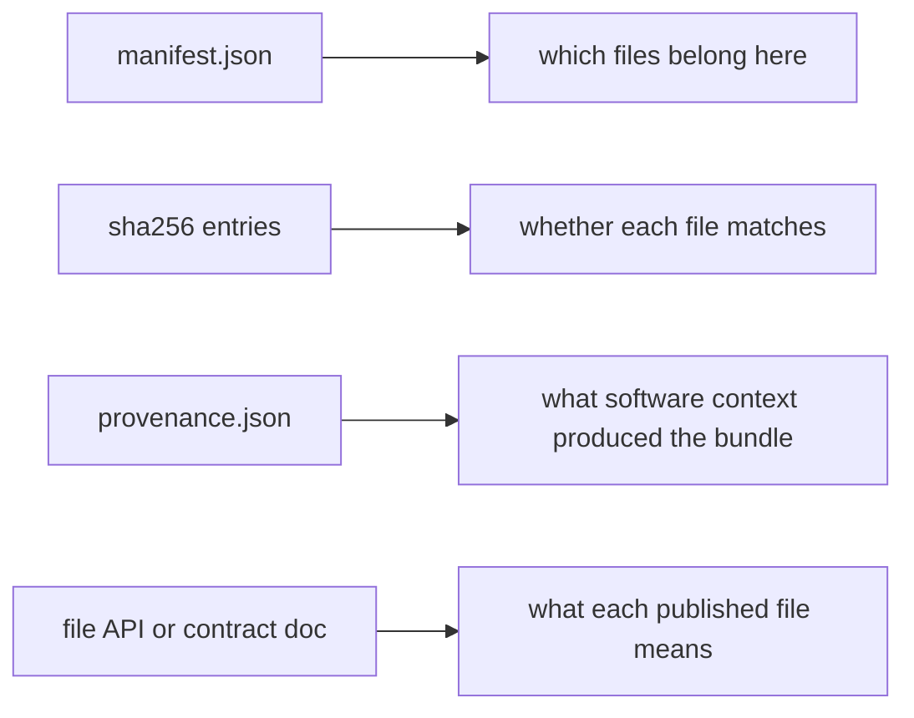

# Manifests, Checksums, and Bundle Integrity

Publishing is not finished when files are copied into `publish/v1/`.

The bundle also needs to defend itself.

That means a reviewer or downstream user should be able to answer questions like:

- what files belong in this bundle?
- how do I know whether the bundle is complete?
- how can I detect whether a file changed?
- where do I look for machine-checkable evidence versus human explanation?

This page is about the evidence surfaces that make a publish bundle reviewable.

## A bundle should explain itself

The capstone publish bundle includes:

- `manifest.json`
- `provenance.json`
- `summary.json`
- `summary.tsv`
- `report/index.html`
- `discovered_samples.json`

Those files do not all do the same job.

One of the most common workflow mistakes is assuming that one file can answer every
question.

It usually cannot.

## What a manifest is good at

A manifest is strongest when it answers:

- which files are part of the published bundle
- how those files are named relative to the bundle root
- how to validate their identity

In the capstone, `manifest.json` records published paths and SHA-256 digests.

That is valuable because it makes the bundle inventory explicit instead of implied.

## What checksums are good at

Checksums answer a narrower but essential question:

> is this file the same file I expect?

They help detect:

- accidental corruption
- incomplete transfers
- silent replacement of one artifact with another

Checksums are not a substitute for meaning. They are evidence of identity.

## What a manifest does not prove by itself

A manifest does not fully answer:

- what a file means
- whether the right files were published in the first place
- what software context produced those files
- whether the contract should have been versioned differently

That is why manifests need companion surfaces such as:

- a file API or contract note
- provenance
- review judgment about the publish boundary

## One useful separation

This separation matters because reviewers often ask the right question but check the wrong
artifact.

## A weak integrity story

Weak shape:

- the bundle has files but no explicit inventory
- a report exists, so maintainers assume the bundle is self-explanatory
- checksums are absent, so transfers and comparisons rely on trust alone

This leaves a reviewer with no compact way to validate the bundle.

## A stronger integrity story

Stronger shape:

- the manifest names the published files
- checksum entries let others validate identity
- provenance records software context
- contract documentation explains how to interpret the artifacts

Now the bundle can answer more than one kind of question without forcing one file to do
everything.

## A practical review loop

When reviewing a publish bundle, ask:

1. Does the manifest enumerate the expected public artifacts?
2. Do the checksum entries cover the files the bundle promises?
3. Is provenance present for software-context questions?
4. Is there a document or guide that explains artifact meaning and stability?

If the answer to only the first question is yes, the integrity story is still incomplete.

## Common failure modes

| Failure mode | Why it hurts | Better repair |
| --- | --- | --- |
| manifest lists files but no digests | bundle completeness is visible but file identity is weak | include checksums for published artifacts |
| report is treated as the integrity surface | bundle validation becomes manual and human-only | keep machine-checkable inventory and digests separate |
| provenance is omitted because manifest exists | software context becomes untraceable | pair manifest integrity with provenance evidence |
| manifest includes internal or unstable files | public boundary becomes noisy and brittle | inventory only the intentional publish contract |
| contract meaning lives only in author memory | downstream users cannot interpret the bundle confidently | document the role of each public artifact explicitly |

## The explanation a reviewer trusts

Strong explanation:

> `manifest.json` tells us which files belong in `publish/v1/` and gives us digests to
> verify identity, while `provenance.json` explains the producing software context and the
> file API explains what each artifact means.

Weak explanation:

> the manifest is there, so the bundle is self-documenting.

The strong explanation respects the limits of each artifact. The weak explanation assigns
too much responsibility to one file.

## End-of-page checkpoint

Before leaving this page, you should be able to:

- explain what a manifest proves and what it does not prove
- explain why checksums are about identity rather than meaning
- describe why provenance is a separate integrity surface
- explain why a publish bundle still needs a file API or contract note
