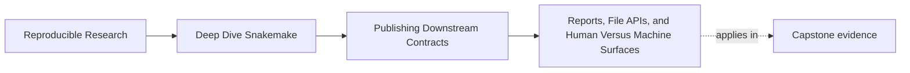
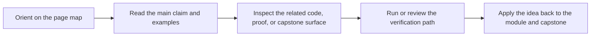
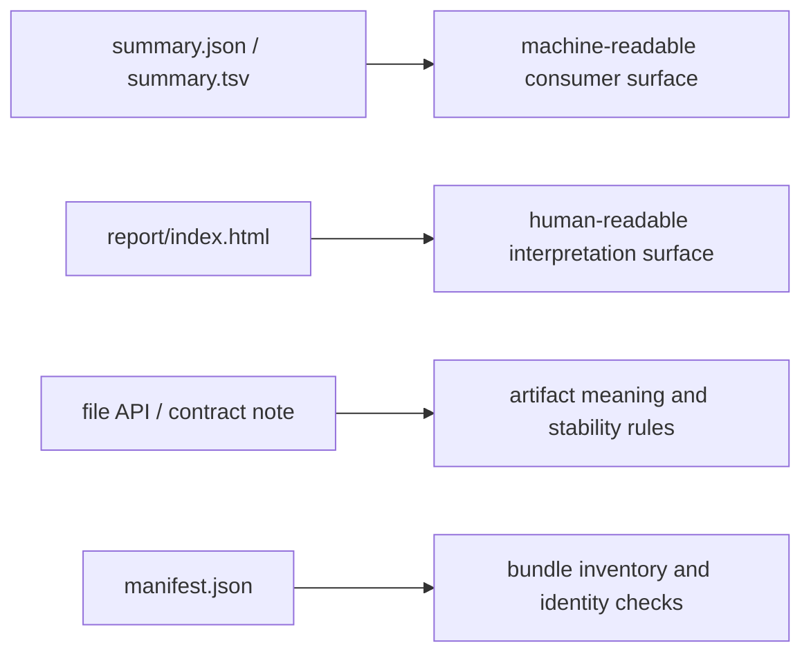

# Reports, File APIs, and Human Versus Machine Surfaces

<!-- page-maps:start -->
## Page Maps

<!-- page-maps:end -->

A strong publish bundle usually needs more than one kind of artifact.

That is not a flaw. It is a sign that the bundle is serving more than one audience.

The important question is:

> which artifact is for machines, which artifact is for humans, and which artifact defines the contract?

If that answer is blurry, downstream users and reviewers start reading the wrong file for
the wrong job.

## Human-readable and machine-readable are different needs

Downstream consumers often need stable machine-readable artifacts such as:

- `summary.json`
- `summary.tsv`
- `manifest.json`

Reviewers and collaborators often also need human-readable artifacts such as:

- `report/index.html`
- contract notes or file API documents

The mistake is not having both. The mistake is failing to say which one is authoritative
for which question.

## A report is valuable, but it is not automatically the contract

The capstone builds `report/index.html` from `summary.json`.

That is a healthy relationship:

- `summary.json` remains a structured machine-readable artifact
- the report turns that information into a readable explanation for humans

This means the report helps interpretation, but it should not become the only source of
truth for downstream automation.

## A file API answers a different question again

A file API or contract note helps a human understand:

- what artifacts exist in the public bundle
- what each one means
- which paths are stable
- what kind of change would count as a contract break

This is different from both the report and the manifest.

The report explains what happened in the run. The file API explains how to use the bundle.

## One artifact should not do every job

The point of this diagram is not to create bureaucracy. It is to prevent role confusion.

## A weak publish explanation

Weak shape:

- the report is polished, so teams stop maintaining structured summaries
- the JSON exists, but no one documents whether it is stable
- consumers scrape the HTML because the machine-readable contract is unclear

This produces fragile downstream use and painful review discussions.

## A stronger publish explanation

Stronger shape:

- keep a structured artifact for machine consumption
- keep a readable report for human inspection
- keep a contract document that explains artifact roles and stability
- make sure those surfaces agree with each other

That gives each audience a proper interface.

## A practical test

Ask these questions:

1. If a script wanted to consume this bundle, which file should it read?
2. If a reviewer wanted to understand the run quickly, which file should they open?
3. If a maintainer wanted to know whether a path is stable, where is that promised?

If one artifact is trying to answer all three questions, the publish design is probably
too vague.

## Common failure modes

| Failure mode | What it causes | Better repair |
| --- | --- | --- |
| downstream tools scrape HTML reports | machine usage depends on presentation markup | keep a stable machine-readable artifact authoritative |
| JSON bundle exists but is undocumented | consumers guess which fields are stable | document contract roles in a file API or contract note |
| report and summary drift apart | humans and tools no longer see the same story | generate human-readable surfaces from structured artifacts where possible |
| manifest is used as a semantic guide | users know file names but not meanings | pair inventory evidence with contract explanations |
| every artifact is called “the output” | review discussions become imprecise | name whether an artifact is for machines, humans, validation, or provenance |

## The explanation a reviewer trusts

Strong explanation:

> `summary.json` and `summary.tsv` are the machine-facing outputs, `report/index.html`
> helps humans inspect the run, and the file API explains the meaning and stability of the
> published artifacts.

Weak explanation:

> the report shows everything, so the rest is optional.

The strong explanation preserves clear roles. The weak explanation collapses them.

## End-of-page checkpoint

Before leaving this page, you should be able to:

- explain why reports and machine-readable summaries are both useful
- explain why a report should not become the only downstream surface
- describe what a file API contributes beyond a report or manifest
- explain how role confusion creates brittle downstream use
