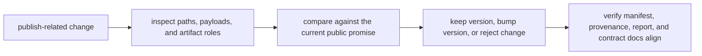

# Reviewing Publish Drift and Downstream Risk

The publish boundary deserves the same seriousness as code review.

If a workflow changes what it publishes, how it names files, or what those files mean,
downstream trust can break even when the workflow still runs successfully.

This page is about catching that drift before it becomes a downstream incident.

## Publish drift is not only about missing files

Drift can look obvious:

- a published path disappears
- a new file appears unexpectedly

But it can also be quieter:

- a JSON field changes meaning
- a report stops matching the structured summary
- the manifest no longer inventories the full contract
- a notebook begins reading from `results/` because the publish bundle stopped being enough

Those are all publish-review problems.

## A publish review asks a different question than a workflow run review

Workflow run review asks:

- did the jobs complete?
- did the pipeline behave as expected?

Publish review asks:

- what is safe for downstream consumers to rely on now?
- what changed in the public contract?
- what evidence supports trusting the bundle?

Those questions overlap, but they are not identical.

## One useful review loop

This loop helps because teams often jump from “the workflow passed” straight to “the
publish bundle is fine.”

That jump is exactly where drift hides.

## What to inspect first

Start with four practical questions:

1. Did the set of published files change?
2. Did any stable path move, disappear, or get renamed?
3. Did the meaning of an existing artifact change?
4. Do the manifest, provenance, report, and file API still tell the same story?

These questions make downstream risk visible early.

## Drift often arrives through convenience

Common convenience moves:

- “just publish this extra JSON too”
- “the report already shows it, so we can skip updating the contract docs”
- “we only renamed the file, the contents are the same”
- “consumers can read directly from `results/` until we clean this up later”

Each shortcut makes the public contract less deliberate.

## A stronger review posture

Strong shape:

- treat every change inside `publish/v1/` as reviewable contract surface
- compare structured artifacts, human-readable artifacts, and integrity artifacts together
- treat contract ambiguity as a real defect, not just a documentation gap
- version the publish boundary when the previous promise is no longer true

This makes downstream trust an engineering decision rather than an accident.

## Common failure modes

| Failure mode | Why it is risky | Better repair |
| --- | --- | --- |
| new public artifacts added with no reason | bundle scope expands by drift | require a downstream-use case and contract explanation |
| published path renamed casually | consumers break even if payloads are unchanged | treat path changes as compatibility review events |
| report and summary disagree | humans and tools see different truths | regenerate or repair the surfaces until they align |
| manifest omits part of the public bundle | integrity review becomes incomplete | keep manifest coverage aligned with the publish contract |
| downstream code starts reading internal files again | hidden contract escapes the publish boundary | repair the publish bundle rather than normalizing the shortcut |

## The explanation a reviewer trusts

Strong explanation:

> this change keeps the current publish contract because the stable paths and meanings are
> intact, and the manifest, provenance, report, and file API still align; if any of those
> promises changed, we would treat it as a versioned contract change.

Weak explanation:

> the workflow still runs, so the published outputs are probably fine.

The strong explanation reviews the bundle as a contract. The weak explanation mistakes
workflow success for downstream trust.

## End-of-page checkpoint

Before leaving this page, you should be able to:

- explain how publish review differs from basic workflow run review
- name several forms of publish drift beyond missing files
- describe what should trigger compatibility or versioning discussion
- explain why contract ambiguity is a real downstream risk
