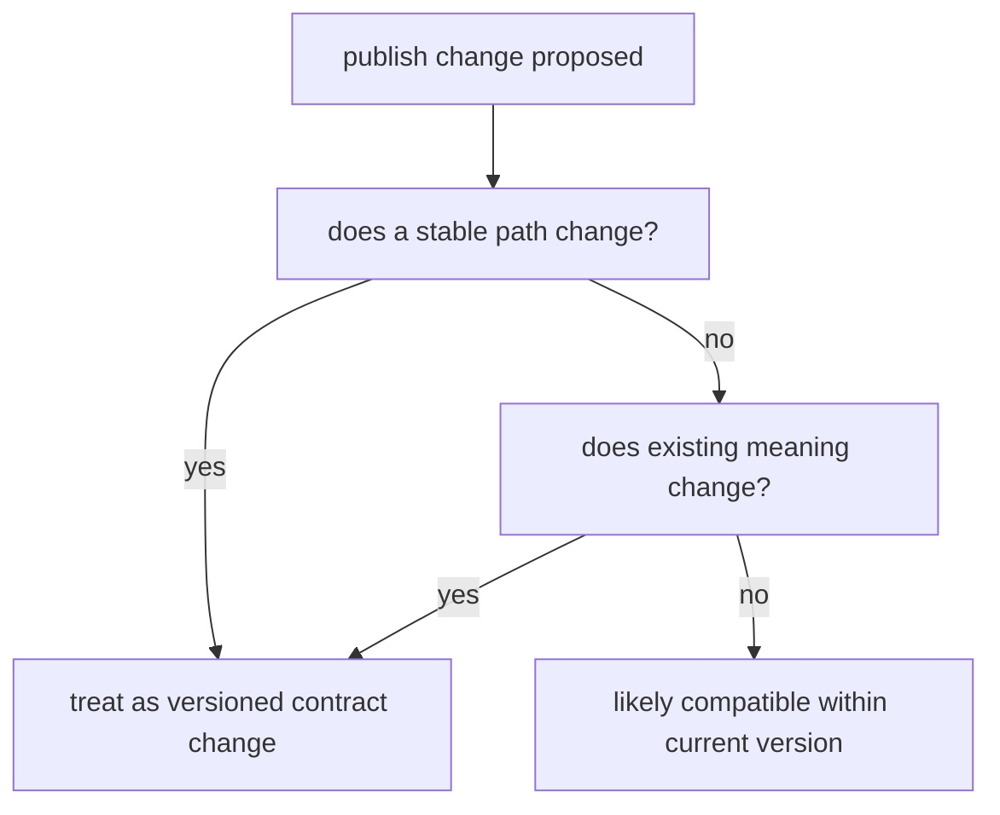

# Versioned Publish Boundaries and Compatible Change

Once you know which files belong in the public contract, the next question appears:

> how do downstream users know when that contract has changed?

That is the job of versioned publish boundaries.

Versioning is not a cosmetic folder name. It is how a workflow tells the downstream world
whether paths, payloads, and expectations are still stable.

## `publish/v1/` is a promise, not a convenience path

When a workflow publishes under a path such as `publish/v1/`, it is saying:

- the files in this boundary are intentionally public
- their paths and meanings are being treated with compatibility discipline
- downstream users should not have to guess whether a change is safe

That is much stronger than simply storing outputs in a neat folder.

## Why versioning belongs to publish design

Without a versioned boundary, small publish changes become dangerous:

- a stable filename disappears
- a JSON field is removed
- a report path moves
- a manifest changes shape

Each change may feel local to the author. To downstream users, those are contract changes.

Versioning makes that change visible instead of surprising.

## One useful distinction: compatible change versus contract change

Not every improvement requires a new publish version.

Some changes are often compatible:

- adding a new optional JSON field
- improving report styling without changing report location or core purpose
- adding more documentation around the published bundle

Some changes are usually contract changes:

- renaming a published file
- removing a field consumers may already use
- changing a path that scripts or notebooks are expected to read
- changing the semantics of an existing artifact without signaling it

That is the judgment this page is trying to sharpen.

## A simple compatibility map

This is not a legal standard. It is a practical review tool.

## The capstone example is already opinionated

The workflow contract guide explicitly treats `publish/v1/` as the smaller public
boundary.

That means files such as:

- `summary.json`
- `summary.tsv`
- `report/index.html`
- `manifest.json`
- `provenance.json`
- `discovered_samples.json`

are expected to be reviewed as part of a versioned surface, not as loose outputs.

## Weak version discipline

Weak shape:

- publish files are renamed casually
- one run adds extra artifacts with no contract discussion
- consumers are expected to “just update” when the bundle changes

This creates hidden downstream work and weakens trust in the bundle.

## Strong version discipline

Strong shape:

- treat path stability as part of the public promise
- distinguish additive compatible change from breaking contract change
- bump the publish version when the old promise is no longer true
- document the meaning of the published files so reviews are concrete

This gives a workflow the same kind of discipline that software interfaces need.

## A practical review test

Ask these questions:

1. Would an existing downstream notebook still find the same path?
2. Would an existing parser still understand the same payload meaning?
3. Is the change additive, or does it alter an existing promise?

If the answer to the first or second question is no, treat the change as a contract change
unless you can defend compatibility clearly.

## Common failure modes

| Failure mode | What happens | Better repair |
| --- | --- | --- |
| publish path renamed casually | downstream automation breaks silently | treat path renames as versioned contract changes |
| optional fields removed later | consumers lose information without warning | prefer additive evolution inside a version |
| report meaning changes without documentation | humans and tools interpret the bundle inconsistently | document artifact roles and change semantics deliberately |
| new files appear in `publish/v1/` with no review | the boundary grows by drift rather than design | require a downstream-use reason for new public artifacts |
| version number never changes because change feels small locally | accumulated drift breaks consumer trust | use downstream compatibility, not author convenience, as the threshold |

## The explanation a reviewer trusts

Strong explanation:

> `publish/v1/summary.json` keeps the same role and core fields, so this change is
> compatible inside the current version; if we rename the file or change the meaning of an
> existing field, we should publish under a new versioned boundary instead.

Weak explanation:

> the structure changed a bit, but downstream users can adapt.

The strong explanation starts from the contract. The weak explanation pushes the burden
onto consumers after the fact.

## End-of-page checkpoint

Before leaving this page, you should be able to:

- explain why versioning belongs to publish boundaries rather than only release notes
- distinguish an additive compatible change from a contract-breaking change
- explain why path renames are often publish-boundary changes
- describe when a new publish version is the honest repair
