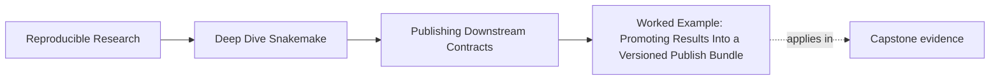
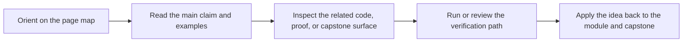
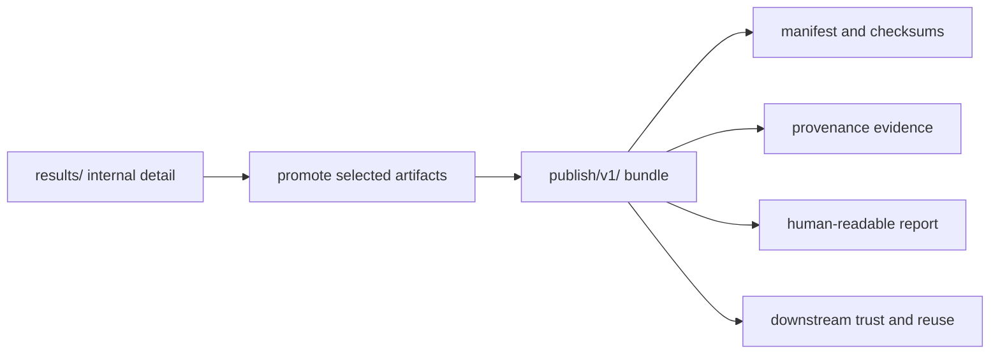

# Worked Example: Promoting Results Into a Versioned Publish Bundle


<!-- page-maps:start -->
## Page Maps




<!-- page-maps:end -->

This worked example ties the module together.

The goal is not to show every publication pattern. The goal is to show how a workflow
turns internal results into a smaller, reviewable downstream contract.

## Starting situation

Imagine a workflow that already produces detailed internal outputs under `results/`:

- per-sample QC JSON files
- trimming summaries
- deduplication summaries
- screening summaries

Those files are useful, but they are not yet a downstream bundle.

If a notebook or another pipeline has to browse `results/{sample}/` to figure out what is
safe to use, the public contract is still weak.

## Better target

The capstone points toward a better structure:

- `results/` keeps workflow-operational detail
- `publish/v1/summary.json` and `publish/v1/summary.tsv` provide structured downstream summaries
- `publish/v1/report/index.html` gives a human-readable view
- `publish/v1/provenance.json` records software context
- `publish/v1/manifest.json` inventories the published files with digests
- `publish/v1/discovered_samples.json` preserves the reviewed discovery set

This is no longer “whatever the run happened to create.” It is a designed bundle.

## Step 1: promote only the right surfaces

The summarize and report rules already show a useful pattern:

```python
rule summarize:
    output:
        json="publish/v1/summary.json",
        tsv="publish/v1/summary.tsv"

rule report:
    input:
        json=rules.summarize.output.json
    output:
        html="publish/v1/report/index.html"
```

This pattern teaches two things:

- structured summaries become part of the public contract
- the report is built from a structured public artifact rather than inventing a separate truth

That is a strong promotion path from internal details to downstream deliverables.

## Step 2: inventory the bundle explicitly

The publish rule then gathers the promoted surfaces into `manifest.json`.

Conceptually:

```python
rule manifest:
    input:
        summary_json = rules.summarize.output.json,
        summary_tsv  = rules.summarize.output.tsv,
        report_html  = rules.report.output.html,
        provenance   = rules.provenance.output.json,
        discovered   = rules.publish_discovered_samples.output.json,
    output:
        json = "publish/v1/manifest.json"
```

That rule matters because the bundle now says, explicitly, which files belong to the
published contract.

In the current capstone bundle, the manifest paths are:

- `discovered_samples.json`
- `provenance.json`
- `report/index.html`
- `summary.json`
- `summary.tsv`

That list is already a reviewable statement about the bundle.

## Step 3: keep artifact roles distinct

The publish bundle works well because each artifact has one clear job:

- `summary.json` and `summary.tsv`: machine-facing outputs
- `report/index.html`: human-facing interpretation
- `manifest.json`: inventory and digest evidence
- `provenance.json`: software-context evidence
- `discovered_samples.json`: reviewed discovery record

This keeps downstream use clearer than a bundle where every file claims to be “the output.”

## Step 4: verify the bundle as a contract

The capstone's `verify_publish.py` script checks several important publish assumptions:

- required files exist and are non-empty
- schema versions are current
- manifest paths match the expected published set
- discovered samples match the summary units
- the report still looks like HTML

That matters because publish review should ask more than whether the workflow finished.

It should ask whether the public bundle is still coherent.

## Step 5: think through a change scenario

Now imagine three possible changes:

1. `summary.json` gets a new optional field for extra downstream metadata.
2. `report/index.html` is renamed to `report/report.html`.
3. another team starts reading `results/sample-a/kmer.json` directly because it is convenient.

These changes do not mean the same thing.

- the first may be a compatible additive change
- the second is a likely publish-boundary change because the stable path moved
- the third is a warning that the publish bundle may no longer be satisfying downstream needs

That is exactly the kind of judgment this module is trying to teach.

## What this example teaches



The point is not to hide the internal workflow. The point is to stop forcing downstream
users to depend on it directly.

## Review summary

If you can explain this example well, you understand the module:

- why internal results and published outputs are different promises
- why the publish bundle needs distinct artifact roles
- why manifests and provenance support bundle trust
- why publish review is a contract review, not only a run review
