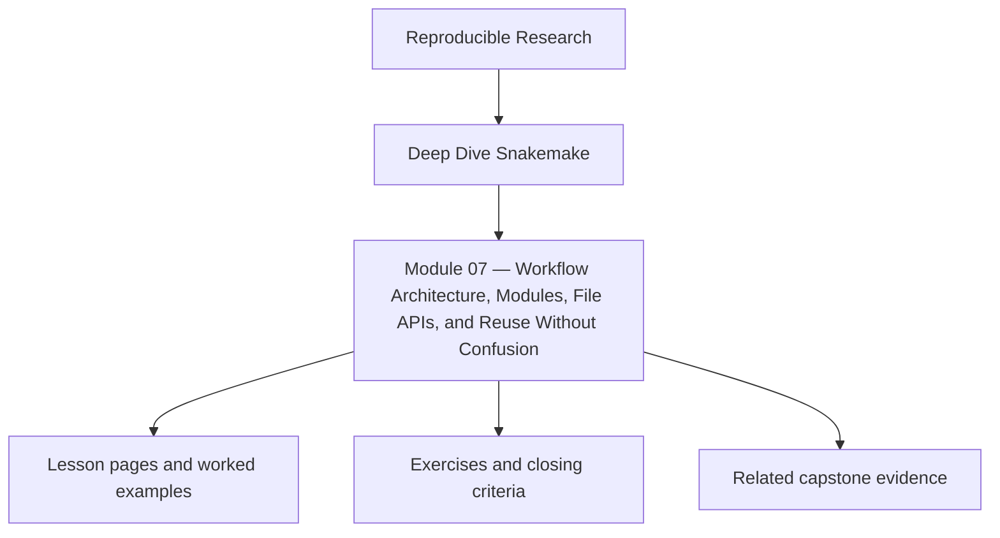
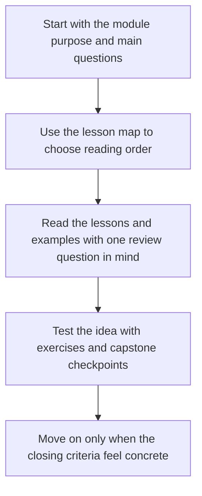

<a id="top"></a>

# Module 07 — Workflow Architecture, Modules, File APIs, and Reuse Without Confusion


<!-- page-maps:start -->
## Module Position




<!-- page-maps:end -->

Read the first diagram as a placement map: this page sits between the course promise, the lesson pages listed below, and the capstone surfaces that pressure-test the module. Read the second diagram as the study route for this page, so the diagrams point you toward the `Lesson map`, `Exercises`, and `Closing criteria` instead of acting like decoration.

Workflows become hard to maintain long before they become biologically or computationally
large. The usual cause is not scale by itself. It is hidden architecture: rules copied
across files, modules introduced without a boundary story, and consumers depending on
paths that were never documented as an interface.

This module is about designing a Snakemake repository that stays legible as it grows:
where rules live, how helper modules are arranged, which files are public contracts, and
how reuse can reduce duplication without burying the workflow model.

Capstone exists here as corroboration. The module should already make repository
boundaries understandable before you inspect the reference workflow layout.

### Before You Begin

This module works best after Modules 01-06, especially the parts on file contracts,
publish surfaces, and production boundaries.

Use this module if you need to learn how to:

* split a Snakemake repository into modules without hiding the real workflow shape
* define file APIs and repository boundaries that other teams can review
* reuse rules and helper code without turning the workflow into an internal framework

Proof loop for this module:

```bash
snakemake --list-rules
snakemake -n
snakemake --summary
```

Capstone corroboration:

* inspect `capstone/Snakefile`
* inspect `capstone/workflow/rules/`
* inspect `capstone/FILE_API.md`
* inspect `capstone/TOUR.md`

## At a Glance

| Focus | Learner question | Capstone timing |
| --- | --- | --- |
| repository boundaries | "Where should a maintainer look first to understand the workflow shape?" | inspect the capstone after the routing-versus-implementation distinction is clear |
| file APIs | "Which paths are a public promise and which are only implementation detail?" | compare the workflow tree with `FILE_API.md` deliberately |
| reuse without hiding meaning | "How do we reduce duplication without turning the workflow into a private framework?" | use the capstone once module boundaries already feel reviewable |

---

<a id="toc"></a>
## 1) Table of Contents

1. [Table of Contents](#toc)
2. [Learning Outcomes](#outcomes)
3. [How to Use This Module](#usage)
4. [Core 1 — Repository Layers and Rule Placement](#core1)
5. [Core 2 — Modules, Includes, and Namespaced Reuse](#core2)
6. [Core 3 — File APIs as Team Contracts](#core3)
7. [Core 4 — Shared Helpers Without Hidden Coupling](#core4)
8. [Core 5 — Architecture Review Before a Workflow Rots](#core5)
9. [Capstone Sidebar](#capstone)
10. [Exercises](#exercises)
11. [Closing Criteria](#closing)

---

<a id="outcomes"></a>
## 2) Learning Outcomes

By the end of this module, you can:

* organize a Snakemake repository so a newcomer can locate the main workflow boundaries quickly
* use includes or modules without losing track of the visible rule graph
* define a file API that distinguishes stable outputs from internal implementation detail
* reuse helpers and shared code while keeping contracts explicit
* review workflow architecture for hidden coupling before it becomes expensive to change

[Back to top](#top)

---

<a id="usage"></a>
## 3) How to Use This Module

Build or refactor a repository with these layers:

```text
lab/
  Snakefile
  workflow/
    rules/
    scripts/
    envs/
  config/
  profiles/
  src/
  docs/
    FILE_API.md
```

Then answer four questions by inspection:

1. where is the workflow entrypoint?
2. where do rules live?
3. which outputs are public?
4. where does reusable code belong if it is not itself a rule?

If those answers require oral tradition, the architecture is already too opaque.

[Back to top](#top)

---

<a id="core1"></a>
## 4) Core 1 — Repository Layers and Rule Placement

A maintainable Snakemake repository usually has distinct homes for:

* workflow entry logic
* rule definitions
* helper scripts and packages
* config and schemas
* profiles and executor policy
* published file contracts

The top-level `Snakefile` should feel like a routing surface, not the only place where
truth can be located.

Good architecture lets a reviewer answer:

* which files construct the workflow
* which files implement computation
* which files define published outputs

[Back to top](#top)

---

<a id="core2"></a>
## 5) Core 2 — Modules, Includes, and Namespaced Reuse

Breaking a workflow across files is only helpful if the split mirrors responsibility.

Useful patterns:

* `include:` files grouped by coherent rule families
* module boundaries that correspond to stable domains or interfaces
* rule names and output paths that stay understandable after the split

Risky patterns:

* including files purely because one Snakefile became too long
* spreading one workflow concern across many files with no ownership boundary
* hiding critical defaults in a helper file that most reviewers never open

The question is never “can I split this?” It is “does the split make the contract easier
to inspect?”

[Back to top](#top)

---

<a id="core3"></a>
## 6) Core 3 — File APIs as Team Contracts

When a repository grows, downstream trust depends on explicit file APIs.

A file API should answer:

* which paths are stable
* what each published file means
* which formats are authoritative
* which directories are internal only

This is the architectural equivalent of a typed interface. Without it:

* notebooks read unstable intermediate files
* tests bind to implementation detail
* refactors become dangerous because consumers were never named

[Back to top](#top)

---

<a id="core4"></a>
## 7) Core 4 — Shared Helpers Without Hidden Coupling

Shared code becomes dangerous when it reads undeclared files, relies on global config
shape that rules do not document, or mutates behavior through import-time side effects.

Healthy helper boundaries:

* pass paths and parameters explicitly
* keep pure transformation logic testable outside Snakemake
* let the rule own the file contract while the helper owns the computation
* keep rule names, file paths, and helper names aligned enough that review is still possible

Unhealthy coupling:

* helper code that silently reads sibling directories
* `config` keys assumed by helpers but not validated anywhere
* “common” modules that nobody understands but everyone is afraid to touch

[Back to top](#top)

---

<a id="core5"></a>
## 8) Core 5 — Architecture Review Before a Workflow Rots

Review a growing workflow with these questions:

* can a new contributor find the rule entrypoint quickly?
* can a downstream consumer tell what is public versus internal?
* can you remove or refactor one rule family without surprising unrelated parts?
* does the repository layout reinforce the mental model or fight it?
* are file contracts and module boundaries documented where people will actually read them?

Architecture rot often starts as convenience:

* “we will document the path later”
* “put it in common for now”
* “this extra include is temporary”

If you do not stop those shortcuts early, the workflow stops teaching its own shape.

[Back to top](#top)

---

<a id="capstone"></a>
## 9) Capstone Sidebar

Use the capstone to inspect:

* `Snakefile` as the workflow entrypoint
* `workflow/rules/` as the split between rule families
* `FILE_API.md` as the stable downstream contract
* `src/capstone/` as helper code that stays outside rule files

[Back to top](#top)

---

<a id="exercises"></a>
## 10) Exercises

1. Refactor one single-file workflow into rule-family files without changing the visible contract.
2. Write a short `FILE_API.md` for one workflow and mark which directories are internal only.
3. Move one piece of reusable logic into `src/` and make its inputs explicit in the calling rule.
4. Review a workflow repository and list the three strongest signs of hidden architectural coupling.

[Back to top](#top)

---

<a id="closing"></a>
## 11) Closing Criteria

You pass this module only if you can demonstrate:

* a repository layout that mirrors workflow responsibilities clearly
* rule splits or modules that improve inspectability rather than hiding it
* a file API that names the stable downstream surface
* reusable helpers that do not smuggle undeclared dependencies across the repository

[Back to top](#top)
