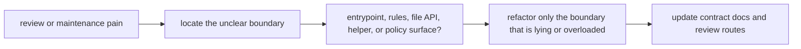

# Architecture Review, Drift, and Refactor Triggers

Architecture rarely collapses all at once.

It drifts.

That drift usually looks small in the moment:

- one more include
- one more helper
- one more path nobody documents yet
- one more rule file with a vague name

This page is about recognizing when those small moves have become an architecture problem.

## Architecture review asks whether the repository still teaches itself

At this stage, the key question is not only:

> does the workflow run?

It is also:

> could a new reviewer explain the repository shape without oral rescue?

That is the real architecture bar.

## Drift becomes visible before the workflow is huge

Warning signs often appear early:

- new contributors cannot find the entrypoint quickly
- file names and directories stop signaling ownership clearly
- contract docs lag behind path and workflow changes
- the rule graph is technically present, but helper layers are easier to inspect than the rules

These are architecture signals, not mere tidiness complaints.

## Refactors should be triggered by review pain, not by aesthetics alone

A repository refactor is justified when it improves one of these things:

- ownership clarity
- path-contract clarity
- onboarding and review speed
- separation between orchestration, implementation, and policy

It is weaker when the main reason is:

- “the tree feels messy”
- “this helper file looks too long”
- “we prefer more folders”

Those may be symptoms, but they are not yet architectural reasons.

## One useful review loop

This loop matters because large refactors often fail by changing several boundaries at
once without making any of them clearer.

## Strong refactor triggers

Strong triggers include:

- one rule family can no longer be reviewed as a coherent unit
- path contracts have changed but are no longer visible in docs
- helper code now hides workflow meaning
- the top-level assembly no longer explains how the repository is composed
- one architectural surface is doing multiple jobs badly

Those are good reasons to change the repository shape.

## Weak refactor triggers

Weak triggers include:

- rearranging folders with no ownership gain
- introducing modules or abstractions before reuse is real
- renaming files only because another layout feels trendier

These often increase churn without improving architecture.

## Common failure modes

| Failure mode | Why it hurts | Better repair |
| --- | --- | --- |
| refactor changes too many layers at once | reviewers cannot see what improved | isolate the overloaded or misleading boundary first |
| docs are updated after the architecture drift has already spread | review stays reactive | treat doc drift as an architecture defect early |
| repository shape follows personal taste more than workflow boundaries | maintenance becomes subjective | refactor around ownership and contract questions |
| new structure hides the visible DAG further | readability drops despite cleaner folders | preserve a clear entrypoint and named rule families |
| teams normalize confusion because the workflow still runs | architecture debt becomes invisible | use onboarding and review pain as a real signal |

## The explanation a reviewer trusts

Strong explanation:

> this refactor is needed because the current boundary no longer tells the truth: the rule
> family has outgrown its ownership surface, the file API is lagging the real paths, and a
> reviewer can no longer explain the repository without opening unrelated helper layers.

Weak explanation:

> we reorganized the repository to make it cleaner.

The strong explanation identifies the failing boundary. The weak one names only a mood.

## End-of-page checkpoint

Before leaving this page, you should be able to:

- explain how architecture drift appears before dramatic breakage
- name several strong triggers for architectural refactoring
- distinguish review pain from mere style preference
- explain why documentation lag is itself an architecture problem
