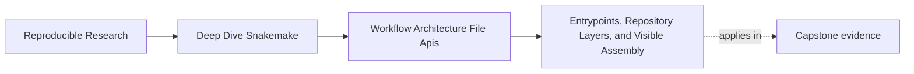
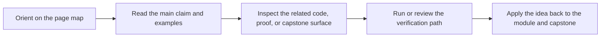
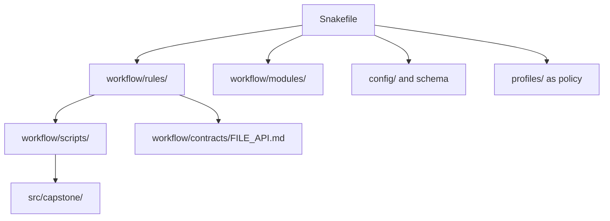

# Entrypoints, Repository Layers, and Visible Assembly

<!-- page-maps:start -->
## Page Maps

<!-- page-maps:end -->

The first architecture question in a Snakemake repository is simple:

> where should a reviewer look first to understand the workflow?

If that question does not have a clear answer, the repository is already asking too much
from memory and too little from structure.

This page is about making the entrypoint and layer responsibilities visible.

## The top-level entrypoint should announce the workflow shape

In the capstone, the top-level `Snakefile` does several important things:

- loads and validates config
- sets stable defaults
- assembles the workflow from named rule files
- defines the entrypoint target

That is a strong job for the entrypoint.

It tells a reviewer:

- where workflow assembly starts
- which files contribute rules
- which boundaries are visible at the top level

The `Snakefile` should feel like a routing and assembly surface, not a hiding place.

## A repository becomes clearer when layers have jobs

The capstone architecture already points toward a healthy split:

- `Snakefile` for visible assembly
- `workflow/rules/` for rule families and declared file contracts
- `workflow/modules/` for reusable workflow bundles
- `workflow/scripts/` for workflow-adjacent implementation
- `src/capstone/` for reusable package code
- `profiles/` for execution policy
- `config/` for input configuration and schema boundaries

These folders are useful only when their ownership stays legible.

## Layering is not about folder aesthetics

A repository layer matters when it answers a review question quickly.

For example:

- “where is the workflow assembled?” points to `Snakefile`
- “where does this rule family live?” points to `workflow/rules/`
- “where is reusable implementation code?” points to `src/capstone/`
- “where are path promises documented?” points to the file API and contract docs

If a folder exists but does not answer any boundary question, it may be decorative rather
than architectural.

## One useful architecture map

This diagram matters because it shows the repository as a set of named boundaries rather
than a pile of adjacent directories.

## A weak entrypoint

Weak shape:

- the `Snakefile` contains large implementation blocks
- rule inclusion happens with no clear naming or ownership reason
- important defaults are scattered across helper files most reviewers never read

This makes the repository harder to enter and easier to misunderstand.

## A stronger entrypoint

Stronger shape:

- keep the top-level file focused on assembly, defaults, and visible targets
- use named includes or modules that match coherent rule families
- keep implementation code and helper logic in their own owned layers

Now a reviewer can explain the repository in the same order they discover it.

## A practical test

Ask these questions:

1. Can a new reviewer locate the workflow assembly point quickly?
2. Can they tell which folders are for orchestration, implementation, policy, and contracts?
3. Does the entrypoint reveal more than it hides?

If those answers depend on prior oral explanation, the architecture is already weaker than
it should be.

## Common failure modes

| Failure mode | What goes wrong | Better repair |
| --- | --- | --- |
| `Snakefile` becomes a giant monolith | assembly and implementation blur together | keep orchestration visible and move owned logic outward |
| folders exist with no clear responsibility | readers browse without a mental map | assign each layer one reviewable job |
| config, policy, and workflow logic mix together | architecture questions become semantic questions | separate meaning, policy, and configuration surfaces clearly |
| helper code becomes easier to find than rules | the visible DAG stops being the first story | keep rule assembly easier to inspect than helper internals |
| entrypoint only works for insiders | onboarding depends on oral tradition | make the top-level file teach the repository layout directly |

## The explanation a reviewer trusts

Strong explanation:

> the `Snakefile` assembles the workflow and points to the owned rule families, while the
> repository layers separate orchestration, implementation, contracts, configuration, and
> policy so a reviewer can inspect one boundary at a time.

Weak explanation:

> the repository is organized into folders, and the important parts are spread around.

The strong explanation describes ownership. The weak one describes geography.

## End-of-page checkpoint

Before leaving this page, you should be able to:

- explain what the top-level `Snakefile` should own
- describe why repository layers need named responsibilities
- explain how visible assembly helps code review and onboarding
- identify one sign that a repository entrypoint is hiding too much
