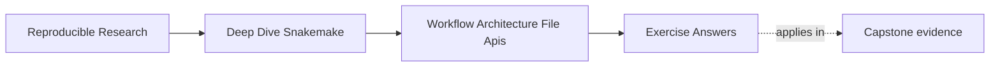

# Exercise Answers

<!-- page-maps:start -->
## Page Maps

<!-- page-maps:end -->

These answers are model explanations, not the only acceptable wording.

What matters is whether the reasoning makes repository ownership and review surfaces
clearer.

## Answer 1: Read the repository entrypoint

What belongs in the entrypoint:

- config loading and validation
- visible workflow assembly
- stable defaults
- the default target or public target surface

What should probably move elsewhere:

- the 150-line `run:` block

Why this is an architecture issue:

The entrypoint should announce the workflow shape. Once it starts hiding large
implementation logic, the repository entry surface becomes less useful for review and
onboarding.

## Answer 2: Judge a rule split

Why the split is weak:

- the filenames do not communicate ownership or workflow concern
- the split may reduce line count without improving architectural meaning

What kind of boundary would be stronger:

- rule families grouped by coherent workflow concern, such as preprocessing, summarization,
  publishing, or another clearly named domain

What a reviewer should infer from names:

- what the file owns
- which rules belong there
- how it relates to the visible workflow story

The key problem is not the number of files. It is the lack of an ownership signal.

## Answer 3: Review a file-API gap

What architecture problem this creates:

- path promises are real, but they are undocumented
- downstream and workflow-facing boundaries blur together

Risks:

- refactors break notebooks and tests invisibly
- maintainers cannot tell whether a path rename is a contract change
- consumers depend on internal layout by accident

What to add first:

- a file API or contract document that distinguishes workflow-facing paths from public
  publish-facing paths

The goal is to make path promises reviewable instead of implied.

## Answer 4: Diagnose hidden coupling

A strong review comment would say:

> This is not only a local code-quality problem. The helper changes repository behavior
> through undeclared files, unvalidated config, and import-time side effects, which means
> the visible rule and config surfaces no longer tell the full truth. That weakens the
> architecture because reviewers must inspect hidden layers to understand workflow meaning.

Why:

- architecture depends on visible boundaries staying trustworthy
- hidden dependencies move meaning away from the declared repository surfaces

## Answer 5: Decide whether to refactor

Architecture signals:

- onboarding questions keep repeating
- ownership boundaries are no longer obvious
- path contracts and code-placement rules are not visible enough

What boundary to inspect first:

- the entrypoint and the contract docs

Why:

- if reviewers cannot find the assembly point or the path promises, the rest of the
  architecture will feel arbitrary too

What kind of refactor is justified:

- clarify the top-level assembly
- rename or regroup rule families around ownership
- strengthen file-API or contract docs
- make the split between `workflow/scripts/` and `src/` easier to explain

The refactor should improve reviewability, not only folder appearance.

## Self-check

If your answers consistently explain:

- who owns orchestration
- where path promises live
- where reusable code belongs
- what makes a refactor honest rather than cosmetic

then you are using the module correctly.
