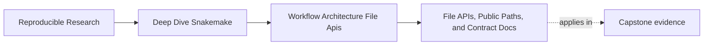
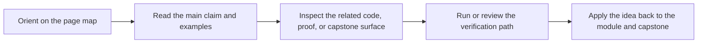
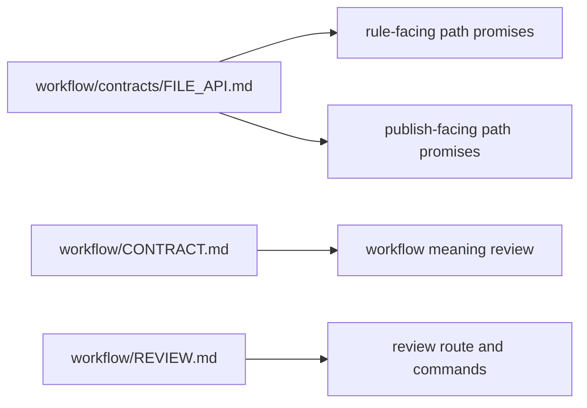

# File APIs, Public Paths, and Contract Docs

<!-- page-maps:start -->
## Page Maps

<!-- page-maps:end -->

Repository architecture is not only about where code lives.

It is also about where path promises live.

That is why Module 07 includes file APIs. Once a repository grows, path stability becomes a
team problem, not just a local implementation detail.

## A file API is an architectural boundary

A file API answers questions such as:

- which paths are stable
- which directories are internal
- which files downstream users or rules are allowed to rely on
- what kind of path change counts as a contract change

Without those answers, repository growth becomes dangerous because consumers depend on
paths that were never clearly named as promises.

## The capstone keeps path contracts close to the workflow

The capstone's `workflow/contracts/FILE_API.md` is doing important architectural work.

It records:

- the discovery surface
- the per-sample results surface
- the published outputs surface
- compatibility rules for path and payload changes

That means a reviewer does not have to infer path promises from the directory tree alone.

## File APIs are not only for downstream publishing

It is easy to think file APIs matter only for public reports or published bundles.

They also matter inside the workflow because rules depend on file surfaces too.

For example:

- `results/discovered_samples.json` is a workflow contract surface
- `results/{sample}/...` names stable per-sample result families
- `publish/v1/...` names the smaller public contract

This is why file APIs belong to architecture, not only to documentation.

## One useful separation

This separation matters because architecture stays healthier when path promises, meaning
promises, and review routes each have a visible home.

## A weak file-API posture

Weak shape:

- path meaning is implied by current folder names
- notebooks and tests rely on paths with no written contract
- path renames are treated as refactors even when consumers break

This makes repository change feel cheaper than it really is.

## A stronger file-API posture

Stronger shape:

- write down the stable workflow-facing and publish-facing path surfaces
- distinguish internal and public directories explicitly
- treat path changes as reviewable contract events
- keep contract docs close enough to the workflow that maintainers actually use them

Now the repository can evolve without pretending every path is accidental.

## A practical test

Ask these questions:

1. Could a maintainer tell which paths are stable just by reading the contract docs?
2. Would a path rename obviously trigger review rather than slip through as cleanup?
3. Do workflow-facing and downstream-facing path promises stay distinguishable?

If the answer to the first question is no, the architecture is relying on memory again.

## Common failure modes

| Failure mode | What it causes | Better repair |
| --- | --- | --- |
| path promises live only in current directory names | refactors break hidden consumers | document stable path surfaces explicitly |
| workflow and publish paths are mixed together | internal and public contracts blur | separate workflow-facing and downstream-facing surfaces |
| tests encode implementation paths casually | architecture becomes harder to change | bind tests to declared contract paths where appropriate |
| file API is too far from the workflow | maintainers stop using it during real reviews | keep contract docs close to the architecture they describe |
| path renames are treated as harmless cleanup | contract changes are merged invisibly | review path changes as architecture and contract events |

## The explanation a reviewer trusts

Strong explanation:

> the repository documents which workflow paths and published paths are stable, so a path
> change is reviewed as a contract event rather than as a cosmetic refactor.

Weak explanation:

> the folder names are descriptive, so the API is obvious.

The strong explanation creates a review surface. The weak explanation relies on current
layout luck.

## End-of-page checkpoint

Before leaving this page, you should be able to:

- explain why a file API is part of architecture rather than optional documentation
- distinguish workflow-facing and downstream-facing path contracts
- explain why path renames should trigger review
- describe one way file APIs reduce architecture drift
