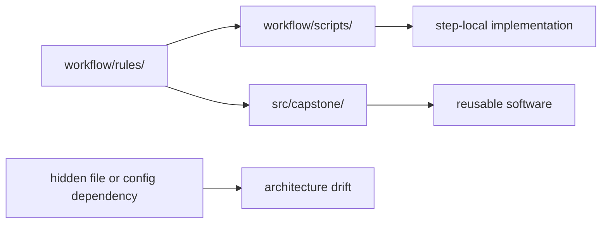

# Helpers, Scripts, Packages, and Coupling Control

Architecture gets weaker when implementation code becomes easier to find than the workflow
itself.

That usually happens slowly:

- helper modules absorb more logic
- scripts start reading undeclared files
- reusable code reaches into workflow state casually

At first, the repository looks more “organized.” Later, nobody can tell where workflow
meaning ends and implementation begins.

This page is about stopping that drift.

## Different code homes should imply different ownership

A healthy repository uses different homes for different reasons:

- `workflow/scripts/` for workflow-adjacent implementation
- `src/capstone/` for reusable package code
- `workflow/rules/` for file contracts and orchestration

These are not status markers. They are ownership markers.

## `workflow/scripts/` stays close to the workflow on purpose

Code in `workflow/scripts/` is a good fit when:

- one workflow step owns the behavior
- the code is tightly coupled to rule-local inputs and outputs
- the script is still easier to review when kept near the orchestration layer

The capstone's `workflow/scripts/provenance.py` is a useful example of code that belongs
close to one workflow step.

## `src/` is for reusable implementation, not hidden workflow logic

Code in `src/capstone/` is a better fit when:

- logic is reused across several steps
- the code deserves direct imports and tests
- the module is part of the software layer rather than just workflow glue

That becomes dangerous only when package code starts mutating workflow meaning through
undeclared assumptions.

## Coupling becomes architectural when it is hidden

Hidden coupling often looks like this:

- helper code reads files the rule never declared
- shared code assumes config keys that are not validated clearly
- import-time side effects alter behavior in ways the rule layer does not reveal

These are not only code smells. They are architecture smells because they weaken the
visible repository boundaries.

## One useful contrast

The point is not to maximize the number of layers. The point is to keep the visible rule
graph more informative than the hidden helper internals.

## A weak helper posture

Weak shape:

- generic `helpers` modules grow without a domain boundary
- reusable code silently reaches into workflow state
- readers must inspect imports to understand workflow meaning

This is how a repository turns into a private framework.

## A stronger helper posture

Stronger shape:

- the rule layer still owns file contracts and orchestration
- step-local code stays near the step
- reusable code stays reusable by accepting explicit inputs and parameters
- config and path assumptions remain declared in visible repository surfaces

Now code reuse supports the workflow story instead of replacing it.

## A practical test

Ask these questions:

1. Could I explain this workflow change without opening five helper modules first?
2. Does this helper require undeclared files or config to function?
3. Is this code reusable because it has a clean interface, or only because it is hard to find?

If the first answer is no, the repository may already be over-coupled.

## Common failure modes

| Failure mode | What it causes | Better repair |
| --- | --- | --- |
| giant generic helper modules | ownership disappears | split helpers by domain or by step-local ownership |
| package code reads workflow state implicitly | rule contracts stop telling the full story | pass inputs and parameters explicitly from the rule layer |
| step-local code promoted too early | reusable layer becomes ceremonial and noisy | keep code close to the step until reuse is real |
| helper imports become the only way to understand behavior | workflow review starts below the rule layer | keep orchestration and declared inputs visible in rule files |
| scripts and package code blur together | readers cannot tell what is local versus reusable | distinguish step-local implementation from reusable software clearly |

## The explanation a reviewer trusts

Strong explanation:

> the rule still owns the file contract, step-local logic stays in `workflow/scripts/`,
> reusable logic stays in `src/`, and helper code only accepts declared inputs and params
> instead of reaching into hidden workflow state.

Weak explanation:

> we moved the complex code into helpers so the workflow looks cleaner.

The strong explanation protects boundaries. The weak explanation only relocates complexity.

## End-of-page checkpoint

Before leaving this page, you should be able to:

- explain the architectural difference between `workflow/scripts/` and `src/`
- describe why hidden helper dependencies are architecture problems
- explain why the rule layer should remain easier to inspect than helper internals
- name one sign that a repository is becoming a private framework
