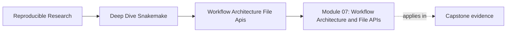
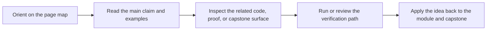

# Module 07: Workflow Architecture and File APIs


<!-- page-maps:start -->
## Page Maps




<!-- page-maps:end -->

Workflow architecture becomes important as soon as one person can no longer keep the whole
repository in their head.

That is not a late-stage problem. It starts the moment a workflow gains:

- more than one rule family
- more than one place where code can live
- more than one audience reviewing the repository

This module is about making that repository shape legible on purpose.

You will learn how to:

- keep the top-level workflow entrypoint understandable
- split rules and modules by ownership rather than by panic
- define file APIs so path stability is reviewable
- place helper code where it supports the workflow instead of swallowing it
- review architecture drift before the repository becomes oral tradition

The capstone corroboration surface for this module is the repository architecture itself:
`Snakefile`, `workflow/rules/`, `workflow/modules/`, `workflow/scripts/`,
`workflow/contracts/FILE_API.md`, `src/capstone/`, and the review documents that connect
them.

## Why this module exists

Many workflows do not fail because their science is wrong or because Snakemake is the
wrong tool.

They fail because the repository stops teaching its own shape.

Typical failure patterns look like this:

- the top-level `Snakefile` becomes a dumping ground
- rule files are split, but no one can explain the ownership boundary
- helper code becomes more important than the visible workflow graph
- path promises live in habit instead of in a file API
- new contributors need oral explanation before they can review anything safely

This module repairs those problems by treating architecture as part of reproducibility and
reviewability.

## Study route

```mermaid
flowchart LR
  overview["Overview"] --> core1["Core 1: entrypoint and repository layers"]
  core1 --> core2["Core 2: rule families and module boundaries"]
  core2 --> core3["Core 3: file APIs and path contracts"]
  core3 --> core4["Core 4: helpers, scripts, and package code"]
  core4 --> core5["Core 5: architecture review and drift control"]
  core5 --> example["Worked example"]
  example --> practice["Exercises and answers"]
  practice --> glossary["Glossary"]
```



Read the module in that order if the repository still feels like a pile of folders.

If the shape is already partly clear, use this shortcut:

- open Core 2 if your main problem is splitting rules or modules sanely
- open Core 3 if your main problem is path stability and file APIs
- open Core 5 if your main problem is reviewing architectural drift

## Module map

| Page | Purpose |
| --- | --- |
| [Overview](index.md) | explains the module promise and study route |
| [Entrypoints, Repository Layers, and Visible Assembly](entrypoints-repository-layers-and-visible-assembly.md) | teaches how the repository announces its shape |
| [Rule Families, Modules, and Ownership Boundaries](rule-families-modules-and-ownership-boundaries.md) | teaches how to split workflow logic without hiding it |
| [File APIs, Public Paths, and Contract Docs](file-apis-public-paths-and-contract-docs.md) | teaches path-level contracts and stable file surfaces |
| [Helpers, Scripts, Packages, and Coupling Control](helpers-scripts-packages-and-coupling-control.md) | teaches where implementation code belongs and how coupling spreads |
| [Architecture Review, Drift, and Refactor Triggers](architecture-review-drift-and-refactor-triggers.md) | teaches when architecture is getting harder to trust |
| [Worked Example: Reading a Snakemake Repository like an Architect](worked-example-reading-a-snakemake-repository-like-an-architect.md) | walks through a concrete repository review path |
| [Exercises](exercises.md) | gives five mastery exercises |
| [Exercise Answers](exercise-answers.md) | explains model answers and review logic |
| [Glossary](glossary.md) | keeps the module vocabulary stable |

## What should be clear by the end

By the end of this module, you should be able to explain:

- what the top-level `Snakefile` should own
- how rule families and modules should reflect ownership rather than file length
- why a file API is part of repository architecture, not extra paperwork
- how helper code and package code can support or distort the visible workflow
- when a repository refactor is architecture repair versus architecture drift

## Capstone route

Use the capstone only after the local module ideas are already legible.

Best corroboration surfaces for this module:

- `capstone/Snakefile`
- `capstone/workflow/rules/`
- `capstone/workflow/modules/`
- `capstone/workflow/CONTRACT.md`
- `capstone/workflow/contracts/FILE_API.md`
- [Architecture Guide](../capstone/docs/architecture.md)
- [Capstone File Guide](../capstone/capstone-file-guide.md)

Useful proof route:

```bash
snakemake --list-rules
snakemake -n
make tour
```

The point of that route is not only to prove the workflow runs. It is to inspect whether
the repository shape is still understandable without guesswork.
