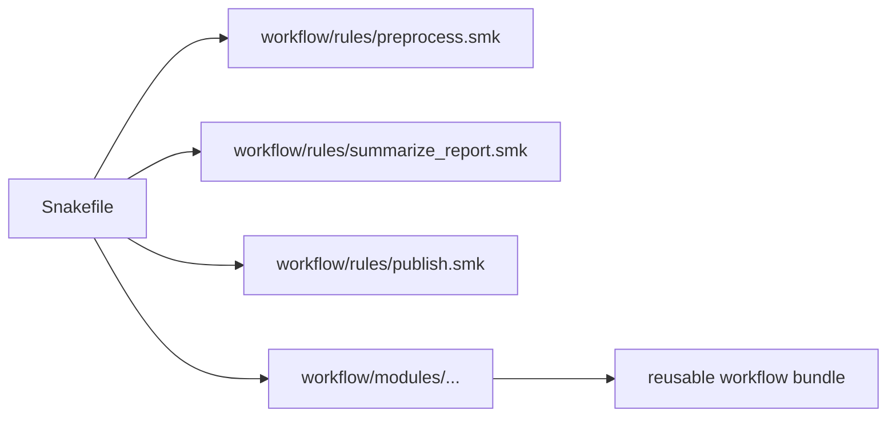

# Rule Families, Modules, and Ownership Boundaries

<!-- page-maps:start -->
## Page Maps

<!-- page-maps:end -->

Once a repository has more than a handful of rules, the next architecture question appears:

> how should the workflow be split so the structure becomes clearer rather than more hidden?

That question matters because splitting files can either improve review or make the
workflow harder to see.

This page is about splitting by ownership, not by panic.

## A file split is only useful when it reveals responsibility

Moving rules into separate files is not automatically good architecture.

It only becomes useful when the split helps a reviewer answer:

- which set of rules belongs together
- why they belong together
- what contract or domain boundary they share

In the capstone, `workflow/rules/preprocess.smk`, `summarize_report.smk`, and `publish.smk`
already point toward named rule families with different jobs.

That is a meaningful split.

## Rule families should correspond to coherent workflow concerns

A strong rule-family boundary often groups rules that share:

- one stage of the workflow story
- one file-surface family
- one review question

For example:

- preprocessing rules transform raw inputs into per-sample results
- summarize and report rules promote internal detail into reviewable outputs
- publish rules define the public bundle and its integrity surfaces

That is easier to inspect than a split based only on file size.

## Modules solve a different problem than includes

The capstone also contains `workflow/modules/`.

That signals a different boundary again:

- `workflow/rules/` can hold locally owned rule families
- `workflow/modules/` can hold reusable workflow bundles with clearer interfaces

The important lesson is not “use modules because they exist.”

The lesson is that includes and modules solve different ownership questions.

## One useful contrast

| Surface | Best use | Main question it answers |
| --- | --- | --- |
| top-level `Snakefile` | workflow assembly | how is the workflow composed? |
| `workflow/rules/` | local rule families | which rules belong to this repository concern? |
| `workflow/modules/` | reusable workflow bundles | which larger unit can be reused without blurring local ownership? |

This comparison matters because architecture gets weaker when one surface starts trying to
do the job of another.

## A visual split

The point is not that every repository must look exactly like this. The point is that each
split should carry a readable reason.

## Weak splitting

Weak shape:

- one rule family is scattered across many files
- a module exists only because someone wanted fewer lines in one file
- critical defaults or wiring move into a helper layer most reviewers never inspect

This creates indirection without clarity.

## Strong splitting

Strong shape:

- each rule file corresponds to a clear workflow concern
- module boundaries exist only when a reusable bundle has a real interface story
- the top-level assembly still lets a reviewer see the workflow shape quickly

Now reuse supports understanding instead of fighting it.

## A practical test

Ask these questions:

1. If I rename this file, what ownership boundary would break?
2. Can a reviewer explain why these rules live together?
3. Is this module reusable because it has an interface, or only because someone moved code?

If the third answer is the second one, the split probably needs rethinking.

## Common failure modes

| Failure mode | What it causes | Better repair |
| --- | --- | --- |
| file split based only on length | architecture becomes arbitrary | group rules by workflow concern and review boundary |
| one concern spread across many files | readers must reconstruct the workflow mentally | consolidate or rename around clear ownership |
| modules introduced with no interface story | reuse hides rather than clarifies | define what the module owns and what it exposes |
| rule assembly buried under helper indirection | visible DAG shape becomes harder to inspect | keep high-level composition near the entrypoint |
| reuse pursued for its own sake | local readability drops before any real gain appears | reuse only when the boundary becomes clearer, not just smaller |

## The explanation a reviewer trusts

Strong explanation:

> these rules stay together because they own one workflow concern and one review surface,
> while the module boundary exists only where a reusable workflow bundle has a clear
> interface and does not hide the visible DAG.

Weak explanation:

> we split the workflow into more files so it would feel cleaner.

The strong explanation is about ownership. The weak one is about appearance.

## End-of-page checkpoint

Before leaving this page, you should be able to:

- explain why rule families should map to coherent workflow concerns
- distinguish local rule files from reusable workflow modules
- describe one sign that a file split is architectural rather than cosmetic
- explain how too much indirection can hide the visible workflow graph
