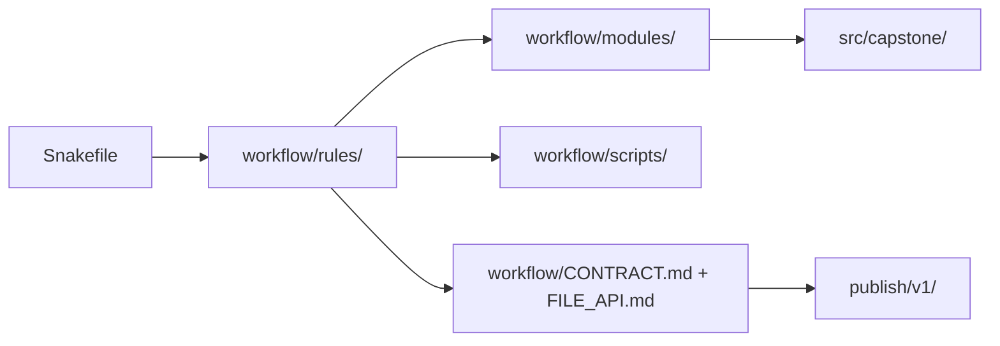

# Worked Example: Reading a Snakemake Repository Like an Architect

This worked example ties the module together.

The goal is not to inspect every file in the repository. The goal is to show how a
reviewer reads a growing workflow without getting lost in helper code or folder noise.

## Starting situation

Imagine you inherit the capstone and need to answer three questions quickly:

1. where is the workflow assembled?
2. where do the main rule families live?
3. where are path contracts and public promises documented?

If you cannot answer those questions in a stable order, the repository architecture is
already too opaque.

## Step 1: start at the entrypoint

The top-level `Snakefile` is the right first file because it visibly:

- loads and validates config
- sets directory defaults
- includes rule-family files
- defines the main target

That is exactly what a good entrypoint should do.

A reviewer learns the repository shape immediately:

- `workflow/rules/common.smk`
- `workflow/rules/preprocess.smk`
- `workflow/rules/summarize_report.smk`
- `workflow/rules/publish.smk`

This is better than starting in helper code, because the entrypoint shows the visible DAG
assembly first.

## Step 2: inspect rule families before helpers

Once the entrypoint is clear, the next useful move is to inspect the named rule families.

This gives a workflow story:

- preprocessing builds internal per-sample surfaces
- summarize and report promote selected artifacts
- publish defines the public bundle and its integrity surface

That sequence teaches architecture and workflow meaning at the same time.

## Step 3: inspect reusable workflow surfaces separately

The repository also contains `workflow/modules/`.

That tells a reviewer something different:

- these are reusable workflow bundles
- they are not the same kind of surface as the locally assembled rule families

For example, `workflow/modules/qc_module/Snakefile` and
`workflow/modules/screen_module/Snakefile` show reusable rule-template style boundaries,
while `workflow/scripts/provenance.py` remains workflow-adjacent step logic.

That is a useful architectural distinction.

## Step 4: inspect package code only after workflow boundaries are visible

The capstone also has `src/capstone/`.

That is the right place to expect reusable implementation code such as:

- `trim_fastq.py`
- `kmer_profile.py`
- `screen_panel.py`

By the time a reviewer reaches this layer, they should already know which rule or module
surface owns the orchestration boundary.

That prevents package code from becoming the first and only story of the repository.

## Step 5: confirm path contracts

Architecture review is incomplete until the path contracts are visible too.

The capstone keeps those in:

- `workflow/CONTRACT.md`
- `workflow/contracts/FILE_API.md`
- `capstone/docs/file-api.md`

Those docs answer questions the directory tree alone cannot:

- which workflow paths are stable
- which published paths are stable
- what kinds of changes count as contract changes

This is where architecture becomes reviewable rather than intuitive.

## One review route

The point of this route is to keep visible ownership ahead of implementation detail.

## A useful contrast

Weak reading order:

- open `src/capstone/` first
- browse helpers until the workflow shape slowly appears

Strong reading order:

- start with `Snakefile`
- inspect named rule families
- inspect modules and scripts by role
- inspect package code once orchestration is already legible
- confirm path contracts in the contract docs

The second route produces architectural understanding faster and with less guesswork.

## What this example teaches

If you can explain this example well, you understand the module:

- why entrypoint clarity matters
- why rule families and modules solve different architecture questions
- why helper code should not become the first repository story
- why file APIs and contract docs belong to architecture review
