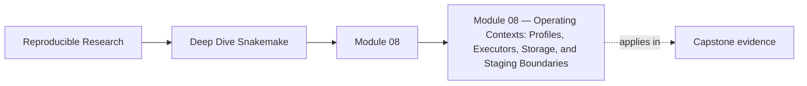
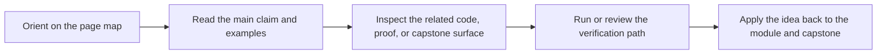

<a id="top"></a>

# Module 08 — Operating Contexts: Profiles, Executors, Storage, and Staging Boundaries


<!-- page-maps:start -->
## Page Maps




<!-- page-maps:end -->

A workflow that only works under one command on one machine is not yet operationally
sound. Snakemake becomes much more useful when the workflow semantics stay stable while
the operating context changes: local development, CI, scheduled execution, scratch space,
or a different executor plugin.

This module is about drawing that line cleanly. Profiles, executor settings, latency
knobs, storage choices, retries, and staging policies should change *how* the workflow is
run, not silently rewrite what the workflow means.

Capstone exists here as corroboration. The local exercises should already make the
execution-policy boundary understandable before you compare local, CI, and scheduler
profiles in the reference workflow.

### Before You Begin

This module works best after Modules 01-07, especially the parts on dynamic DAGs,
profiles, file APIs, and publish boundaries.

Use this module if you need to learn how to:

* separate workflow semantics from local, CI, and cluster policy
* keep retries, latency waits, and staging decisions from becoming hidden correctness crutches
* review whether executor or storage changes are safe before a workflow is scaled up

Proof loop for this module:

```bash
snakemake --profile profiles/local -n
snakemake --profile profiles/ci -n
snakemake --summary
```

Capstone corroboration:

* inspect `capstone/profiles/local/config.yaml`
* inspect `capstone/profiles/ci/config.yaml`
* inspect `capstone/profiles/slurm/config.yaml`
* inspect `capstone/Makefile`

## At a Glance

| Focus | Learner question | Capstone timing |
| --- | --- | --- |
| profiles as policy | "Which settings may change execution context without changing workflow meaning?" | inspect profile files only after the policy-versus-semantics split is explicit |
| executor and storage boundaries | "What should stay true when the workflow moves from local runs to CI or SLURM?" | compare local, CI, and SLURM surfaces side by side |
| failure discipline | "Which retries or staging choices are operational help, and which would hide a correctness problem?" | use the capstone when you are ready to read policy as evidence |

---

<a id="toc"></a>
## 1) Table of Contents

1. [Table of Contents](#toc)
2. [Learning Outcomes](#outcomes)
3. [How to Use This Module](#usage)
4. [Core 1 — Profiles as Policy, Not Workflow Logic](#core1)
5. [Core 2 — Executor and Storage Boundaries](#core2)
6. [Core 3 — Retries, Incomplete Output Handling, and Failure Discipline](#core3)
7. [Core 4 — Staging, Scratch Space, and Shared Filesystem Reality](#core4)
8. [Core 5 — Reviewing Operating Contexts for Drift](#core5)
9. [Capstone Sidebar](#capstone)
10. [Exercises](#exercises)
11. [Closing Criteria](#closing)

---

<a id="outcomes"></a>
## 2) Learning Outcomes

By the end of this module, you can:

* use profiles to encode operating policy without changing workflow semantics
* explain which executor or storage differences should matter and which should not
* treat retries and incomplete-output handling as explicit failure contracts
* stage workflow data safely without hiding assumptions about shared filesystems
* review operational drift before it causes “works here, fails there” behavior

[Back to top](#top)

---

<a id="usage"></a>
## 3) How to Use This Module

Set up one workflow with at least two profiles:

```text
lab/
  workflow/
    Snakefile
  profiles/
    local/
      config.yaml
    ci/
      config.yaml
  data/
  config/
```

Make both profiles target the same logical workflow but with different operating policy:

1. local development defaults
2. stricter CI or batch-oriented defaults

Then verify that changing profiles changes execution behavior and diagnostics, not the set
of trusted outputs.

[Back to top](#top)

---

<a id="core1"></a>
## 4) Core 1 — Profiles as Policy, Not Workflow Logic

Profiles are where you put:

* executor choice
* core and resource defaults
* printed command policy
* latency and retry settings
* storage or scheduler settings

Profiles are *not* where you should hide:

* changes to workflow inputs
* silent output-path rewrites
* config values that alter the scientific or analytical contract

If moving from `profiles/local` to `profiles/ci` changes what the workflow is supposed to
produce, your policy boundary is leaking into semantics.

[Back to top](#top)

---

<a id="core2"></a>
## 5) Core 2 — Executor and Storage Boundaries

Different operating contexts are real:

* local execution
* CI execution
* SLURM or another scheduler
* remote or staged storage

But the workflow should still answer the same core questions:

* what are the declared inputs?
* what outputs are authoritative?
* what changes are expected when a job is delayed, retried, or staged?

Executor or storage differences are safest when:

* the workflow file contract stays unchanged
* resource expectations are declared rather than guessed
* any staging path or scratch policy is explicit in review

[Back to top](#top)

---

<a id="core3"></a>
## 6) Core 3 — Retries, Incomplete Output Handling, and Failure Discipline

Retries are useful, but only when they represent a conscious failure contract.

Good retry questions:

* which failures are plausibly transient?
* which failures indicate a wrong rule or broken environment?
* what output cleanup happens if a job stops halfway?

Bad retry habits:

* adding retries because failures are unexplained
* treating retries as a substitute for atomic outputs
* leaving incomplete artifacts behind and hoping Snakemake will “sort it out”

Operational discipline means a failed run remains understandable. Retries should make that
easier, not murkier.

[Back to top](#top)

---

<a id="core4"></a>
## 7) Core 4 — Staging, Scratch Space, and Shared Filesystem Reality

Operating context becomes fragile when the workflow assumes:

* metadata is instantly visible everywhere
* scratch and publish paths behave the same
* temporary state can be inspected later even though it is node-local
* a shared filesystem will always make output discovery immediate

Staging discipline means:

* know where temporary work happens
* know when a staged result becomes visible as a trusted output
* keep publish boundaries separate from scratch policy
* document latency-sensitive assumptions instead of treating them as folklore

[Back to top](#top)

---

<a id="core5"></a>
## 8) Core 5 — Reviewing Operating Contexts for Drift

Review questions for mature workflows:

* does the profile encode policy or sneak in semantics?
* do local and CI runs still agree on the published outputs?
* are retries hiding an actual correctness defect?
* would a filesystem or executor change alter only operations, or also meaning?
* are staging assumptions written down where another engineer can find them?

Operational drift often looks like convenience:

* “just add this flag to the profile”
* “CI can use a different path”
* “the scheduler is flaky, raise retries”

The right response is not always “never do that.” It is “name the boundary clearly before
the workflow starts depending on accidents.”

[Back to top](#top)

---

<a id="capstone"></a>
## 9) Capstone Sidebar

Use the capstone to inspect:

* `profiles/local`, `profiles/ci`, and `profiles/slurm` as policy surfaces
* `Makefile` targets such as `wf-dryrun`, `verify`, and `confirm`
* the distinction between clean-room confirmation and ordinary local workflow runs
* how published artifacts remain the same even when the operating context changes

[Back to top](#top)

---

<a id="exercises"></a>
## 10) Exercises

1. Create two profiles for one workflow and show that they change operations without changing published results.
2. Add a retry policy and explain which failures it is allowed to treat as transient.
3. Simulate a staging or shared-filesystem assumption, then document the boundary that keeps publish results trustworthy.
4. Review a profile file and identify one setting that belongs there and one that should move back into workflow or config code.

[Back to top](#top)

---

<a id="closing"></a>
## 11) Closing Criteria

You pass this module only if you can demonstrate:

* at least two operating profiles with clear policy roles
* stable workflow semantics across those profiles
* failure handling that explains retries and incomplete outputs explicitly
* operating-context assumptions documented well enough for another engineer to review

[Back to top](#top)
