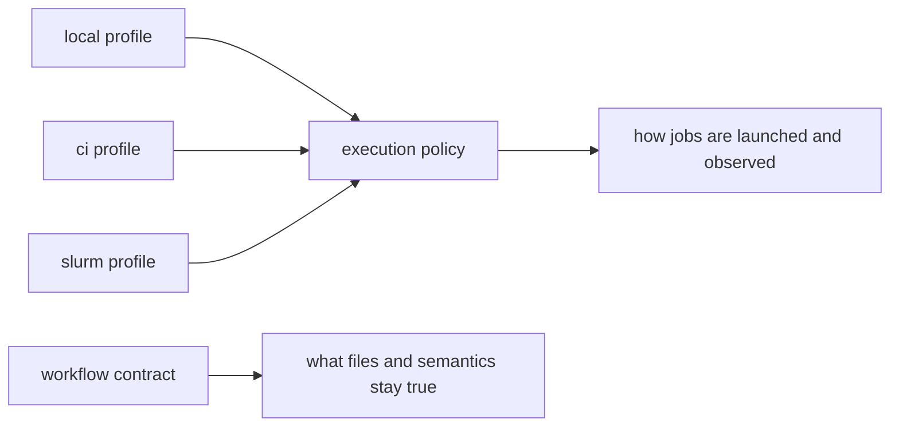

# Executors, Queues, and Context-Invariant Workflow Meaning

Once profiles are understood as policy surfaces, the next question appears:

> what should stay true when the workflow moves from local runs to CI or a scheduler?

That is the core operating-context question.

If the answer is “it depends on the machine,” the workflow contract is already weaker than
it should be.

## Different execution contexts are real

Local, CI, and scheduler-backed runs do not behave identically.

They differ in practical ways:

- concurrency limits
- queueing and scheduling delay
- filesystem latency
- available cores and memory
- operational logging expectations

Those differences are not failures. They are part of real operating environments.

The problem begins when those differences start changing workflow meaning instead of
execution behavior.

## A workflow should travel across contexts without changing its contract

When the execution context changes, the workflow should still answer the same questions:

- what are the declared inputs?
- what outputs are authoritative?
- what path contracts remain stable?
- what rebuild or publish evidence should exist?

If those answers differ by context, the repository may have multiple hidden workflows
instead of one stable workflow with multiple operating policies.

## The capstone profiles illustrate this boundary well

The capstone offers:

- `profiles/local/config.yaml`
- `profiles/ci/config.yaml`
- `profiles/slurm/config.yaml`

These profiles differ in policy surfaces such as:

- job count expectations
- latency waits
- shell-command visibility

They do not claim to redefine:

- rule contracts
- publish paths
- workflow discovery semantics

That is the right architectural posture.

## One useful contrast

This diagram matters because it shows variation in operations without variation in core
meaning.

## A weak context boundary

Weak shape:

- CI uses different semantic config values to “make things pass”
- cluster runs write outputs to a different contract path with no deliberate versioning
- local runs quietly skip checks that change the trusted result story

Now the operating context has become part of the workflow meaning.

## A stronger context boundary

Stronger shape:

- keep execution differences in profile or executor policy
- keep workflow meaning in rule, config-contract, and publish-contract surfaces
- compare dry-runs across contexts to confirm the workflow story remains coherent

This makes migrations less mysterious and profile review more honest.

## A practical test

Ask these questions when a context changes:

1. Would the same inputs still produce the same trusted outputs?
2. Is the dry-run plan semantically the same, even if execution settings differ?
3. Did a context-specific change leak into path, config, or publish meaning?

If the answer to the third question is yes, the context boundary is leaking.

## Common failure modes

| Failure mode | What goes wrong | Better repair |
| --- | --- | --- |
| CI uses a different semantic config story | tests stop representing the real workflow | keep semantic config separate from profile policy |
| cluster context rewrites trusted paths casually | one operating surface becomes a hidden fork | keep contract paths stable or version changes deliberately |
| local runs quietly skip meaningful checks | context convenience alters trust | separate optional diagnostics from contract-defining behavior |
| scheduler migration assumes filesystem behavior equals local behavior | latent path and visibility issues appear later | review storage and latency assumptions explicitly |
| context comparison happens only after failures | drift remains invisible until late | compare profiles and dry-runs before migration or scale-up |

## The explanation a reviewer trusts

Strong explanation:

> local, CI, and SLURM change how the workflow is launched and observed, but the rule
> contracts, config meaning, and published outputs stay the same, so the operating-context
> differences remain policy rather than semantic drift.

Weak explanation:

> the workflow behaves a little differently in each environment, which is normal.

The strong explanation distinguishes policy from meaning. The weak explanation normalizes
drift without examining it.

## End-of-page checkpoint

Before leaving this page, you should be able to:

- explain what should remain invariant across operating contexts
- explain why executor changes should not create a hidden alternate workflow
- describe one safe context difference and one dangerous one
- explain why comparing dry-runs across profiles is useful architecture evidence
