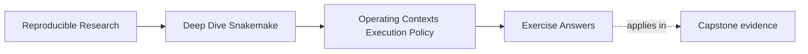
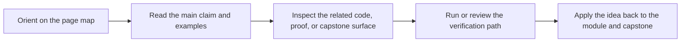

# Exercise Answers

<!-- page-maps:start -->
## Page Maps

<!-- page-maps:end -->

These answers are model explanations, not the only acceptable wording.

What matters is whether the reasoning keeps policy and workflow meaning separate.

## Answer 1: Decide whether a profile change is safe

Likely operating policy:

- local: `latency-wait: 60`
- CI: `printshellcmds: false`

Likely semantic leak:

- SLURM: a different `publish_dir`

Why:

Latency waits and shell-command visibility change how the workflow is run and observed.
A different publish directory changes a trusted contract path and therefore changes more
than policy.

## Answer 2: Review retries honestly

Why this may be weak:

- it increases policy pressure without first classifying the failure
- it risks hiding deterministic workflow or environment defects

What question should be asked first:

- is this failure plausibly transient, or is it deterministic?

What evidence to request:

- failed logs
- any cluster or storage evidence that explains the intermittence
- confirmation that incomplete outputs are handled explicitly

The main lesson is that retries are not a substitute for diagnosis.

## Answer 3: Diagnose a storage-boundary problem

What trust problem this creates:

- reviewers are inspecting a temporary execution surface as if it were the contract surface

When a file should count as trusted:

- once it has been materialized onto the declared workflow or publish path that the contract
  says reviewers and downstream users may trust

What needs clarification:

- the boundary between scratch or staging locations and trusted output locations
- the visibility and promotion model for outputs

## Answer 4: Compare contexts

A strong argument would say:

> Side-by-side dry-run comparison matters because all three contexts can “work” while still
> carrying different workflow meaning. Dry-runs help reveal whether profiles changed only
> execution policy or whether one context now plans a different semantic story.

Why:

- successful execution is not enough evidence against semantic drift
- comparison makes hidden context-specific behavior much easier to spot

## Answer 5: Escalate a suspicious policy change

Why this is not just a profile difference:

- sample filtering changes workflow semantics and published meaning

Which review surface should own that decision:

- visible workflow or config-contract surfaces, not profile policy

What should happen before approval:

- move the semantic setting into an explicit workflow or config boundary
- review the effect on contracts and outputs
- compare contexts again after the change is made honest

## Self-check

If your answers consistently explain:

- what stays in policy
- what belongs to workflow meaning
- what evidence justifies retry or latency changes
- when storage and path trust become review issues

then you are using the module correctly.
