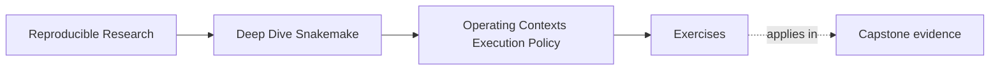

# Exercises

<!-- page-maps:start -->
## Page Maps

<!-- page-maps:end -->

Use these exercises to practice operating-context judgment, not only profile vocabulary.

The strongest answers will make the policy boundary and the semantic boundary explicit.

## Exercise 1: Decide whether a profile change is safe

A teammate proposes these profile changes:

- local: `latency-wait: 60`
- CI: `printshellcmds: false`
- SLURM: a different `publish_dir`

Write a short review note that explains:

- which changes look like operating policy
- which change looks like a semantic leak
- why the distinction matters

## Exercise 2: Review retries honestly

A workflow has started failing intermittently on one cluster. The proposed fix is:

- increase retries from 1 to 5
- do not inspect failed logs yet

Explain:

- why this may be a weak operating response
- what failure classification question should be asked first
- what evidence you would want before approving the change

## Exercise 3: Diagnose a storage-boundary problem

A scheduler-backed run stages outputs onto node-local scratch and later copies some of
them to shared storage. Reviewers have started checking the scratch directory directly when
the shared output is delayed.

Explain:

- what trust problem this creates
- when a file should count as a trusted output
- what policy or documentation boundary needs to be clarified

## Exercise 4: Compare contexts

A repository has `profiles/local`, `profiles/ci`, and `profiles/slurm`. No one has ever
compared their dry-runs side by side.

Write a short argument for why that comparison matters even if all three contexts appear to
“work.”

Your answer should focus on semantic drift rather than operational convenience.

## Exercise 5: Escalate a suspicious policy change

During review, you notice that one profile now sets a different config value that changes
how samples are filtered before publication.

Describe:

- why this is not just a profile difference
- which review surface should own that decision instead
- what should happen before the change is approved

## Mastery check

You have a strong grasp of this module if your answers consistently keep four ideas visible:

- profiles own policy, not workflow meaning
- context changes should preserve trusted outputs
- retries and latency settings need a failure model
- storage and visibility assumptions must be reviewable
