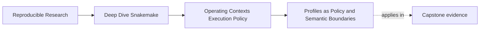
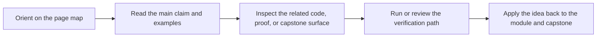
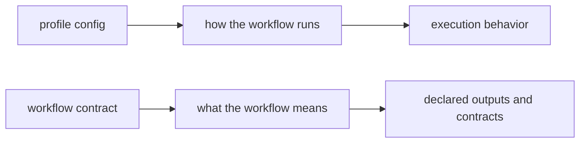

# Profiles as Policy and Semantic Boundaries

<!-- page-maps:start -->
## Page Maps

<!-- page-maps:end -->

The first operating-context question is the most important one:

> what is allowed to change when the profile changes?

If that answer is vague, profiles become one of the easiest places to hide semantic drift.

This page is about keeping that boundary honest.

## Profiles should change operations, not workflow meaning

A profile is a good home for operating policy such as:

- executor choice
- parallelism defaults
- printed command policy
- latency waits
- retry counts
- log visibility and operational convenience flags

Those settings affect how the workflow is run.

They should not silently change:

- the set of inputs the workflow trusts
- the meaning of the outputs it promises
- the path contract of the repository
- the scientific or analytical interpretation of the run

That distinction is the foundation of this module.

## The capstone profiles are small on purpose

The capstone's `profiles/local/config.yaml`, `profiles/ci/config.yaml`, and
`profiles/slurm/config.yaml` are useful because they stay narrow.

They express operating differences such as:

- job counts
- latency waits
- shell command visibility
- failed-log visibility

That makes them easier to review as policy rather than as hidden workflow definition.

## Why this boundary matters

If switching from `profiles/local` to `profiles/ci` changes what the workflow is supposed
to produce, then the repository is no longer separating policy from semantics.

At that point:

- reviews become harder
- reproducibility claims weaken
- environment-specific behavior starts to masquerade as workflow truth

This is how “works locally” becomes a structural problem instead of a temporary annoyance.

## One useful contrast

The point of this diagram is that policy and meaning are connected, but they are not the
same boundary.

## A weak profile posture

Weak shape:

- a profile injects alternate paths that change workflow meaning
- a profile changes config values that alter the analytical contract
- maintainers rely on profile switching to “fix” correctness differences

This creates hidden forks of workflow behavior.

## A stronger profile posture

Stronger shape:

- keep profile settings focused on executor and operational behavior
- keep workflow meaning in visible workflow and config-contract surfaces
- review profile changes as policy changes unless they explicitly cross into semantics

Now profiles help the workflow move across contexts without pretending to redefine it.

## A practical test

Ask these questions about a profile change:

1. Does this setting change only execution policy?
2. Would the trusted outputs mean the same thing after the change?
3. If this changed the workflow contract, would that fact be visible anywhere besides the profile?

If the answer to the second question is no, the profile boundary is leaking.

## Common failure modes

| Failure mode | What goes wrong | Better repair |
| --- | --- | --- |
| profile changes output or input paths | operating policy starts altering workflow meaning | keep path contracts in workflow or config surfaces, not in profiles |
| CI profile carries “special-case” semantic knobs | one context becomes a hidden alternate workflow | move semantic settings into explicit config and review them there |
| retries and waits are used to hide unstable rules | policy masks correctness issues | repair the rule or runtime instead of normalizing the symptom |
| profile files accumulate unrelated decisions | policy review becomes muddy | keep profile settings focused on execution context |
| maintainers cannot explain whether a setting is semantic | drift goes unchallenged | document the policy-versus-semantics boundary and review against it |

## The explanation a reviewer trusts

Strong explanation:

> these profile differences affect execution policy only: job concurrency, logging, and
> latency expectations change, but the workflow contract, inputs, and published outputs do
> not.

Weak explanation:

> the profiles are different because each environment needs its own setup.

The strong explanation names the boundary. The weak explanation leaves the boundary
unexamined.

## End-of-page checkpoint

Before leaving this page, you should be able to:

- explain what profiles should own
- explain what profiles should not silently change
- describe why profile drift can become semantic drift
- give one example of a policy change that is safe and one that is not
