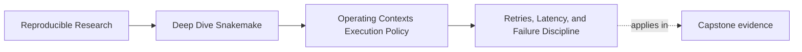
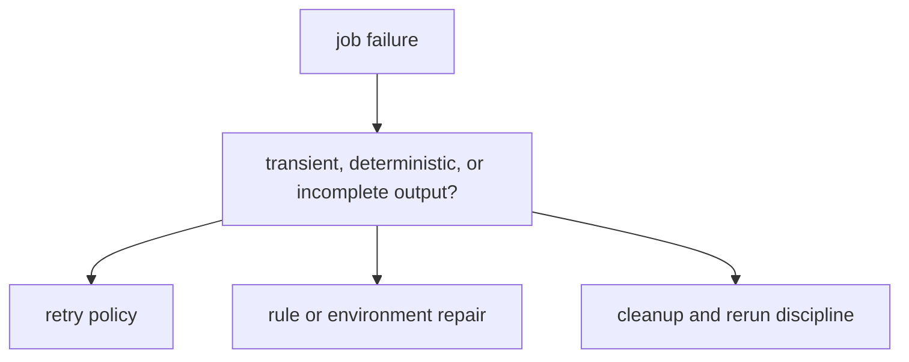

# Retries, Latency, and Failure Discipline

<!-- page-maps:start -->
## Page Maps

<!-- page-maps:end -->

Not every failure means the workflow is wrong.

But not every repeated failure is transient either.

This page is about the difference.

Retries, latency waits, and incomplete-output handling are useful operating tools only when
they support understanding instead of hiding defects.

## Operational help should not become a correctness crutch

Settings such as:

- retry counts
- latency waits
- rerun-incomplete behavior
- failed-log visibility

can improve robustness and reviewability.

They become risky when they are used to avoid harder questions:

- why is this rule unstable?
- why are outputs incomplete?
- why does visibility lag matter here?
- why does one environment need more “help” than another?

If those questions disappear behind higher retry counts, the policy boundary is masking a
real defect.

## Failures need categories

A strong operating posture separates at least three kinds of failure:

- likely transient operational failures
- deterministic workflow or environment failures
- incomplete or partially written outputs that need explicit cleanup behavior

Those categories do not deserve the same response.

Retries may help the first.

They usually do not fix the second.

The third requires honest output-discipline rather than wishful reruns.

## The capstone profiles hint at this boundary

The capstone profiles include operational settings such as:

- `rerun-incomplete: true`
- `latency-wait`
- visible shell commands and failed logs

These are useful precisely because they stay visible as policy.

They do not pretend to explain *why* a failure happened. They only define how the system
should respond once the failure exists.

## One useful contrast

This matters because one policy knob should not answer all three branches.

## A weak failure posture

Weak shape:

- retries increase whenever failures become annoying
- latency waits are raised without examining storage or visibility assumptions
- incomplete outputs remain after failure and are treated as normal clutter

This makes operating policy look helpful while understanding gets worse.

## A stronger failure posture

Stronger shape:

- use retries only when transient failure is plausible
- use latency waits as explicit filesystem-policy decisions, not as superstition
- keep failed logs visible enough that maintainers can inspect root causes
- treat incomplete outputs as contract and cleanup questions, not as background noise

Now the workflow fails in ways that remain understandable.

## A practical test

Ask these questions when a failure-related setting changes:

1. What class of failure is this setting meant to address?
2. Would this change help diagnose the issue or only postpone it?
3. Could the same setting be hiding a deterministic defect in the workflow or runtime?

If the second answer is “only postpone it,” the policy is probably doing the wrong job.

## Common failure modes

| Failure mode | What goes wrong | Better repair |
| --- | --- | --- |
| retries increase with no failure classification | true defects stay alive longer | define which failures are plausibly transient first |
| latency waits become folklore | storage problems stay unnamed | treat latency as an explicit filesystem and visibility assumption |
| incomplete outputs are left ambiguous | reruns and review become murky | use explicit incomplete-output policy and cleanup expectations |
| failed logs are hidden to reduce noise | diagnosis gets slower and more anecdotal | keep failure evidence accessible during review |
| teams celebrate resilience without understanding failure cause | policy success masks semantic risk | pair policy changes with root-cause review |

## The explanation a reviewer trusts

Strong explanation:

> this retry and latency policy exists because the operating context may introduce genuine
> scheduling or visibility delays, but we still inspect failed logs and treat incomplete
> outputs as evidence, not as harmless leftovers.

Weak explanation:

> we raised retries so the workflow would stop failing.

The strong explanation names the failure model. The weak explanation only suppresses the
symptom.

## End-of-page checkpoint

Before leaving this page, you should be able to:

- explain when retries are justified and when they are suspicious
- explain why latency waits should be tied to real visibility assumptions
- describe why incomplete outputs are a policy and contract concern
- explain how failure evidence supports operating review
