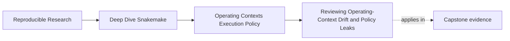
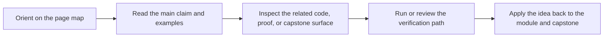
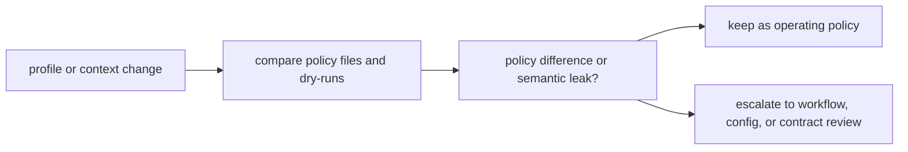

# Reviewing Operating-Context Drift and Policy Leaks

<!-- page-maps:start -->
## Page Maps

<!-- page-maps:end -->

Operating-context drift is rarely dramatic at first.

It usually arrives through small decisions that seem harmless:

- one more profile-specific tweak
- one more context-specific path override
- one more retry increase
- one more undocumented storage assumption

This page is about catching those leaks before they rewrite workflow behavior by accident.

## Operating-context review is different from ordinary workflow review

A normal workflow review asks:

- does the DAG still make sense?
- do the rules still declare the right contracts?

An operating-context review asks:

- do different contexts still mean the same workflow?
- are profile differences still policy rather than semantics?
- are storage, failure, and visibility assumptions still explicit?

Those questions overlap, but they are not the same.

## Drift becomes visible when contexts are compared side by side

The capstone's `profile-audit` route is valuable because it compares:

- profile config files
- dry-runs under multiple contexts
- review questions about policy versus meaning

That is exactly the right posture.

Drift stays harder to see when each context is inspected in isolation.

## One useful review loop

This loop matters because context drift often hides behind the phrase “environment-specific
adjustment.”

## What to inspect first

Start with four practical questions:

1. Do the context differences stay within executor, logging, latency, or retry policy?
2. Did any context introduce different paths, different semantic config, or different trusted outputs?
3. Are failures being explained better, or merely retried more often?
4. Are storage and visibility assumptions named clearly enough for another maintainer to audit them?

These questions make policy leaks visible early.

## A weak review posture

Weak shape:

- profiles are approved one at a time with no cross-context comparison
- “works on the cluster” is treated as sufficient justification
- policy changes are merged before anyone asks whether the workflow meaning drifted

This lets execution context become a hidden author of workflow behavior.

## A stronger review posture

Stronger shape:

- compare local, CI, and scheduler contexts side by side
- treat policy differences as acceptable only when workflow meaning remains stable
- escalate suspicious differences into config, contract, or workflow review
- keep evidence bundles or review notes that explain why the drift is acceptable or not

Now the repository can move across contexts without losing its semantic center.

## Common failure modes

| Failure mode | Why it is risky | Better repair |
| --- | --- | --- |
| context-specific semantic knobs are hidden in profiles | one workflow becomes several hidden variants | move semantics into visible workflow or config surfaces |
| cluster migration relies on unreviewed storage differences | path trust changes without being named | audit filesystem and visibility assumptions explicitly |
| retries rise as contexts get noisier | deterministic defects stay mislabeled as transient | classify failure modes before altering policy |
| dry-runs are never compared across contexts | semantic drift stays invisible | compare planned work across local, CI, and scheduler profiles |
| policy review happens without evidence | context changes become anecdotal | use audit bundles, dry-runs, and guide routes as review evidence |

## The explanation a reviewer trusts

Strong explanation:

> these context differences remain operating policy because the dry-run plan, contract
> paths, config meaning, and trusted outputs stay stable across local, CI, and SLURM; the
> remaining differences are executor and observability policy only.

Weak explanation:

> each environment needs its own behavior, so exact comparison is not very useful.

The strong explanation checks invariants. The weak explanation excuses drift before it is
examined.

## End-of-page checkpoint

Before leaving this page, you should be able to:

- explain how operating-context review differs from ordinary workflow review
- name several signs of a policy leak
- explain why side-by-side dry-run comparison is valuable
- describe when a profile change should escalate into semantic review
