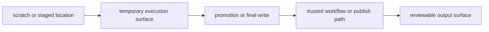

# Staging, Storage, and Filesystem Assumptions

Operating contexts are not only about executors and profiles.

They are also about where data lives while the workflow runs and when that data becomes
visible to the rest of the system.

This page is about making those assumptions explicit instead of treating them as invisible
background behavior.

## Storage policy can affect operations without changing workflow meaning

A workflow may run across contexts that differ in:

- local scratch availability
- shared filesystem latency
- remote or mounted storage behavior
- when output metadata becomes visible

Those differences matter operationally.

They should not silently change:

- which outputs count as trusted
- which paths belong to the workflow contract
- when publication happens

That is the core storage-policy boundary.

## Scratch space is not the same thing as a published surface

Scratch or staged paths are useful for:

- temporary computation
- reducing pressure on shared storage
- executor-local working directories

They are not the same as:

- stable workflow-facing outputs
- publish-facing outputs
- long-lived review surfaces

Confusing those roles is one of the fastest ways to create operating-context drift.

## Visibility assumptions must stay explicit

Latency and visibility matter when:

- a job finishes but another process does not yet see the output
- a scheduler context uses a different storage path than local runs
- a staged artifact exists only on node-local scratch until promotion

Those are operating realities.

The mistake is not that they exist. The mistake is assuming them silently.

## One useful contrast

This matters because a file can exist before it becomes part of a trusted contract.

## A weak storage posture

Weak shape:

- scratch paths are treated as if they were final outputs
- shared filesystem visibility lag is addressed only by folklore
- publish surfaces are assumed to behave like temporary work directories

This makes storage behavior look simpler than it really is, while trust gets harder to
review.

## A stronger storage posture

Stronger shape:

- name where temporary work happens
- name when and where trusted outputs are materialized
- treat latency and visibility as explicit operating assumptions
- keep publish and workflow contracts separate from scratch policy

Now storage differences can be reviewed as policy instead of as mystery.

## A practical test

Ask these questions when storage policy changes:

1. Is this path temporary, workflow-facing, or publish-facing?
2. When does an artifact become trustworthy enough for downstream use?
3. Are visibility or latency assumptions being documented, or only tolerated?

If the first answer is fuzzy, the storage boundary is already too weak.

## Common failure modes

| Failure mode | What goes wrong | Better repair |
| --- | --- | --- |
| scratch artifacts are inspected as if they were final truth | reviewers trust unstable surfaces | keep trusted outputs on declared workflow or publish paths |
| latency waits compensate for unnamed storage assumptions | policy becomes superstition | document the visibility model and review it explicitly |
| cluster or CI contexts use alternate output locations casually | operating policy leaks into path contracts | keep final contract paths stable across contexts |
| publish boundaries depend on temporary directories implicitly | downstream trust depends on runtime accident | separate promotion into trusted outputs from temporary work locations |
| filesystem behavior is discussed only after failures | migrations stay risky | audit storage and visibility assumptions before scale-up |

## The explanation a reviewer trusts

Strong explanation:

> staged or scratch locations are temporary execution surfaces only; trusted workflow and
> publish outputs are materialized on declared contract paths, and any latency or
> visibility assumptions are reviewed as operating policy.

Weak explanation:

> the files eventually show up, so the storage details do not matter much.

The strong explanation names the trust boundary. The weak explanation delegates trust to
luck.

## End-of-page checkpoint

Before leaving this page, you should be able to:

- explain why scratch space is not a contract surface
- describe when an artifact becomes trustworthy enough for review or downstream use
- explain why latency and visibility assumptions belong in policy review
- name one storage change that is operationally safe and one that is not
