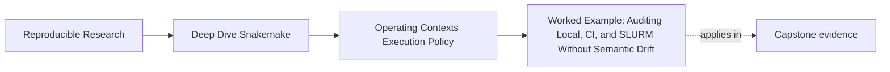
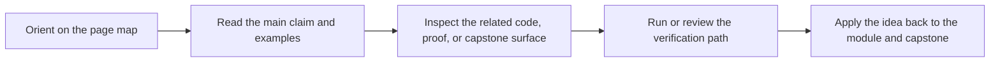
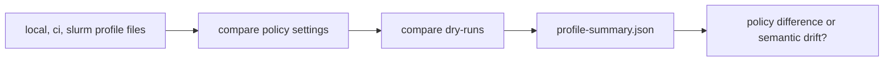

# Worked Example: Auditing Local, CI, and SLURM Without Semantic Drift

<!-- page-maps:start -->
## Page Maps

<!-- page-maps:end -->

This worked example ties the module together.

The goal is not to prove that every profile difference is harmless. The goal is to show
how a reviewer can compare operating contexts without confusing policy variation for
workflow variation.

## Starting situation

Imagine you inherit a workflow with three operating contexts:

- local development
- CI
- SLURM

The repository claims that these contexts change execution policy, not workflow meaning.

That claim is only trustworthy if the review route can prove it.

## Step 1: read the profile surfaces directly

The capstone gives a good starting point:

- `profiles/local/config.yaml`
- `profiles/ci/config.yaml`
- `profiles/slurm/config.yaml`

Those files are small enough that a reviewer can compare them without guesswork.

They change policy surfaces such as:

- `jobs`
- `latency-wait`
- `printshellcmds`
- `show-failed-logs`
- `rerun-incomplete`

That is already a useful signal: the profiles are not trying to carry the whole workflow.

## Step 2: compare the dry-runs, not only the flags

The Makefile's `profile-audit` route then does something important:

- it copies the profile configs into one audit bundle
- it captures `local-dryrun.txt`
- it captures `ci-dryrun.txt`
- it captures `slurm-dryrun.txt`

This matters because dry-runs reveal whether policy differences are still preserving the
same workflow story.

The right question is not only “did the profile file change?”

It is:

> does the planned workflow still mean the same thing?

## Step 3: use a compact policy summary

The `profile-summary` route adds a smaller comparison surface.

Its job is to separate:

- shared settings
- differing settings
- profile-only settings

That is useful because a reviewer can see, quickly, whether differences are:

- expected operating policy differences
- suspicious context-specific behavior

## Step 4: decide what remains invariant

At this point, the reviewer should still be able to say:

- the rule contracts remain the same
- the path contracts remain the same
- the published outputs remain the same
- the context differences are about how the workflow runs and is observed

If that explanation stops being true, the repository has drifted beyond policy.

## Step 5: think through a leak scenario

Now imagine three possible changes:

1. the SLURM profile raises `latency-wait`
2. the CI profile adds a different output path to make tests easier
3. the local profile raises retries after intermittent failures

These do not mean the same thing.

- the first may be a legitimate policy response to visibility delays
- the second is a semantic leak because trusted paths changed by context
- the third may be safe or unsafe depending on whether the failures were actually transient

That is exactly the kind of operating judgment this module is trying to teach.

## One audit route

The point is not to worship dry-runs. The point is to compare policy and meaning in the
right order.

## What this example teaches

If you can explain this example well, you understand the module:

- why profiles should stay narrow
- why dry-run comparison is a semantic check rather than only an operational one
- why some context differences are expected and some are leaks
- why policy review needs evidence rather than intuition
