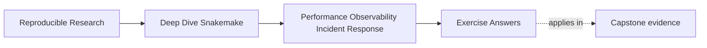
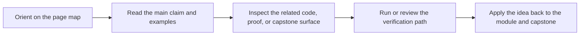

# Exercise Answers

<!-- page-maps:start -->
## Page Maps

<!-- page-maps:end -->

These answers are model explanations, not the only acceptable wording.

What matters is whether the reasoning stays evidence-first and truth-preserving.

## Answer 1: Name the dominant cost class

Strong diagnosis:

- the dominant lead is planning and discovery cost

Why:

- dry-run is already slower, which means the problem begins before tool execution
- benchmark files for the heavy rules are unchanged, which weakens the case for a tool
  runtime regression
- the discovered sample list is larger, which suggests the workflow is planning more work

What is not the strongest lead right now:

- pure tool runtime
- a benchmark-detectable slowdown in the heavy rules

What to inspect next:

- the discovery artifact or sample list
- the dry-run target set
- the recent edit that changed discovery behavior

The main lesson is to name the planning problem before touching execution settings.

## Answer 2: Choose the right evidence surface

First artifact to inspect:

- `snakemake --summary`

Why:

- the claim begins with a surprising rebuild of `summary.tsv`, so workflow-state evidence
  should come before rule-runtime evidence

Second artifact if the first one does not support the claim:

- the benchmark file for the aligner rule family

Why:

- once the rebuild scope is understood, benchmark evidence can test whether the aligner
  itself became slower

The important distinction is that `--summary` tells you what changed in workflow state,
while the benchmark tells you what a specific rule cost.

## Answer 3: Triage a flaky cluster-only incident

Why the proposed fix is not yet sufficient:

- raising retries and latency waits changes operating policy without first classifying the
  failure
- it may hide a deterministic storage, staging, or profile problem

Incident class to test first:

- operating context or storage behavior

Why:

- the incident appears only on one scheduler-backed profile

Evidence to consult first:

- the relevant rule logs for failing targets
- benchmark or timing evidence for the same rule family
- provenance or profile evidence such as `make -C capstone profile-audit`

The main lesson is that cluster-only incidents should not be flattened into "needs more
retries."

## Answer 4: Review a suspicious optimization

Potentially valid tuning move:

- grouping several tiny QC jobs into one aggregation step

Why it may be valid:

- grouping can honestly reduce scheduler overhead if the declared outputs, failure
  visibility, and evidence surfaces stay reviewable

Semantic or evidence regressions:

- removing one declared input from a slow rule
- deleting benchmark files because they create clutter

Why:

- removing a declared input changes workflow meaning and rerun truth
- deleting benchmark files weakens the evidence surface needed for performance review

Proof required before approving the valid part:

- dry-run showing the same semantic target set
- benchmark evidence at the new grouped boundary
- confirmation that output and failure visibility remain usable

## Answer 5: Draft a runbook entry

A strong minimal runbook entry could say:

1. Run `snakemake -n -p` or `make -C capstone wf-dryrun` first.
2. Check `snakemake --summary` to see whether the workflow state matches the report.
3. Inspect one matching rule log and one benchmark file for the suspicious rule family.
4. If the issue appears context-specific, run `make -C capstone profile-audit`.
5. Escalate when the issue points to profile drift, publish trust, or a semantic change
   rather than local runtime behavior.
6. Prove the repair with `make -C capstone tour` or `make -C capstone verify-report`,
   depending on whether execution evidence or published trust is the main question.

Why this is strong:

- it starts with the narrowest honest command
- it separates workflow-state evidence from rule-local evidence
- it includes a real escalation trigger
- it ends with a proof route rather than with vague advice

## Self-check

If your answers consistently explain:

- which cost class is dominant
- which evidence surface fits the question
- what incident class is under review
- what semantic truth must remain unchanged

then you are using Module 09 correctly.
