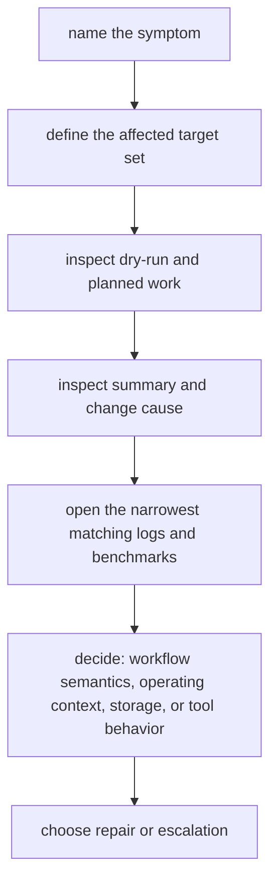

# Incident Triage for Slow and Flaky Runs

An incident is the worst time to invent a process.

If the workflow is slow, flaky, or unexpectedly noisy, the fastest honest response is a
fixed ladder that narrows the question before anyone edits the repository.

## The incident ladder



Do not skip steps because the workflow "probably" has the same issue as last time.

## Step 1: Name the symptom precisely

Bad incident opening:

> The pipeline is broken.

Good incident opening:

> `summary.tsv` rebuilt for 40 samples even though only config changed, and the run took
> 25 minutes longer than the previous CI run.

That sentence gives you three anchors:

- which surface changed
- which scope changed
- which comparison made the symptom visible

## Step 2: Define the affected scope

Before opening logs, answer:

- which targets or samples are affected
- whether this is one rule family or many
- whether the issue appears locally, in CI, on the scheduler, or across contexts

Wide-scoped incidents often turn out to be planning, config, or storage questions. Narrow
ones often turn out to be rule-local tool or script questions.

## Step 3: Inspect planned work first

Use dry-run before real execution when you can:

```bash
snakemake -n -p
snakemake --summary
snakemake --list-changes input code params
```

Those commands answer three early questions:

- what Snakemake thinks it needs to do
- which outputs it considers current or stale
- what class of change triggered reruns

This often resolves the incident before you touch any runtime logs.

## Step 4: Read the narrowest matching evidence

Once the scope is clear, inspect only the artifacts that match it:

- the log for the affected rule and sample
- the benchmark for that rule family
- the relevant provenance or profile evidence if the context differs

This is where many teams lose time. They open every log in the repository instead of the
one log that matches the claim.

## Step 5: Classify the incident

By this point, push the problem into one primary class:

| Incident class | What it usually means |
| --- | --- |
| workflow semantics | hidden dependencies, changed targets, widened discovery, wrong file contracts |
| operating context | profile drift, queue behavior, staging assumptions, latency differences |
| storage and visibility | files arrive late, land in the wrong place, or are inspected before promotion |
| tool behavior | the script or external tool is slower, noisier, or failing deterministically |

The point is not perfect taxonomy. The point is to stop treating all failures as one blur.

## Step 6: Decide repair versus escalation

Once the class is named, decide whether the next move is:

- a local repair
- a workflow review
- a profile or storage review
- a publish-boundary review
- a clean-room confirmation

Use the capstone route when you need stronger corroboration:

- `make -C capstone wf-dryrun`
- `make -C capstone evidence-summary`
- `make -C capstone tour`
- `make -C capstone verify-report`
- `make -C capstone profile-audit`

## Common incident shapes

### Surprise reruns after a small edit

First suspects:

- code or parameter drift
- widened target lists
- helper changes that altered discovery or publication

### Slow run with normal benchmark timings

First suspects:

- too many short jobs
- planner expansion
- executor or storage overhead

### Flaky run that only appears on one context

First suspects:

- profile drift
- filesystem latency
- staging or scratch assumptions

### Clean local run but suspicious published output

First suspects:

- publish-boundary drift
- missing provenance or verification evidence
- internal results being trusted as if they were public artifacts

## A simple incident note template

Write notes in this order:

1. symptom
2. affected scope
3. first confirming command
4. evidence consulted
5. current incident class
6. next action

Example:

> Symptom: CI rebuilt the summary for all samples and took 18 minutes longer than the last
> successful run. Scope: publish-oriented rules only. First confirming command:
> `snakemake --list-changes input code params`. Evidence consulted: dry-run, summary,
> `summarize` benchmark, `publish/v1/provenance.json`. Current class: workflow semantics
> with possible config drift. Next action: review the config change and repeat dry-run
> locally before touching thread or retry settings.

## Keep this standard

The first repository edit should happen only after the incident note names:

- the symptom
- the scope
- the evidence used
- the current incident class

If those are missing, the workflow is being debugged by momentum instead of by evidence.
