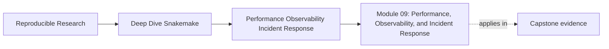

# Module 09: Performance, Observability, and Incident Response


<!-- page-maps:start -->
## Page Maps




<!-- page-maps:end -->

A workflow can be correct, portable, and still become painful to trust once runs get
slow, noisy, or unpredictable.

That is the problem this module addresses.

Module 09 is not about tuning for sport. It is about keeping a workflow reviewable under
pressure:

- naming where time is actually spent
- adding evidence surfaces that answer real review questions
- diagnosing incidents before touching the workflow
- improving feedback loops without hiding semantic drift
- leaving behind a route another maintainer can follow

The capstone corroboration surface for this module is the execution evidence and incident
review route around it: `logs/`, `benchmarks/`, `publish/v1/provenance.json`,
`make evidence-summary`, `make tour`, `make verify-report`, and
`capstone/docs/tour.md`.

## Why this module exists

Many workflow teams eventually hit the same failure pattern:

- a run feels slow, but nobody can say whether the cost is planning, scheduling, storage,
  or tool runtime
- logs exist, but they do not answer the question maintainers actually have
- the first response to a flaky run is to change retries, threads, or grouping
- performance work quietly changes workflow meaning and gets called optimization
- the only incident playbook lives in one person's memory

This module repairs those problems by teaching observability and performance as part of
workflow stewardship rather than as cleanup after the real work.

## Study route


Read the module in that order the first time.

If the problem is already clear, use this shortcut:

- open Core 1 when the question is mostly "where is the cost?"
- open Core 2 when the question is mostly "which artifact should I inspect?"
- open Core 3 when the question is mostly "what do I do first in an incident?"
- open Core 4 when the question is mostly "is this optimization honest?"
- open Core 5 when the question is mostly "how do we make this reviewable for others?"

## Module map

| Page | Purpose |
| --- | --- |
| [Overview](index.md) | explains the module promise and study route |
| [Workflow Cost Models and Timing Surfaces](workflow-cost-models-and-timing-surfaces.md) | teaches how to separate planning, scheduling, storage, and tool cost |
| [Logs, Benchmarks, Summaries, and Provenance](logs-benchmarks-summaries-and-provenance.md) | teaches which evidence surface answers which question |
| [Incident Triage for Slow and Flaky Runs](incident-triage-for-slow-and-flaky-runs.md) | teaches an evidence-first diagnosis ladder |
| [Performance Tuning without Semantic Drift](performance-tuning-without-semantic-drift.md) | teaches how to improve speed without making the workflow lie |
| [Runbooks, Escalation, and Operational Review](runbooks-escalation-and-operational-review.md) | teaches how to leave behind a usable operating route |
| [Worked Example: Investigating a Slow and Noisy Workflow](worked-example-investigating-a-slow-and-noisy-workflow.md) | walks through one realistic incident from symptom to repair |
| [Exercises](exercises.md) | gives five mastery exercises |
| [Exercise Answers](exercise-answers.md) | explains model answers and review logic |
| [Glossary](glossary.md) | keeps the module vocabulary stable |

## What should be clear by the end

By the end of this module, you should be able to explain:

- how Snakemake planning cost differs from tool runtime and filesystem drag
- why logs, benchmarks, summaries, and provenance need distinct jobs
- how to triage a slow or flaky run without editing first
- which performance changes preserve workflow truth and which ones only hide trouble
- what belongs in a runbook for local use, CI review, and incident escalation

## Commands to keep close

These commands form the evidence loop for Module 09:

```bash
snakemake -n -p
snakemake --summary
snakemake --list-changes input code params
make -C capstone wf-dryrun
make -C capstone evidence-summary
make -C capstone tour
```

The point of that route is not to collect output for its own sake. It is to choose the
smallest honest artifact that answers the current question.

## Capstone route

Use the capstone only after the local module ideas are already legible.

Best corroboration surfaces for this module:

- `capstone/logs/`
- `capstone/benchmarks/`
- `capstone/publish/v1/provenance.json`
- `capstone/Makefile`
- `capstone/docs/proof-guide.md`
- `capstone/docs/tour.md`
- `capstone/docs/tour.md`

Useful proof route:

```bash
make -C capstone wf-dryrun
make -C capstone evidence-summary
make -C capstone tour
make -C capstone verify-report
```

The point of that route is to confirm that workflow evidence stays reviewable before and
after the workflow runs.
