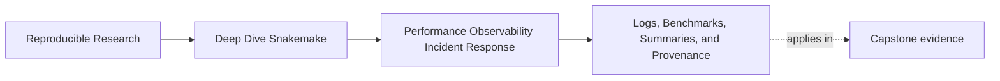
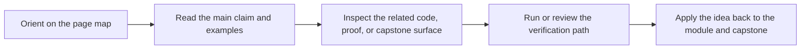
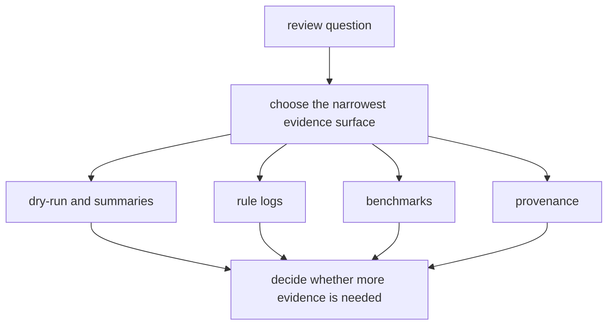

# Logs, Benchmarks, Summaries, and Provenance

<!-- page-maps:start -->
## Page Maps

<!-- page-maps:end -->

Observability gets noisy when every artifact is expected to answer every question.

That is not more evidence. It is less clarity.

Snakemake already gives you strong evidence surfaces, but each one has a different job:

- logs explain what one rule said while it ran
- benchmarks explain what one rule cost
- summaries explain workflow state across outputs
- provenance explains who and what produced the run

If you keep those jobs separate, incidents become easier to explain.

## The main evidence surfaces

| Surface | Best question it answers | Weak question for this surface |
| --- | --- | --- |
| dry-run with `-n -p` | what Snakemake plans to do and why | how long the tools will take |
| per-rule `log:` files | what happened inside a specific job | whether the whole workflow was efficient |
| per-rule `benchmark:` files | how expensive one job or rule family was | why the DAG became larger |
| `snakemake --summary` | which outputs exist, are pending, or were rebuilt | why a tool failed internally |
| `snakemake --list-changes input code params` | which tracked change class caused reruns | whether the rerun was expensive |
| `publish/v1/provenance.json` | which configuration and runtime identity produced the publish bundle | the exact text of a failing tool command |

You do not need every surface for every review. You need the smallest honest one.

## A clean way to think about them

This prevents two common mistakes:

- opening huge logs before confirming the workflow even planned the expected jobs
- quoting benchmark numbers before checking whether the rerun was legitimate

## Logs: tell the local execution story

Good rule logs answer questions such as:

- which sample or target failed
- which command or script branch ran
- whether the tool waited on data, retried internally, or exited cleanly

Good logs are specific. They name the rule-local situation.

Weak logs only print generic progress lines or dump unrelated environment detail that no
reviewer asked for.

## Benchmarks: measure the rule, not the mood

Use `benchmark:` when you want a durable answer to:

- which rule family is expensive
- whether a rule changed its runtime profile after an edit
- whether tiny jobs are being overwhelmed by launch overhead

Benchmarks become especially useful when a team keeps arguing from memory:

> "I think trimming got slower."

That claim should move quickly toward benchmark evidence, not toward a thread-count edit.

## Summaries: keep workflow state visible

`snakemake --summary` is a workflow-state surface, not a debugging diary.

Use it to answer:

- which outputs already exist
- which ones are planned for rebuild
- whether the workflow state matches what the incident report claims

This is often the fastest way to discover that a "performance problem" is actually a
surprise rerun caused by changed inputs or changed code.

## Change reports: explain why Snakemake wants to rerun

`snakemake --list-changes input code params` helps when reviewers need to know which change
class triggered work.

That matters because the next review question changes with the answer:

- input change points toward upstream data movement or discovery
- code change points toward scripts, wrappers, or rule logic
- parameter change points toward config or policy review

Without that distinction, teams often talk about churn without naming its source.

## Provenance: tie the run to its identity

Workflow evidence is incomplete if you cannot answer:

- which config values were material
- which profile or operating context shaped the run
- which environment or tool identity produced the published result

That is the job of provenance.

Provenance is not a replacement for logs or benchmarks. It is the identity surface that
lets you compare runs honestly when the repository alone does not explain the difference.

## A small example

Suppose a reviewer says:

> The report looks different and the workflow took longer.

A good evidence route might be:

1. `snakemake --summary` to confirm what rebuilt
2. `snakemake --list-changes input code params` to classify the rerun cause
3. one matching benchmark file for the slowest rule family
4. one matching rule log for the suspicious target
5. `publish/v1/provenance.json` if the change still cannot be explained

That route is short, and every step has a reason.

## What good observability looks like

Good observability is:

- rule-local when debugging one failure
- workflow-level when explaining changed state
- stable enough that teams can compare runs over time
- cheap enough that nobody removes it as soon as pressure rises

Bad observability usually looks like one of these:

- giant shared logs with no rule ownership
- benchmark files nobody reads or reviews
- summaries collected but never compared to a claim
- provenance missing when context differences are the real suspect

## Keep this standard

Before adding a new evidence surface, finish this sentence:

> We need this artifact because it answers this review question better than the artifacts
> we already have.

If you cannot finish that sentence, the workflow probably needs a clearer reading route
more than it needs another file.
